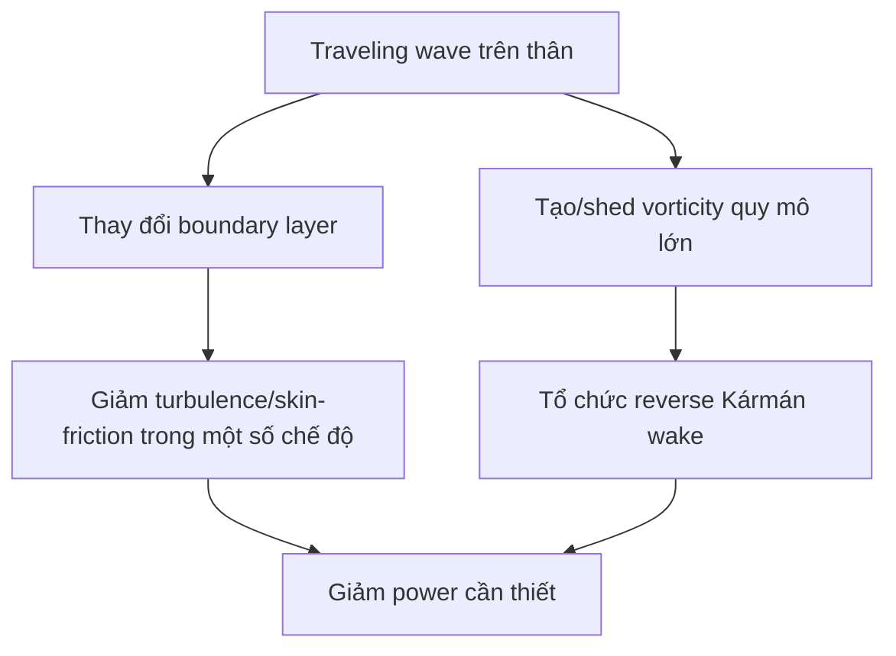

# Bài 08 - Lớp biên, traveling wave và relaminarization

## 1. Tóm tắt

Ngoài wake phía sau, chuyển động traveling wave của thân còn có thể thay đổi lớp biên sát bề mặt. Bài báo tổng hợp thí nghiệm và mô phỏng cho thấy khi tốc độ truyền sóng trên bề mặt đủ lớn so với tốc độ dòng tới, turbulence trong lớp biên có thể giảm mạnh và flow có xu hướng relaminarize.

## 2. Mục tiêu bài học

- hiểu khái niệm tỷ số `c/U`;
- diễn giải Figure 13;
- liên hệ traveling-wave motion với suppression of turbulence;
- hiểu vì sao relaminarization có thể liên hệ với giảm công suất;
- nhận biết phạm vi Reynolds number của các kết quả được nêu.

## 3. Traveling wave speed

Ký hiệu:

- `c`: tốc độ truyền của traveling wave trên tấm/thân;
- `U`: tốc độ dòng tới hoặc tốc độ tiến đặc trưng.

Bài báo nhắc các thí nghiệm trước cho thấy turbulence trong boundary layer bị suppress khi tốc độ truyền sóng vượt tốc độ free stream.

## 4. Mô phỏng của Zhang

Một nghiên cứu DNS được dẫn trong bài báo xét tấm hai chiều dao động kiểu traveling wave ở:

- `Re = 6000`;
- turbulence intensity của dòng tới khoảng 5%;
- `c/U` thay đổi được.

Kết quả: turbulence giảm đáng kể khi `c/U > 1`.

## 5. Figure 13 - profile vận tốc lớp biên

Hình so sánh profile tại ba trường hợp:

- `c/U = 0,0`;
- `c/U = 0,4`;
- `c/U = 1,2`.

Profile `c/U = 0` mang dạng điển hình của lớp biên turbulent. Ở `c/U = 0,4`, profile thay đổi ít. Ở `c/U = 1,2`, profile đã chuyển mạnh theo hướng laminarized.

Figure caption cũng cho friction velocity vô thứ nguyên giảm theo các trường hợp:

- khoảng 0,055 ở `c/U = 0`;
- khoảng 0,049 ở `c/U = 0,4`;
- khoảng 0,041 ở `c/U = 1,2`.

## 6. Liên hệ với công suất tối thiểu

Bài báo nêu rằng trong mô phỏng này, power cần để propel foil là nhỏ nhất tại `c/U = 1,2`. Kết quả tương tự được liên hệ với thí nghiệm trên robot kiểu tuna và flow visualization lớp biên của cá sống.

Điều này không chứng minh mọi hệ phải chạy ở `c/U = 1,2`; nó cho thấy **tốc độ truyền sóng tương đối so với dòng tới là một tham số thiết kế quan trọng**.

## 7. Vì sao traveling wave có thể thay đổi lớp biên?

Ở mức diễn giải từ bài báo, chuyển động bề mặt liên tục thay đổi vị trí separation, shear và vorticity sát thân. Khi forcing đủ phù hợp, turbulence của boundary layer không còn phát triển như trên một tấm đứng yên/cứng.

Bài báo không cung cấp một mô hình đóng đơn giản cho cơ chế relaminarization, nên khóa học không bổ sung công thức ngoài nguồn.

## 8. Liên hệ với robot và cá thật

Các kết quả boundary layer bổ sung cho cơ chế wake:

Hai nhánh không nên bị đồng nhất. Một nhánh liên quan flow sát bề mặt, nhánh kia liên quan wake và thrust.

## 9. Câu hỏi tự kiểm tra

1. `c/U` biểu diễn điều gì?
2. Trong case Zhang, turbulence giảm mạnh khi tỷ số nào vượt 1?
3. Figure 13 cho thấy profile thay đổi thế nào từ `c/U=0` tới `1,2`?
4. Vì sao không nên coi `1,2` là giá trị tối ưu phổ quát?
5. Phân biệt cơ chế boundary-layer relaminarization với reverse Kármán wake.

## 10. Tổng kết

Thân mềm không chỉ tác động lên wake xa phía sau; nó còn điều khiển lớp biên sát bề mặt. Traveling wave với tốc độ tương đối phù hợp có thể làm giảm turbulence và công suất trong các điều kiện được nghiên cứu, bổ sung một cơ chế nữa cho lợi ích của locomotion kiểu cá.
