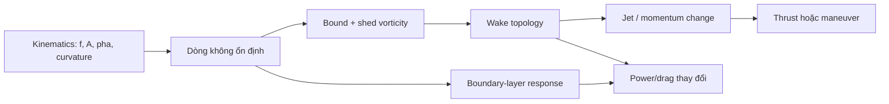

# Bài 09 - Tổng hợp nguyên lý thủy động lực học và thiết kế

## 1. Mục tiêu

Bài ôn tập này kết nối toàn bộ khóa học thành một mô hình tư duy thống nhất, từ foil dao động đến thân cá, turning và robot biomimetic.

## 2. Mô hình nhân - quả tổng quát

Khi thiết kế hoặc phân tích một cá/robot, nên đi theo chuỗi này thay vì chỉ nhìn quỹ đạo xương.

## 3. Bảy nguyên lý cốt lõi

### 3.1. Chuyển động không ổn định là tài nguyên

Unsteadiness không chỉ gây tổn thất. Nó cho phép tạo lực tức thời lớn, delay stall, hình thành LEV và tái sử dụng năng lượng trong xoáy tới.

### 3.2. Wake topology quan trọng hơn “quẫy mạnh”

Hai hệ có biên độ giống nhau nhưng khác pha có thể tạo wake hoàn toàn khác và hiệu suất khác.

### 3.3. Strouhal là thước đo quan trọng nhưng không đủ

`St = fA/U` kết nối kinematic với wake. Tuy nhiên phải xét thêm phase, góc tấn, reduced frequency và hình học.

### 3.4. Body là propulsor, không chỉ là giá đỡ tail

Body tạo bound vorticity, shed vorticity và đóng góp lớn vào power/thrust.

### 3.5. Tail là bộ tái định vị xoáy

Tail làm việc trong dòng đã bị body biến đổi; chức năng của nó bao gồm thao tác các xoáy tới để hình thành jet có tổ chức.

### 3.6. Maneuver cần timing chính xác

C-start và turning cần hình thành, shed và ghép cặp xoáy đúng thời điểm. Timing sai tạo wake phân tán và lực không tập trung.

### 3.7. Thân mềm còn điều khiển boundary layer

Traveling wave có thể suppress turbulence trong một số vùng tham số, ảnh hưởng power bên cạnh cơ chế wake.

## 4. Ma trận quan sát - diễn giải

| Quan sát | Diễn giải phù hợp theo bài báo |
|---|---|
| Hai xoáy trái dấu mỗi chu kỳ tạo jet | Dấu hiệu reverse Kármán wake tạo thrust |
| Wake rất rộng, vortex pairs lệch khỏi centerline | Có thể thuộc chế độ ghép cặp xoáy trái dấu |
| Vortex sau foil yếu hơn vortex tới | Có thể là destructive interaction và energy extraction |
| Body amplitude tăng về tail | Bound vorticity và shedding tăng về phía sau |
| C-turn tạo một cặp xoáy lớn | Local jet đổi momentum để rẽ |
| Power robot giảm ở một số `St` | Kinematics phù hợp với wake/boundary-layer dynamics |

## 5. Khung phân tích một animation cá

Đối với một animation hoặc rig, có thể kiểm tra theo thứ tự:

1. **Traveling wave có thật sự truyền dọc thân không?**
2. **Amplitude có phân bố hợp lý từ đầu đến tail không?**
3. **Pha tail có liên hệ với body hay tách rời?**
4. **Turn có body curvature trước khi đổi heading không?**
5. **Fast-start có tăng biên độ/tốc độ uốn và timing bất đối xứng không?**
6. **Fin motion có thay đổi theo maneuver không?**

Khung này là ứng dụng suy luận từ bài báo; nó không thay thế CFD/PIV nếu cần xác nhận lực thực.

## 6. Case study tổng hợp

Giả sử robot bơi thẳng nhưng tiêu thụ power cao dù tail quẫy mạnh.

### 6.1. Không nên kết luận ngay

“Tail yếu” hoặc “biên độ chưa đủ” chưa chắc đúng.

### 6.2. Các biến cần kiểm tra

- `St` có ở vùng hợp lý cho cấu hình đang dùng không?
- phase heave/pitch của tail có tạo reverse Kármán wake không?
- body có tạo traveling wave hay chỉ tail dao động?
- tail có nhận vorticity tới ở pha thuận lợi không?
- boundary layer có bị forcing theo cách làm tăng hay giảm turbulence?

### 6.3. Dữ liệu nên đo

- input power;
- mean thrust;
- wake velocity/vorticity;
- body curvature theo thời gian;
- phase giữa các segment;
- tốc độ tiến `U`, `f`, `A`, để tính `St`.

## 7. Checklist cuối khóa

- [ ] Giải thích được reverse Kármán street.
- [ ] Tính được Strouhal.
- [ ] Nêu được 5 tham số chính của flapping foil.
- [ ] Viết được hai biểu thức lực ngang trong slender-body section.
- [ ] Mô tả được body-tail vorticity sequence.
- [ ] Mô tả được C-turn vortex-pair mechanism.
- [ ] Giải thích được Figure 12 và Figure 13.
- [ ] Phân biệt wake control và boundary-layer control.

## 8. Tổng kết

Một mô hình bơi kiểu cá tốt phải nhất quán ở ba lớp: **kinematics**, **flow structures**, và **energetics**. Chỉ khi ba lớp này khớp nhau, ta mới có thể nói một chuyển động “giống cá” không chỉ về hình ảnh mà còn về logic thủy động lực học.
