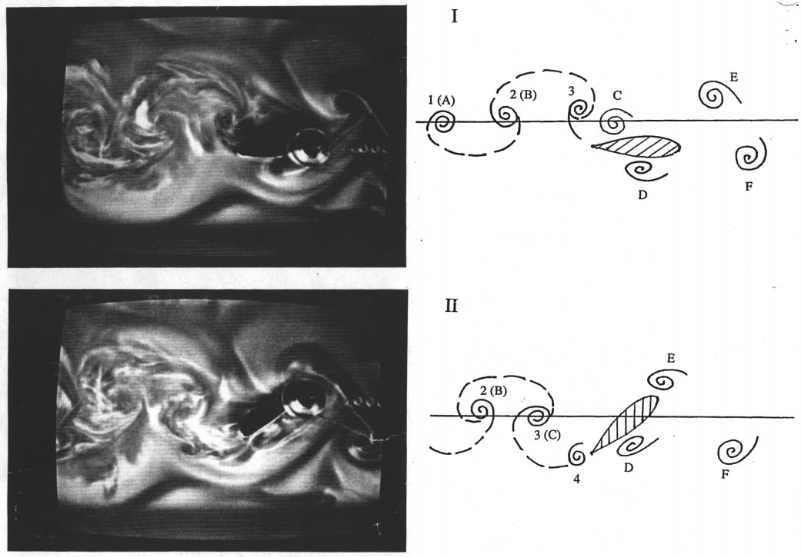
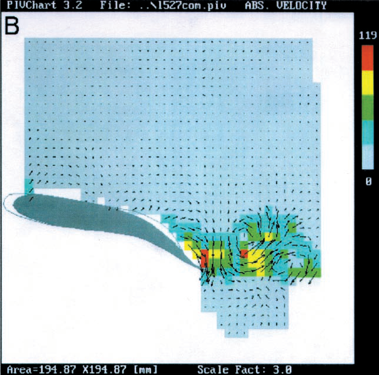
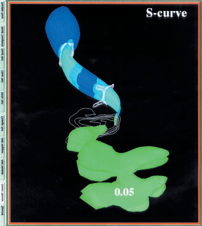
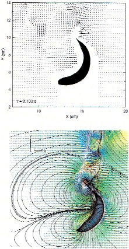
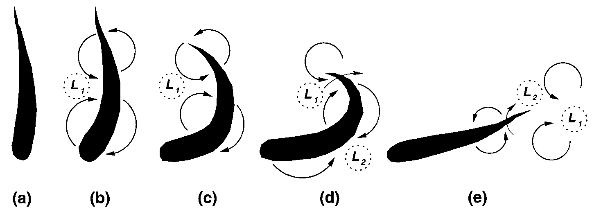
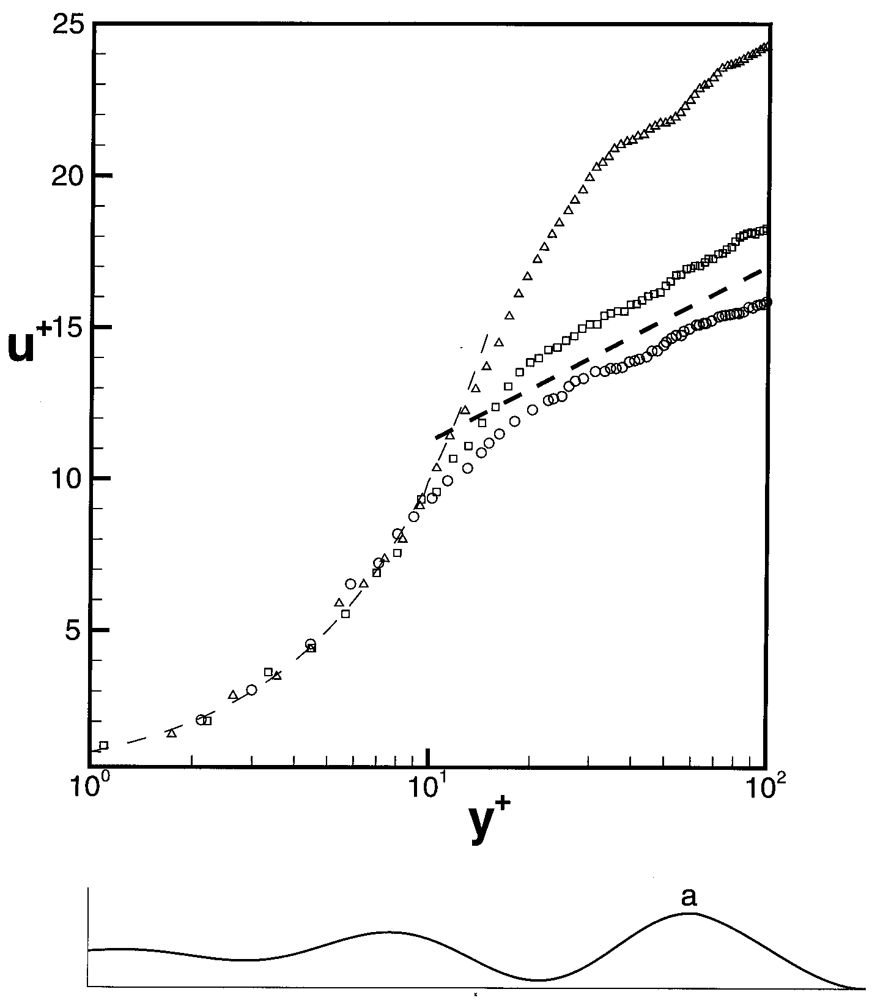
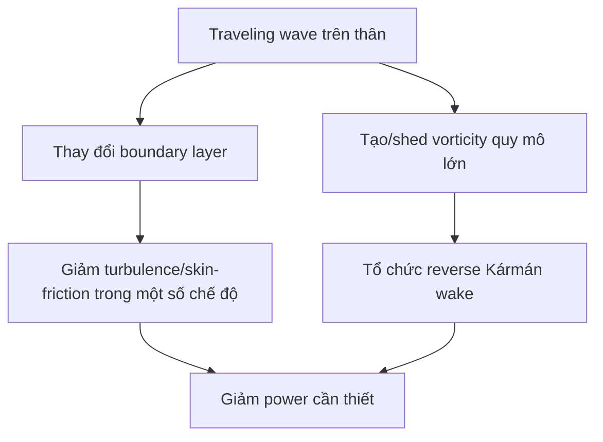
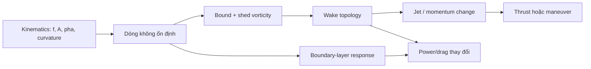

# Khóa học đầy đủ - Thủy động lực học của bơi kiểu cá


---

# Phân tích tài liệu nguồn và chiến lược chuyển thành khóa học

## 1. Loại tài liệu

PDF là một **review paper** về thủy động lực học của fishlike swimming, không phải giáo trình theo chương. Vì vậy việc chuyển thành khóa học không nên giữ nguyên thứ tự từng đoạn, mà phải tái cấu trúc thành chuỗi kiến thức có prerequisite rõ ràng.

## 2. Luận điểm trung tâm

Trục giải thích xuyên suốt bài báo là **vorticity control**: chuyển động không ổn định của thân và vây tạo các cấu trúc xoáy quy mô lớn; các cấu trúc này được vận chuyển, shed và tái định vị, đặc biệt bởi tail, để tạo thrust và force quá độ cho maneuver.

## 3. Các lớp kiến thức trong PDF

### 3.1. Lớp cơ chế cơ bản

- unsteady flow control;
- interaction giữa foil và oncoming vortices;
- reverse Kármán wake;
- heave, pitch, phase và Strouhal.

### 3.2. Lớp mô hình hóa cá bơi

- slender-body theory;
- lực ngang và added mass;
- hạn chế của mô hình mặt cắt gần hai chiều;
- flow ba chiều quanh thân mềm.

### 3.3. Lớp cơ chế sinh học

- body-generated vorticity;
- shedding tăng dần về peduncle;
- tail repositioning;
- steady swimming, fast-start và turning.

### 3.4. Lớp kiểm chứng kỹ thuật

- DPIV và flow visualization;
- RoboTuna/RoboPike;
- power reduction;
- boundary-layer relaminarization.

## 4. Vì sao khóa học tách thành 8 bài lõi

Nếu học thẳng theo paper, người mới dễ gặp công thức slender-body trước khi hình thành trực giác đầy đủ về wake. Khóa học sắp lại theo chuỗi:

1. vorticity control;
2. foil dao động;
3. Strouhal và efficiency;
4. slender-body theory;
5. body-tail wake control;
6. turning/fast-start;
7. robot biomimetic;
8. boundary layer.

Thứ tự này đi từ mô hình đơn giản sang hệ phức tạp và từ cơ chế sang kiểm chứng.

## 5. Những điểm được giữ nguyên phạm vi

- Khoảng `St = 0,25-0,35` chỉ được trình bày là tối ưu cho **một số profile cụ thể** trong các nghiên cứu được review.
- Giá trị efficiency tới 87% thuộc các foil và điều kiện tải cụ thể.
- Giảm power hơn 50% thuộc vùng tham số của robot thí nghiệm được dẫn.
- Các con số circulation/core radius trong turning thuộc Giant Danio ở case được nghiên cứu.
- `c/U = 1,2` là trường hợp cho power tối thiểu trong mô phỏng/thí nghiệm được mô tả, không phải hằng số phổ quát.

## 6. Xử lý hình ảnh

PDF có các Figure đen-trắng nằm trong bài chính và Figure màu nằm ở color insert cuối file. Toàn bộ ảnh nhúng có ích đã được tách thành file PNG riêng, đổi tên theo Figure và liên kết trực tiếp trong các bài học.

## 7. Kết quả đầu ra

Khóa học tạo ra:

- 8 lesson kiến thức;
- 1 bài tổng hợp;
- 1 assessment cuối khóa;
- glossary;
- bản đồ trang/hình nguồn;
- bibliography của paper;
- 17 PNG figure được tách từ PDF.


---

# Bài 01 - Chuyển động không ổn định và điều khiển độ xoáy

## 1. Tóm tắt

Cá nhanh và cá voi nhỏ không chỉ tạo lực bằng cách “đẩy nước ra sau”. Điểm quan trọng trong bài báo là chúng khai thác **dòng chảy không ổn định** do thân, vây và đuôi chuyển động nhịp nhàng. Các chuyển động này tạo, vận chuyển, hợp nhất, triệt tiêu và tái định vị những cấu trúc xoáy lớn. Cách nhìn đó được gọi là **vorticity control - điều khiển độ xoáy**.

## 2. Mục tiêu bài học

Sau bài này, người học có thể:

- giải thích vì sao dòng không ổn định là trung tâm của bơi kiểu cá;
- mô tả ba kiểu tương tác giữa xoáy tới và xoáy do foil sinh ra;
- phân biệt tương tác tăng cường, triệt tiêu và ghép cặp xoáy;
- giải thích vì sao tái định vị xoáy có thể tăng hiệu suất;
- đọc Figure 1 như một ví dụ về thu hồi năng lượng từ trường xoáy tới.

## 3. Từ lực đẩy truyền thống đến bơi kiểu cá

Phương tiện biển truyền thống thường được phân tích quanh trạng thái gần ổn định. Trong khi đó, cá sử dụng chuyển động nhịp nhàng và có biên độ đáng kể của thân, vây và đuôi. Bài báo nhấn mạnh ba lợi thế của cách vận động này:

- tạo lực lớn trong khoảng thời gian ngắn một cách hiệu quả;
- phối hợp thân và đuôi để giảm năng lượng cần cho bơi ổn định;
- phối hợp chuyển động quá độ để giảm năng lượng bị thất thoát vào wake khi cơ động.

Vì vậy, không nên xem dao động thân chỉ là một “hậu quả” của việc bơi. Nó là một thành phần chủ động của cơ chế tạo và điều khiển dòng.

## 4. Vorticity control là gì?

Trong ngữ cảnh của bài báo, chuỗi ý tưởng cốt lõi là:


Điều đáng chú ý là vây đuôi không luôn tạo lực từ “nước sạch”. Nó thường làm việc trong một trường vận tốc đã bị thân và các phần khác của cá làm biến đổi.

## 5. Ba chế độ tương tác xoáy - foil

Bài báo tổng hợp ba dạng tương tác khi một foil dao động gặp các xoáy quy mô lớn có kích thước lõi cùng bậc với chord của foil.

### 5.1. Tương tác tăng cường

Xoáy tới kết hợp **cùng chiều có lợi** với xoáy do foil shed ra, tạo các xoáy mạnh hơn trong wake. Các xoáy có thể sắp xếp thành reverse Kármán street.

Ý nghĩa: động lượng trong jet wake được tăng cường, nhưng điều này không mặc nhiên có nghĩa là hiệu suất tối đa vì năng lượng cần để tạo xoáy cũng phải được tính đến.

### 5.2. Tương tác triệt tiêu

Xoáy tới và xoáy do foil tạo ra tương tác theo cách làm yếu nhau. Wake phía sau có xoáy yếu hơn nhưng vẫn có thể giữ cấu trúc reverse Kármán.

Điểm quan trọng là foil có thể **lấy lại một phần năng lượng chứa trong các eddy tới**. Trong thí nghiệm được bài báo dẫn lại, chế độ triệt tiêu gắn với tăng đáng kể hiệu suất của foil.

### 5.3. Ghép cặp xoáy trái dấu

Xoáy tới có thể ghép với xoáy trái dấu do foil sinh ra thành các cặp xoáy. Các cặp này dịch ra khỏi đường tâm và tạo một wake rộng.

Đây là một topology wake khác với hai trường hợp reverse Kármán street hẹp hơn.

## 6. Xoáy có thể xuất hiện ở đâu trên foil?

Bài báo chỉ ra vorticity của foil có thể được sinh ra ở:

- trailing edge - mép sau;
- leading edge - mép trước;
- hoặc đồng thời ở cả hai.

Do đó, khi mô phỏng hoặc rig một vây cá, chỉ quan tâm đến vị trí mép sau là chưa đủ nếu chuyển động có góc tấn lớn hoặc không ổn định mạnh.

## 7. Phân tích Figure 1



Hình mô tả một foil dao động thao tác các xoáy được tạo từ một vật thể tiết diện D đặt ở thượng lưu. Dòng chảy đi từ phải sang trái. Trước foil, các xoáy tới còn mạnh; sau khi tương tác, các xoáy wake yếu đi và vị trí thay đổi mạnh.

Điểm cần đọc từ hình không phải là “xoáy biến mất”, mà là **foil đã thay đổi cách các xoáy sắp xếp và phân phối năng lượng**. Chính khả năng điều khiển pha, vị trí và cường độ của các cấu trúc này là nền tảng cho các bài tiếp theo.

## 8. Tác động của forcing tuần hoàn

Bài báo cũng tổng hợp các kết quả cho thấy forcing tuần hoàn có thể thay đổi đáng kể cấu trúc wake. Khi tần số forcing gần tần số Strouhal tự nhiên của wake, ảnh hưởng lên wake có thể mạnh. Trong một số thí nghiệm với cylinder quay dao động, bề rộng wake và do đó drag giảm đáng kể.

Một kết quả khác: traveling wave trên một tấm mềm có thể làm giảm turbulence trong lớp biên khi tốc độ truyền sóng lớn hơn tốc độ dòng tự do. Ý tưởng này sẽ quay lại ở Bài 08.

## 9. Các hiểu lầm cần tránh

- **Không phải mọi xoáy đều là tổn thất.** Xoáy có thể là phương tiện mang động lượng và có thể được tái sử dụng.
- **Không phải xoáy càng mạnh càng tốt.** Hiệu suất phụ thuộc tổ chức wake và năng lượng trao đổi.
- **Không thể phân tích riêng đuôi khỏi dòng tới.** Dòng tới đã mang “lịch sử” chuyển động của thân.
- **Vorticity control không chỉ là tạo xoáy.** Phần quan trọng là timing, vị trí và tương tác giữa các xoáy.

## 10. Câu hỏi tự kiểm tra

1. Vì sao bơi kiểu cá được xem là một bài toán dòng không ổn định?
2. Ba kiểu tương tác giữa xoáy tới và xoáy do foil sinh ra khác nhau thế nào?
3. Vì sao tương tác triệt tiêu vẫn có thể làm tăng hiệu suất?
4. Tại sao vị trí tương đối của xoáy và foil quan trọng không kém cường độ xoáy?
5. Từ Figure 1, hãy mô tả sự thay đổi của wake trước và sau foil.

## 11. Checklist kiến thức

- [ ] Tôi giải thích được vorticity control bằng lời của mình.
- [ ] Tôi phân biệt được tăng cường, triệt tiêu và ghép cặp xoáy.
- [ ] Tôi hiểu tail có thể tái sử dụng trường xoáy do body tạo ra.
- [ ] Tôi hiểu forcing tuần hoàn có thể thay đổi wake và drag.

## 12. Tổng kết

Luận điểm nền tảng của toàn khóa là: **cá không chỉ tạo lực bằng hình dạng vây; chúng tạo và điều khiển một trường xoáy không ổn định theo thời gian**. Bài tiếp theo chuyển sang hệ tối giản hơn - một foil vừa heave vừa pitch - để xem các tham số nào điều khiển việc hình thành jet và reverse Kármán street.


---

# Bài 02 - Foil dao động và cơ chế tạo lực đẩy

## 1. Tóm tắt

Một foil chuyển động tiến với tốc độ trung bình ổn định, đồng thời dao động **heave** và **pitch**, có thể tạo lực đẩy nếu các tham số chuyển động phù hợp. Bài học này xây dựng trực giác về jet wake, reverse Kármán street và bộ tham số kinematic của foil.

## 2. Mục tiêu bài học

- phân biệt heave và pitch;
- giải thích tiêu chí wake dạng jet đối với lực đẩy trung bình;
- nhận biết reverse Kármán street;
- liệt kê các tham số chính của một flapping foil;
- hiểu vai trò của leading-edge vortex và tip vortex.

## 3. Heave và pitch

**Heave** là chuyển động tịnh tiến ngang/lateral của foil. **Pitch** là chuyển động quay của foil quanh một trục. Hai chuyển động phối hợp tạo ra góc tấn tức thời và phân bố áp suất thay đổi liên tục.

Một cách biểu diễn khái niệm:

```text
Dòng tới U  --->

           /  foil tại một thời điểm
          /
   heave ↑↓      pitch ↺↻
```

Bài báo không đưa ra một luật điều khiển duy nhất cho mọi trường hợp. Thay vào đó, nó nhấn mạnh hiệu suất phụ thuộc tổ hợp biên độ, pha, tần số và góc.

## 4. Khi nào foil tạo thrust?

Nếu vận tốc trung bình phía sau foil tạo thành **jet**, wake mang động lượng theo hướng phù hợp để sinh thrust. Nếu hệ chủ yếu chịu drag, wake mang dấu hiệu của một **drag wake**.

Trong cả hai trường hợp, wake không tĩnh: các cấu trúc xoáy quy mô lớn hình thành theo chu kỳ.

## 5. Reverse Kármán street

Một Kármán vortex street cổ điển phía sau vật cản liên hệ với drag. Trong một foil tạo thrust, hai xoáy trái dấu mỗi chu kỳ có thể sắp xếp ngược chiều quay so với trường hợp drag, tạo **reverse Kármán street**.

Bài báo liên hệ hiệu suất cao với wake có **hai xoáy lớn mỗi chu kỳ**, thay vì các topology phức tạp hơn như bốn xoáy lớn mỗi chu kỳ.

## 6. Các tham số chính của flapping foil

Bài báo liệt kê năm tham số quan trọng:

1. tỷ số biên độ heave so với chord;
2. feathering parameter;
3. độ lệch pha giữa heave và pitch;
4. reduced frequency;
5. vị trí tương đối của trục pitch.

Có thể dùng số Strouhal và góc tấn danh nghĩa thay cho một số cách tham số hóa trên.

### 6.1. Góc tấn danh nghĩa

Góc tấn danh nghĩa được mô tả là chênh lệch cực đại giữa góc do heave gây ra và góc pitch. Nó là một cách gói gọn cường độ “tấn” của foil trong chuyển động kết hợp.

### 6.2. Pha giữa heave và pitch

Hai chuyển động có thể có cùng tần số nhưng khác pha. Pha quyết định foil xoay như thế nào tại thời điểm nó đạt biên heave, từ đó thay đổi góc tấn, lực tức thời và cách xoáy shed ra.

## 7. Leading-edge vortex

Khi dòng tách gần leading edge, một **leading-edge vortex - LEV** có thể hình thành. Bài báo tổng hợp các công trình từ khí động học côn trùng để làm rõ rằng các cơ chế không ổn định có thể trì hoãn stall và tạo lực lớn.

Trong thí nghiệm foil dao động được dẫn lại, sự hình thành LEV ở mức vừa phải có liên hệ với hiệu suất đẩy cao, lên tới khoảng 87% trong các cấu hình tải vừa phải được nghiên cứu.

Điều kiện được bài báo nêu cho vùng hiệu suất cao gồm:

- biên độ heave cùng bậc với chord;
- góc tấn danh nghĩa khoảng 20°;
- Strouhal phù hợp với việc hình thành reverse Kármán street.

Đây là kết quả theo cấu hình thí nghiệm, không phải bộ tham số phổ quát.

## 8. Xoáy đầu mút và hiệu ứng ba chiều

Foil có aspect ratio hữu hạn tạo tip vortices. Bài báo ghi nhận rằng với foil dao động, khi tần số tăng, hiệu ứng ba chiều có thể nhỏ hơn so với foil chuyển động ổn định, do hình thành các tip vortices luân phiên dấu và vận tốc cảm ứng yếu hơn.


Figure 4 cho thấy một cấu trúc tip vortex phức tạp được truy vết bằng khí bơm vào vùng áp suất thấp của lõi xoáy. Nó minh họa rằng wake thực tế là ba chiều và các vortex ring/tip vortex có thể nối với nhau theo cấu trúc phức tạp.

## 9. Liên hệ với vây cá

Foil là mô hình tối giản. Vây cá thật có:

- độ mềm;
- biến dạng theo span;
- chuyển động do thân đưa tới;
- tương tác với wake của thân;
- hình học thay đổi theo loài.

Vì vậy, các kết quả foil là nền tảng để hiểu cơ chế, không phải bản sao đầy đủ của vây cá sống.

## 10. Bài tập ngắn

### 10.1. Nhận diện tham số

Cho một foil có chord `c`, heave biên độ `h0`, pitch góc `θ0`, tần số `f`, tốc độ tiến `U`. Hãy phân loại đại lượng nào là hình học, kinematic và động lực wake.

### 10.2. Giải thích wake

Nếu quan sát thấy hai xoáy trái dấu mỗi chu kỳ, sắp xếp thành jet phía sau foil, hãy giải thích vì sao đó là dấu hiệu của chế độ tạo thrust.

### 10.3. Phân tích LEV

Vì sao LEV không nên mặc định được xem là “xấu”? Trả lời dựa trên quan hệ giữa LEV, lift và hiệu suất trong dòng không ổn định.

## 11. Tổng kết

Foil heave + pitch là mô hình cơ bản để thấy rằng thrust phụ thuộc tổ chức wake chứ không chỉ phụ thuộc biên độ quẫy. Bài tiếp theo đưa số Strouhal vào trung tâm để liên hệ kinematic với dynamics của wake và hiệu suất.


---

# Bài 03 - Số Strouhal, động lực wake và hiệu suất

## 1. Tóm tắt

Số Strouhal là tham số vô thứ nguyên kết nối tần số dao động, bề rộng/biên độ wake và tốc độ tiến. Bài báo dùng nó như một thước đo đặc biệt hữu ích để mô tả **dynamics của wake**, đồng thời nhấn mạnh rằng reduced frequency vẫn cần thiết để mô tả mức độ không ổn định của foil.

## 2. Mục tiêu bài học

- tính và diễn giải số Strouhal;
- phân biệt vai trò của Strouhal và reduced frequency;
- giải thích vì sao “khớp” tần số dao động với instability của wake có thể tăng hiệu suất;
- đọc Figure 2, Figure 3 và Figure 12;
- tránh diễn giải sai khoảng Strouhal tối ưu.

## 3. Định nghĩa Strouhal

Bài báo định nghĩa:

$$
St = \frac{fA}{U}
$$

trong đó:

- `f`: tần số dao động;
- `A`: bề rộng wake, thường được xấp xỉ bằng tổng biên độ lateral của foil;
- `U`: tốc độ tiến.

Số Strouhal không có đơn vị.

## 4. Ý nghĩa vật lý

Nếu giữ `U` cố định:

- tăng `f` làm tăng `St`;
- tăng `A` làm tăng `St`.

Nếu giữ `f` và `A` cố định:

- tăng `U` làm giảm `St`.

Nhưng giá trị của `St` không tự nói hết về foil. Hai hệ có cùng `St` vẫn có thể khác chord, pha pitch-heave, góc tấn và Reynolds number.

## 5. Strouhal và reduced frequency không thay thế hoàn toàn nhau

Bài báo phân biệt:

- **reduced frequency**: đo mức độ không ổn định bằng cách so sánh thang bước sóng không gian của nhiễu với chord;
- **Strouhal**: hữu ích hơn cho việc đặc trưng dynamics của wake.

Do cả chuyển động foil lẫn wake đều quan trọng, hai tham số thường cần được dùng đồng thời.

## 6. Wake instability và vùng hiệu suất cao

Luận điểm của Triantafyllou và cộng sự là hiệu suất tối ưu xuất hiện khi tần số foil tương thích với dynamics tự nhiên của wake, cụ thể gần tần số mà nhiễu trong wake được khuếch đại mạnh nhất theo phân tích ổn định tuyến tính.

Nói cách khác, hệ không chỉ “quẫy nhanh” mà cần **quẫy ở nhịp phù hợp với khả năng tổ chức xoáy của wake**.

## 7. Khoảng Strouhal 0,25-0,35

Trong các profile cụ thể được nghiên cứu, bài báo báo cáo vùng tối ưu khoảng:

$$
0.25 \lesssim St \lesssim 0.35
$$

Tuy nhiên chính bài báo lưu ý rằng các trường hợp khác có thể cho giá trị khác. Vì vậy, nên xem đây là một **vùng tham chiếu thực nghiệm/theoretical cho các cấu hình được khảo sát**, không phải luật sinh học phổ quát.

## 8. Figure 2 - dữ liệu cá heo


Dữ liệu kinematic của cá heo được huấn luyện cho thấy các tần số vô thứ nguyên nằm gần vùng dự đoán từ phân tích instability. Điểm quan trọng của hình là sự liên hệ giữa quan sát sinh học và lý thuyết wake, chứ không phải một đường phụ thuộc đơn giản của `St` theo Reynolds number.

## 9. Figure 3 - hiệu suất foil


Figure 3 so sánh nhiều “case” có biên độ heave, góc tấn danh nghĩa và pha heave-pitch khác nhau. Các đường cong khác nhau đáng kể. Điều này chứng minh rằng:

- `St` rất quan trọng;
- nhưng cùng một `St`, hiệu suất vẫn phụ thuộc mạnh vào các tham số khác.

Do đó, tối ưu một rig/robot chỉ bằng cách đặt `St` vào một khoảng mục tiêu là chưa đủ.

## 10. Figure 12 - robot cá và hai đỉnh giảm công suất


Robot thân mềm trong nghiên cứu Barrett et al. cho hai đỉnh giảm công suất: một gần `St ≈ 0,13` và một gần `St ≈ 0,25`. Hình dạng đường cong được nhận xét là tương tự quan hệ hiệu suất - Strouhal của flapping foil.

Điểm này một lần nữa nhắc rằng hệ thân mềm hoàn chỉnh có thể có nhiều cơ chế/tối ưu cục bộ, không nhất thiết chỉ một đỉnh.

## 11. Ví dụ tính toán

Một foil có:

- `f = 2 Hz`;
- `A = 0,15 m`;
- `U = 1,0 m/s`.

Khi đó:

$$
St = \frac{2 \times 0.15}{1.0} = 0.30
$$

Giá trị 0,30 nằm trong khoảng 0,25-0,35 được báo cáo cho một số profile trong bài báo. Tuy nhiên, chưa thể kết luận foil này có hiệu suất tối ưu nếu chưa biết pha, góc tấn, chord và topology wake.

## 12. Bài tập

1. Với `f = 3 Hz`, `A = 0,08 m`, `U = 1,2 m/s`, tính `St`.
2. Nếu muốn giữ `St` không đổi khi tốc độ tăng 20%, cần thay `fA` như thế nào?
3. Từ Figure 3, giải thích vì sao không thể tối ưu bằng Strouhal một biến.
4. Từ Figure 12, nêu hai vùng Strouhal có giảm công suất nổi bật trong robot.
5. Viết một câu giải thích sự khác nhau giữa “foil unsteadiness” và “wake dynamics”.

## 13. Tổng kết

Strouhal là cầu nối giữa kinematics và wake, nhưng nó không phải tham số duy nhất. Hiệu suất cao xuất hiện khi chuyển động foil phối hợp với dynamics của wake để tạo cấu trúc xoáy có tổ chức, đặc biệt reverse Kármán street.


---

# Bài 04 - Slender-body theory và lực ngang của thân cá

## 1. Tóm tắt

Bài này chuyển từ foil độc lập sang thân cá kéo dài. Slender-body theory xem sự biến đổi hình học theo trục dọc chậm hơn nhiều so với tiết diện ngang, từ đó xấp xỉ crossflow ở các mặt cắt vuông góc với trục cá như bài toán gần hai chiều. Đây là nền tảng lịch sử quan trọng, nhưng các hình DPIV và mô phỏng ba chiều cho thấy dòng thật có thể lệch đáng kể khỏi giả thiết này.

## 2. Mục tiêu bài học

- hiểu giả thiết hình học của slender-body theory;
- diễn giải hai biểu thức lực ngang trong bài báo;
- hiểu khái niệm added mass cục bộ;
- nhận biết giới hạn của mô hình hai chiều mặt cắt;
- giải thích vì sao mô phỏng số ba chiều trở nên cần thiết.

## 3. Hệ tọa độ và mô hình hóa thân cá

Bài báo dùng:

- `x`: trục dọc thân;
- `y`: hướng chuyển động ngang/transverse;
- `z`: hướng không uốn chính;
- `h(x,t)`: độ lệch của backbone;
- `U`: tốc độ tiến.

Vì nhiều loài cá có thân kéo dài, thay đổi hình học theo `x` tương đối chậm. Slender-body theory giả sử crossflow do chuyển động ngang của thân có thể được xấp xỉ gần hai chiều trên các mặt phẳng `yz`.

## 4. Lực ngang theo Lighthill

Với giả thiết dòng chưa tách, bài báo đưa biểu thức lực ngang trên một đơn vị chiều dài:

$$
L = -\left(\frac{\partial}{\partial t}+U\frac{\partial}{\partial x}\right)
\left[
  a\left(\frac{\partial h}{\partial t}+U\frac{\partial h}{\partial x}\right)
\right]
$$

trong đó `a` là added mass cục bộ trên một đơn vị chiều dài.

### 4.1. Đạo hàm vật chất dọc thân

Toán tử:

$$
\left(\frac{\partial}{\partial t}+U\frac{\partial}{\partial x}\right)
$$

kết hợp biến thiên theo thời gian và sự “đi qua” không gian với tốc độ tiến `U`.

### 4.2. Added mass

Khi thân tăng tốc ngang, nó phải gia tốc một lượng chất lỏng lân cận. Hiệu ứng quán tính chất lỏng này được gói trong `a`. Vì tiết diện thay đổi dọc thân, added mass cục bộ cũng thay đổi.

## 5. Biểu thức sửa đổi khi có shedding

Nếu cho phép vorticity shed ra dọc phần thân thu hẹp, Wu và Newman & Wu dẫn tới biểu thức được bài báo viết:

$$
L = -a\left(\frac{\partial}{\partial t}+U\frac{\partial}{\partial x}\right)^2 h
$$

Bài báo nhận xét các quan sát dòng gần đây hỗ trợ việc dùng biểu thức thứ hai cho phần sau của thân.

## 6. Vì sao slender-body theory chưa đủ?

Hình dung đơn giản của slender-body theory là crossflow gần hai chiều trên mặt cắt `yz`. Nhưng visualisation trong bài báo cho thấy tùy pha dao động, dòng có thể mang đặc điểm gần hai chiều hơn trong các mặt phẳng `xy` dọc thân.

Điều này nghĩa là:

- dòng thật có cấu trúc ba chiều;
- hướng dòng ưu thế thay đổi theo pha;
- vùng mép trên và mép dưới của thân có thành phần 3D mạnh;
- lực định lượng cần mô phỏng số chính xác hơn.

## 7. Figure 6 - các lát cắt transverse


Figure 6 đặt ba mặt cắt A, B, C dọc thân Giant Danio. Các streamline và vector vận tốc cho thấy flow không chỉ là crossflow hai chiều đơn giản. Ở các vùng khác nhau, pattern dọc và ngang thay đổi theo vị trí và pha.

## 8. Figure 7 - các lát cắt dọc


Figure 7 cho thấy pattern gần hai chiều theo mặt phẳng `xy` còn tồn tại từ mặt phẳng giữa thân lên tới mặt phẳng cách phía trên khoảng 20% chiều sâu. Hình cũng làm rõ tách dòng từ thân và tương tác của tail với vorticity tới.

## 9. Gray's paradox trong bối cảnh bài báo

Bài báo nhắc lại lịch sử “Gray's paradox”: ước lượng ban đầu cho rằng công suất cơ của cá heo dường như nhỏ hơn nhiều công suất cần để kéo một mô hình thân cứng thẳng ở tốc độ cao. Nhiều công trình sau đó tranh luận hoặc sửa lại kết luận này.

Trong khóa học, giá trị của câu chuyện này là gợi ra câu hỏi đúng: **thân mềm đang thay đổi dòng như thế nào so với một thân cứng được kéo thẳng?** Các bài 05, 07 và 08 cung cấp cơ chế cụ thể hơn cho câu hỏi đó.

## 10. Câu hỏi tự kiểm tra

1. Slender-body theory giả định điều gì về biến đổi hình học theo `x`?
2. `h(x,t)` mô tả đại lượng nào?
3. Added mass xuất hiện vì cơ chế vật lý gì?
4. Hai biểu thức lực ngang khác nhau ở giả thiết shedding như thế nào?
5. Figure 6 và Figure 7 cho thấy giới hạn nào của giả thiết crossflow hai chiều?

## 11. Tổng kết

Slender-body theory cung cấp khung toán học mạnh để liên hệ chuyển động backbone với lực ngang. Tuy nhiên, bài báo nhấn mạnh rằng wake và dòng gần thân thực tế là ba chiều, biến thiên theo pha và chịu ảnh hưởng của separation. Vì vậy, bước tiếp theo phải theo dõi **vorticity thực sự được tạo, shed và đưa tới tail như thế nào**.


---

# Bài 05 - Chuỗi điều khiển xoáy từ thân đến đuôi

## 1. Tóm tắt

Đây là bài trung tâm của khóa học. Dữ liệu DPIV và mô phỏng được tổng hợp trong bài báo cho thấy thân cá tạo một làn sóng vorticity bound di chuyển dọc thân. Khi biên độ uốn tăng về phía sau, vorticity tăng, bắt đầu shed mạnh hơn ở vùng thân thu hẹp và cuống đuôi. Vây đuôi sau đó tái định vị các xoáy này để tạo reverse Kármán street và jet đẩy.

## 2. Mục tiêu bài học

- mô tả chuỗi body wave → bound vorticity → shedding → tail interaction → jet;
- giải thích vì sao biên độ chuyển động tăng từ đầu đến đuôi;
- hiểu vai trò của peduncle;
- đọc Figure 5, 7 và 8;
- liên hệ body-generated vorticity với tail-generated vorticity.

## 3. Sóng chuyển động dọc thân

Bài báo mô tả chuyển động thân như một traveling wave. Trong mặt phẳng dọc giữa thân, chuyển động này đi kèm một làn sóng spatial của **body-bound vorticity**.

Không nên hiểu “bound” là xoáy đứng yên tuyệt đối. Nó là vorticity gắn với trường dòng quanh thân trước khi shed tự do vào wake.

## 4. Biên độ tăng dần từ đầu đến đuôi

Khi amplitude của thân tăng từ đầu về đuôi, biên độ bound vorticity cũng tăng. Tại vùng gần chiều rộng cực đại của thân, vorticity ở các mép trên/dưới bắt đầu shed, ban đầu yếu và tăng mạnh khi tới peduncle.

Bài báo nhấn mạnh mức shedding phụ thuộc mạnh vào:

- hình dạng thân;
- hình dạng vây;
- vị trí dọc thân.

## 5. Peduncle là nút chuyển tiếp quan trọng

Ở vùng cuống đuôi, các cấu trúc xoáy ba chiều đã được shed tự do và đi vào vùng tương tác với tail.

Tail không chỉ “quạt” nước. Nó **reposition**:

- xoáy đến từ bên trái sang bên phải;
- xoáy đến từ bên phải sang bên trái.

Sự tái định vị đó giống cơ chế foil thao tác xoáy tới ở Bài 01.

## 6. Chuỗi cơ chế hoàn chỉnh


Đây là lý do mô hình animation cá tự nhiên không nên chỉ xoay tail bone một cách độc lập. Pha và biên độ của thân trước đó quyết định trường dòng mà tail gặp.

## 7. Figure 5 - DPIV phía sau cá bơi thẳng



Figure 5 cho thấy trường vận tốc quanh thân và phía sau tail của một mullet bơi thẳng. Hình được dùng để minh họa reverse Kármán street và tổ chức wake có liên quan đến hiệu suất đẩy cao.

## 8. Figure 7 - separation và tail interaction


Các contour vorticity và streamline cho thấy body không phải khối thụ động. Separation từ thân và interaction của tail với vorticity tới là một chuỗi liên tục.

## 9. Figure 8 - tadpole CFD




Mô phỏng tadpole ở `Re = 7200` cho thấy onset của separation tại mép thân và wake gồm các cấu trúc xoáy ba chiều xoay ngược chiều nhau, bố trí phản đối xứng. Bài báo cũng nhắc rằng chuyển động snout có ảnh hưởng đáng kể tới dòng vùng đầu.

## 10. Nước nông và nước sâu

Một tranh luận lịch sử là xoáy gần thân xuất hiện mạnh tới mức nào. Bài báo tổng hợp kết quả cho thấy nước nông làm shedding thân mạnh hơn và xuất hiện sớm hơn về phía trước, nhưng cơ chế định tính của vorticity control vẫn giữ.

Điều này rất quan trọng khi so sánh video thí nghiệm: độ sâu bể có thể làm thay đổi mức độ separation quan sát được.

## 11. Ý nghĩa cho mô phỏng và animation

Các suy luận sau là cách chuyển trực tiếp nội dung bài báo thành yêu cầu mô hình chuyển động:

- pha uốn phải truyền từ đầu/thân trước về đuôi;
- biên độ thường tăng dần về phía sau;
- tail nên có pha tương quan với sóng thân, không phải random độc lập;
- rẽ hoặc tăng tốc cần thay đổi cả body wave và tail stroke;
- vây đuôi nên được coi là bộ phận “xử lý wake” do thân tạo ra.

Các điểm này là **suy luận thiết kế từ cơ chế thủy động lực học trong bài báo**, không phải thông số rig cụ thể do bài báo cung cấp.

## 12. Câu hỏi tự kiểm tra

1. Vì sao bound vorticity tăng về phía tail?
2. Shedding bắt đầu và mạnh lên ở vùng nào?
3. Tail làm gì với xoáy tới từ hai phía?
4. Reverse Kármán street trong wake giữa thân có bao nhiêu xoáy trái dấu mỗi chu kỳ theo mô tả bài báo?
5. Nước nông thay đổi quan sát shedding như thế nào?

## 13. Tổng kết

Trong bơi ổn định, thân và tail là một hệ thống điều khiển dòng liên tục. Thân tạo và vận chuyển vorticity; phần sau thân shed nó; tail nhận, tái định vị và phối hợp với vorticity do chính tail tạo ra để tổ chức một jet đẩy hiệu quả.


---

# Bài 06 - Rẽ nhanh và fast-start

## 1. Tóm tắt

Cá có thể đạt gia tốc cực lớn và đổi hướng nhanh bằng cách uốn thân thành C hoặc S rồi “mở” thân theo một traveling wave. Cơ chế thủy động lực học chính vẫn là vorticity control, nhưng thay vì wake tuần hoàn ổn định, cơ động nhanh tạo một **cặp xoáy mạnh có hướng**, hình thành một local jet để đổi động lượng của cá.

## 2. Mục tiêu bài học

- mô tả kinematics C-start/S-start;
- hiểu double-flip của vây đuôi;
- mô tả tuần tự hai body-bound vortices trong C-turn;
- giải thích cách tail tái định vị vorticity để tạo vortex pair;
- hiểu vai trò của timing và hạn chế separation drag.

## 3. Kinematics của fast-start

Bài báo dẫn các quan sát trên các loài nhanh như pike, với gia tốc cực đại được báo cáo vượt `150 m/s²` trong các nghiên cứu được trích dẫn.

Chuỗi chuyển động tổng quát:

1. thân uốn mạnh thành hình C hoặc S;
2. thân nhanh chóng duỗi/giải uốn;
3. biến dạng truyền dọc thân như một traveling wave;
4. tail thực hiện stroke mạnh để tổ chức wake thành cặp xoáy đẩy.

## 4. Double-flip của caudal fin

Thí nghiệm mô phỏng tail cho thấy một double-flip:

- flip sang một phía và shed một xoáy;
- đảo chiều và shed xoáy trái dấu.

Kết quả là một vortex pair tạo thrust. Một khoảng trễ thời gian giữa hai flip có thể tăng thrust vì cho phép các eddy phát triển thích hợp trước khi tương tác.

Điểm quan trọng: **timing là một biến điều khiển thủy động lực học**, không chỉ một đặc điểm thẩm mỹ của chuyển động.

## 5. C-turn của Giant Danio

Trong C-maneuver, flow ban đầu tổ chức thành hai vùng gần tròn:

- một gần tail;
- một gần head;

hai vùng này được mô tả như hai body-bound vortices trái dấu.

Sau đó:

1. tail bắt đầu đi sang trái;
2. xoáy ngược chiều kim đồng hồ dịch về tail và shed trước peduncle;
3. xoáy này tới caudal fin và được tái định vị;
4. ở stroke ngược lại, xoáy chiều kim đồng hồ ban đầu gần head đi ra sau;
5. nó shed, được tail thao tác và ghép với xoáy trước;
6. cặp xoáy tạo local jet đổi momentum của cá.

## 6. Figure 9 - đo DPIV và mô phỏng



Figure 9 đối chiếu DPIV trên cá sống với mô phỏng số tại mặt phẳng giữa thân trong một maneuver 60°. Đây là bằng chứng quan trọng rằng mô phỏng có thể tái hiện các cấu trúc flow chính của chuyển động rẽ.

## 7. Figure 10 - chuỗi vorticity control khi rẽ



Figure 10 cô đọng các giai đoạn của turning maneuver. Vùng đánh dấu `L` là vùng áp suất thấp được thân và tail thao tác để tăng cường turning thrust jet.

## 8. Cặp xoáy mạnh hơn bơi thẳng

Trong Giant Danio được phân tích, bài báo báo cáo:

- circulation vô thứ nguyên trung bình của xoáy trong jet lớn hơn khoảng 42% so với xoáy wake điển hình khi bơi thẳng;
- bán kính lõi vortex hơn gấp đôi so với bơi thẳng.

Các con số này thuộc trường hợp nghiên cứu cụ thể, nhưng cho thấy turning cần tạo một “packet” động lượng mạnh hơn wake steady-swimming.

## 9. Vì sao cá cơ động hiệu quả?

Bài báo kết luận sự linh hoạt xuất sắc được giải thích bởi hai yếu tố:

- tạo nhanh một vortex pair nhờ body flexing và tail manipulation;
- không hình thành nhiều vorticity “ký sinh” ngoài cặp xoáy cần thiết, nên tránh separation drag lớn như một rigid body quay tương tự.

Tức là không chỉ tạo lực lớn, mà còn **tập trung wake vào đúng cấu trúc cần cho maneuver**.

## 10. Figure 8 và hình C/S


Mặc dù Figure 8 là mô phỏng tadpole chứ không phải cùng thí nghiệm Giant Danio, hai panel C-curve và S-curve giúp hình dung việc hình dạng thân thay đổi topology dòng phía sau như thế nào.

## 11. Chuyển thành nguyên tắc animation

Từ cơ chế trong bài báo có thể rút ra:

- turning không nên chỉ xoay toàn bộ root bone;
- body curvature phải xuất hiện trước hoặc đồng thời với đổi hướng;
- tail stroke cần có asymmetry theo maneuver;
- gia tốc nhanh nên đi cùng tăng biên độ và thay đổi timing giữa các đoạn thân;
- rẽ trái/phải phải đảo dấu pattern tương ứng của body curvature và tail stroke.

Đây là nguyên tắc định tính; bài báo không cung cấp đường cong keyframe rig cụ thể.

## 12. Câu hỏi tự kiểm tra

1. C-start khác steady swimming ở mục tiêu wake như thế nào?
2. Vì sao cần time lag giữa hai flip của tail trong thí nghiệm được dẫn?
3. Hai body-bound vortices ban đầu nằm gần vùng nào?
4. Tail thao tác chúng như thế nào trước khi tạo cặp xoáy wake?
5. Vì sao absence of parasitic shedding có lợi cho maneuver?

## 13. Tổng kết

Cá rẽ nhanh bằng cách biến toàn thân thành một “máy tạo và định tuyến xoáy”. Body curvature tạo các vùng vorticity mạnh, tail thu nhận và tái định vị chúng thành cặp xoáy định hướng, qua đó tạo local jet đủ mạnh để thay đổi momentum rất nhanh.


---

# Bài 07 - Robot cá, đo công suất và giảm năng lượng cần thiết

## 1. Tóm tắt

Robot mô phỏng cá không chỉ là ứng dụng kỹ thuật; trong bài báo, chúng còn là thiết bị thí nghiệm cho phép đo lực và công suất chính xác hơn cá sống. Các robot thân mềm cho thấy trong một vùng tham số, chuyển động bơi chủ động có thể cần ít công suất hơn đáng kể so với kéo cùng thân ở cấu hình cứng-thẳng.

## 2. Mục tiêu bài học

- hiểu vai trò khoa học của robot biomimetic;
- phân tích RoboTuna và RoboPike;
- diễn giải kết quả giảm công suất trên robot thân mềm;
- hiểu phân bố công suất dọc thân;
- phân biệt “giảm công suất cần thiết” với tuyên bố tuyệt đối về drag.

## 3. Biomimetics trong bài báo

Biomimetics sử dụng nguyên lý từ sinh vật để phát triển cơ cấu nhân tạo. Điểm hai chiều rất quan trọng:

- hiểu cá → thiết kế robot;
- robot đo được chính xác → kiểm nghiệm lại hiểu biết về cá.

Robot cho phép lặp lại cùng một kinematic, kiểm soát phase, amplitude và đo lực/công suất trực tiếp - điều khó thực hiện trên cá sống.

## 4. Figure 11 - RoboTuna và RoboPike


Bài báo mô tả:

- robot dạng bluefin tuna dài khoảng 1,2-1,25 m, gồm tám link, dùng trong đo công suất;
- robot tự hành dạng pike dài 0,81 m, gồm ba link điều khiển độc lập, dùng cho maneuver nhanh.

Sự khác nhau về số link phản ánh mục tiêu thí nghiệm khác nhau: tái hiện traveling-wave tinh hơn so với cơ động chủ động gọn hơn.

## 5. Kết quả giảm công suất cần thiết

Trong một vùng tham số ở Reynolds number cỡ `10^6`, các phép đo lặp lại trên robot mềm cho thấy công suất cần để tự bơi có thể giảm **hơn 50%** so với công suất cần để kéo cùng phương tiện ở cấu hình cứng-thẳng.

Cần đọc kết quả đúng phạm vi:

- so sánh là giữa hai trạng thái của cùng hệ;
- kết quả phụ thuộc vùng tham số;
- không đồng nghĩa với “cá luôn giảm drag 50% trong mọi điều kiện”.

## 6. Figure 12 - hai đỉnh theo Strouhal


Robot cho hai đỉnh đáng chú ý gần:

- `St ≈ 0,13`;
- `St ≈ 0,25`.

Bài báo nhận xét shape của đường cong giống đường hiệu suất flapping foil trong Figure 3. Điều này gợi ý cơ chế wake có vai trò trực tiếp trong việc chọn vùng kinematic tiết kiệm công suất.

## 7. Phân bố công suất dọc thân

Khi chia thân robot thành ba đoạn gần bằng nhau, bài báo dẫn kết quả:

| Đoạn | Tỷ lệ công suất đầu vào |
|---|---:|
| Phía trước | 15% |
| Giữa | 46% |
| Phía sau | 39% |

Phần giữa và sau chiếm phần lớn công suất, phù hợp với đo công suất cơ ở cơ cá sống được trích dẫn.

Điểm này củng cố luận điểm của Bài 05: **thân không chỉ tạo hình dòng; nó đóng góp đáng kể vào propulsive force**.

## 8. Ứng dụng foil và vây trong phương tiện biển

Bài báo tổng hợp nhiều hướng:

- oscillating foil cho ship propulsion;
- pectoral-fin-like mechanism cho hovering;
- fins cho maneuvering tốc độ thấp;
- robot thân mềm cho fast-start và turning.

Tài liệu không cung cấp một kiến trúc cơ điện tối ưu duy nhất; nó tập trung vào cơ chế thủy động lực học chung.

## 9. Nguyên tắc thiết kế rút ra

Từ các kết quả robot có thể rút ra các tiêu chí đánh giá một hệ bơi nhân tạo:

1. không chỉ đo thrust mà phải đo cả power;
2. so sánh active swimming với rigid-tow baseline;
3. sweep Strouhal thay vì chỉ thử một tần số;
4. đo phase giữa các đoạn thân;
5. kiểm tra wake topology bằng PIV/DPIV nếu có thể;
6. phân tích power distribution dọc thân, không chỉ ở actuator tail.

Các mục trên là cách tổ chức thí nghiệm rút từ phương pháp và kết quả bài báo.

## 10. Câu hỏi tự kiểm tra

1. Vì sao robot có giá trị như công cụ khoa học?
2. Hai robot trong Figure 11 khác mục tiêu nào?
3. “Giảm hơn 50% công suất” được so với baseline nào?
4. Phần nào của thân hấp thụ/đóng góp phần lớn input power trong đo robot?
5. Figure 12 cho thấy điều gì về quan hệ Strouhal - power?

## 11. Tổng kết

Robot biomimetic cho phép chuyển các nguyên lý vorticity control thành phép đo định lượng. Kết quả quan trọng nhất không phải “sao chép hình dạng cá”, mà là chứng minh một thân chủ động uốn theo traveling wave có thể tổ chức dòng và công suất khác căn bản một thân cứng được kéo thẳng.


---

# Bài 08 - Lớp biên, traveling wave và relaminarization

## 1. Tóm tắt

Ngoài wake phía sau, chuyển động traveling wave của thân còn có thể thay đổi lớp biên sát bề mặt. Bài báo tổng hợp thí nghiệm và mô phỏng cho thấy khi tốc độ truyền sóng trên bề mặt đủ lớn so với tốc độ dòng tới, turbulence trong lớp biên có thể giảm mạnh và flow có xu hướng relaminarize.

## 2. Mục tiêu bài học

- hiểu khái niệm tỷ số `c/U`;
- diễn giải Figure 13;
- liên hệ traveling-wave motion với suppression of turbulence;
- hiểu vì sao relaminarization có thể liên hệ với giảm công suất;
- nhận biết phạm vi Reynolds number của các kết quả được nêu.

## 3. Traveling wave speed

Ký hiệu:

- `c`: tốc độ truyền của traveling wave trên tấm/thân;
- `U`: tốc độ dòng tới hoặc tốc độ tiến đặc trưng.

Bài báo nhắc các thí nghiệm trước cho thấy turbulence trong boundary layer bị suppress khi tốc độ truyền sóng vượt tốc độ free stream.

## 4. Mô phỏng của Zhang

Một nghiên cứu DNS được dẫn trong bài báo xét tấm hai chiều dao động kiểu traveling wave ở:

- `Re = 6000`;
- turbulence intensity của dòng tới khoảng 5%;
- `c/U` thay đổi được.

Kết quả: turbulence giảm đáng kể khi `c/U > 1`.

## 5. Figure 13 - profile vận tốc lớp biên



Hình so sánh profile tại ba trường hợp:

- `c/U = 0,0`;
- `c/U = 0,4`;
- `c/U = 1,2`.

Profile `c/U = 0` mang dạng điển hình của lớp biên turbulent. Ở `c/U = 0,4`, profile thay đổi ít. Ở `c/U = 1,2`, profile đã chuyển mạnh theo hướng laminarized.

Figure caption cũng cho friction velocity vô thứ nguyên giảm theo các trường hợp:

- khoảng 0,055 ở `c/U = 0`;
- khoảng 0,049 ở `c/U = 0,4`;
- khoảng 0,041 ở `c/U = 1,2`.

## 6. Liên hệ với công suất tối thiểu

Bài báo nêu rằng trong mô phỏng này, power cần để propel foil là nhỏ nhất tại `c/U = 1,2`. Kết quả tương tự được liên hệ với thí nghiệm trên robot kiểu tuna và flow visualization lớp biên của cá sống.

Điều này không chứng minh mọi hệ phải chạy ở `c/U = 1,2`; nó cho thấy **tốc độ truyền sóng tương đối so với dòng tới là một tham số thiết kế quan trọng**.

## 7. Vì sao traveling wave có thể thay đổi lớp biên?

Ở mức diễn giải từ bài báo, chuyển động bề mặt liên tục thay đổi vị trí separation, shear và vorticity sát thân. Khi forcing đủ phù hợp, turbulence của boundary layer không còn phát triển như trên một tấm đứng yên/cứng.

Bài báo không cung cấp một mô hình đóng đơn giản cho cơ chế relaminarization, nên khóa học không bổ sung công thức ngoài nguồn.

## 8. Liên hệ với robot và cá thật

Các kết quả boundary layer bổ sung cho cơ chế wake:



Hai nhánh không nên bị đồng nhất. Một nhánh liên quan flow sát bề mặt, nhánh kia liên quan wake và thrust.

## 9. Câu hỏi tự kiểm tra

1. `c/U` biểu diễn điều gì?
2. Trong case Zhang, turbulence giảm mạnh khi tỷ số nào vượt 1?
3. Figure 13 cho thấy profile thay đổi thế nào từ `c/U=0` tới `1,2`?
4. Vì sao không nên coi `1,2` là giá trị tối ưu phổ quát?
5. Phân biệt cơ chế boundary-layer relaminarization với reverse Kármán wake.

## 10. Tổng kết

Thân mềm không chỉ tác động lên wake xa phía sau; nó còn điều khiển lớp biên sát bề mặt. Traveling wave với tốc độ tương đối phù hợp có thể làm giảm turbulence và công suất trong các điều kiện được nghiên cứu, bổ sung một cơ chế nữa cho lợi ích của locomotion kiểu cá.


---

# Bài 09 - Tổng hợp nguyên lý thủy động lực học và thiết kế

## 1. Mục tiêu

Bài ôn tập này kết nối toàn bộ khóa học thành một mô hình tư duy thống nhất, từ foil dao động đến thân cá, turning và robot biomimetic.

## 2. Mô hình nhân - quả tổng quát



Khi thiết kế hoặc phân tích một cá/robot, nên đi theo chuỗi này thay vì chỉ nhìn quỹ đạo xương.

## 3. Bảy nguyên lý cốt lõi

### 3.1. Chuyển động không ổn định là tài nguyên

Unsteadiness không chỉ gây tổn thất. Nó cho phép tạo lực tức thời lớn, delay stall, hình thành LEV và tái sử dụng năng lượng trong xoáy tới.

### 3.2. Wake topology quan trọng hơn “quẫy mạnh”

Hai hệ có biên độ giống nhau nhưng khác pha có thể tạo wake hoàn toàn khác và hiệu suất khác.

### 3.3. Strouhal là thước đo quan trọng nhưng không đủ

`St = fA/U` kết nối kinematic với wake. Tuy nhiên phải xét thêm phase, góc tấn, reduced frequency và hình học.

### 3.4. Body là propulsor, không chỉ là giá đỡ tail

Body tạo bound vorticity, shed vorticity và đóng góp lớn vào power/thrust.

### 3.5. Tail là bộ tái định vị xoáy

Tail làm việc trong dòng đã bị body biến đổi; chức năng của nó bao gồm thao tác các xoáy tới để hình thành jet có tổ chức.

### 3.6. Maneuver cần timing chính xác

C-start và turning cần hình thành, shed và ghép cặp xoáy đúng thời điểm. Timing sai tạo wake phân tán và lực không tập trung.

### 3.7. Thân mềm còn điều khiển boundary layer

Traveling wave có thể suppress turbulence trong một số vùng tham số, ảnh hưởng power bên cạnh cơ chế wake.

## 4. Ma trận quan sát - diễn giải

| Quan sát | Diễn giải phù hợp theo bài báo |
|---|---|
| Hai xoáy trái dấu mỗi chu kỳ tạo jet | Dấu hiệu reverse Kármán wake tạo thrust |
| Wake rất rộng, vortex pairs lệch khỏi centerline | Có thể thuộc chế độ ghép cặp xoáy trái dấu |
| Vortex sau foil yếu hơn vortex tới | Có thể là destructive interaction và energy extraction |
| Body amplitude tăng về tail | Bound vorticity và shedding tăng về phía sau |
| C-turn tạo một cặp xoáy lớn | Local jet đổi momentum để rẽ |
| Power robot giảm ở một số `St` | Kinematics phù hợp với wake/boundary-layer dynamics |

## 5. Khung phân tích một animation cá

Đối với một animation hoặc rig, có thể kiểm tra theo thứ tự:

1. **Traveling wave có thật sự truyền dọc thân không?**
2. **Amplitude có phân bố hợp lý từ đầu đến tail không?**
3. **Pha tail có liên hệ với body hay tách rời?**
4. **Turn có body curvature trước khi đổi heading không?**
5. **Fast-start có tăng biên độ/tốc độ uốn và timing bất đối xứng không?**
6. **Fin motion có thay đổi theo maneuver không?**

Khung này là ứng dụng suy luận từ bài báo; nó không thay thế CFD/PIV nếu cần xác nhận lực thực.

## 6. Case study tổng hợp

Giả sử robot bơi thẳng nhưng tiêu thụ power cao dù tail quẫy mạnh.

### 6.1. Không nên kết luận ngay

“Tail yếu” hoặc “biên độ chưa đủ” chưa chắc đúng.

### 6.2. Các biến cần kiểm tra

- `St` có ở vùng hợp lý cho cấu hình đang dùng không?
- phase heave/pitch của tail có tạo reverse Kármán wake không?
- body có tạo traveling wave hay chỉ tail dao động?
- tail có nhận vorticity tới ở pha thuận lợi không?
- boundary layer có bị forcing theo cách làm tăng hay giảm turbulence?

### 6.3. Dữ liệu nên đo

- input power;
- mean thrust;
- wake velocity/vorticity;
- body curvature theo thời gian;
- phase giữa các segment;
- tốc độ tiến `U`, `f`, `A`, để tính `St`.

## 7. Checklist cuối khóa

- [ ] Giải thích được reverse Kármán street.
- [ ] Tính được Strouhal.
- [ ] Nêu được 5 tham số chính của flapping foil.
- [ ] Viết được hai biểu thức lực ngang trong slender-body section.
- [ ] Mô tả được body-tail vorticity sequence.
- [ ] Mô tả được C-turn vortex-pair mechanism.
- [ ] Giải thích được Figure 12 và Figure 13.
- [ ] Phân biệt wake control và boundary-layer control.

## 8. Tổng kết

Một mô hình bơi kiểu cá tốt phải nhất quán ở ba lớp: **kinematics**, **flow structures**, và **energetics**. Chỉ khi ba lớp này khớp nhau, ta mới có thể nói một chuyển động “giống cá” không chỉ về hình ảnh mà còn về logic thủy động lực học.


---

# Bài 10 - Đánh giá cuối khóa

## 1. Hướng dẫn

- Thời gian gợi ý: 45-60 phút.
- Không xem đáp án ở cuối trước khi hoàn thành.
- Tổng điểm: 100.

## 2. Phần A - Trắc nghiệm khái niệm (20 điểm)

Mỗi câu 4 điểm.

1. Reverse Kármán street trong bài báo liên hệ mạnh nhất với:
   - A. Drag wake của vật cản cứng
   - B. Jet wake tạo thrust
   - C. Lớp biên đứng yên
   - D. Chỉ leading-edge vortex

2. Số Strouhal trong bài báo được viết là:
   - A. `UA/f`
   - B. `fU/A`
   - C. `fA/U`
   - D. `A/(fU)`

3. Trong vorticity control, tail chủ yếu:
   - A. Chỉ tạo xoáy mới, không tương tác xoáy tới
   - B. Tái định vị xoáy tới và tương tác với xoáy do tail shed
   - C. Giữ wake không có xoáy
   - D. Chỉ giảm skin friction

4. Trong turning C-shape, lực đổi momentum gắn với:
   - A. Một vortex pair mạnh tạo local jet
   - B. Một vortex đứng yên ở head
   - C. Chỉ pressure drag của thân cứng
   - D. Lớp biên laminar tuyệt đối

5. Trong case Zhang được bài báo dẫn, turbulence giảm mạnh khi:
   - A. `c/U < 0,1`
   - B. `c/U = 0`
   - C. `c/U > 1`
   - D. `c/U` không liên quan

## 3. Phần B - Trả lời ngắn (30 điểm)

Mỗi câu 6 điểm.

1. Nêu ba chế độ tương tác giữa oncoming vortex và foil-shed vorticity.
2. Vì sao `St` không đủ để xác định hiệu suất của foil?
3. Slender-body theory giả định gì về crossflow?
4. Mô tả chuỗi vorticity từ body wave tới reverse Kármán wake.
5. Vì sao robot biomimetic hữu ích hơn cá sống trong một số phép đo thủy động lực học?

## 4. Phần C - Bài toán Strouhal (15 điểm)

Một robot cá bơi với:

- `U = 0,8 m/s`;
- `f = 1,6 Hz`;
- tổng excursion ngang của tail `A = 0,14 m`.

### 4.1. Yêu cầu

1. Tính `St`.
2. So sánh giá trị với khoảng 0,25-0,35 được báo cáo cho một số profile trong bài báo.
3. Nêu ít nhất ba thông tin bổ sung phải biết trước khi kết luận robot đang chạy tối ưu.

## 5. Phần D - Phân tích cơ chế turning (20 điểm)

Hãy viết 8-12 câu mô tả C-turn của Giant Danio từ lúc thân gần hoàn thành hình C đến khi vortex pair đi vào wake. Bài trả lời phải đề cập:

- hai body-bound vortices;
- shedding trước peduncle;
- tail repositioning;
- tail-shed vorticity;
- vortex pair;
- local jet.

## 6. Phần E - Thiết kế thí nghiệm (15 điểm)

Bạn có một robot cá thân mềm 6 đoạn và muốn kiểm tra giả thuyết “traveling-wave motion giảm công suất cần thiết”. Hãy đề xuất:

- biến điều khiển;
- biến đo;
- baseline;
- cách tính Strouhal;
- dữ liệu wake cần quan sát;
- cách tách hiệu ứng wake và boundary layer về mặt lập luận.

## 7. Đáp án và rubric

### 7.1. Phần A

1. B
2. C
3. B
4. A
5. C

### 7.2. Phần B - ý chính

1. Tăng cường; triệt tiêu; ghép cặp trái dấu tạo wake rộng.
2. Vì hiệu suất còn phụ thuộc phase, góc tấn, reduced frequency, amplitude/chord, vị trí trục pitch và wake topology.
3. Crossflow trên các mặt cắt vuông góc trục cá được xấp xỉ gần hai chiều do thân slender.
4. Traveling wave → bound vorticity tăng về sau → shedding → free vortices tại peduncle → tail repositioning → interaction với tail-shed vorticity → reverse Kármán street + jet.
5. Robot cho phép lặp kinematics, kiểm soát tham số và đo lực/power chính xác.

### 7.3. Phần C

$$
St = \frac{1.6 \times 0.14}{0.8} = 0.28
$$

`St = 0,28` nằm trong khoảng 0,25-0,35 được nêu cho một số profile. Chưa thể kết luận tối ưu nếu chưa biết ít nhất phase, góc tấn/pitch, chord hoặc reduced frequency, Reynolds number và wake topology.

### 7.4. Phần D - rubric

- 4 điểm: đúng trình tự body-bound vortices.
- 4 điểm: đúng shedding và peduncle.
- 4 điểm: đúng tail repositioning.
- 4 điểm: đúng vortex pair/local jet.
- 4 điểm: diễn giải mạch lạc, không biến các con số case-specific thành luật phổ quát.

### 7.5. Phần E - rubric

- 3 điểm: biến điều khiển hợp lý (`f`, amplitude, phase, wave speed `c`, `U`).
- 3 điểm: đo power và thrust.
- 3 điểm: baseline rigid-straight tow hoặc motion baseline rõ ràng.
- 2 điểm: tính `St = fA/U` đúng.
- 2 điểm: đề xuất PIV/DPIV hoặc quan sát wake tương đương.
- 2 điểm: phân biệt wake dynamics với boundary-layer behavior.


---

# Phụ lục - Thuật ngữ

| Thuật ngữ | Dịch/diễn giải trong khóa học |
|---|---|
| added mass | khối lượng gia tăng do phải gia tốc chất lỏng lân cận |
| aspect ratio | tỷ số hình học đặc trưng của foil theo span/chord |
| body-bound vorticity | độ xoáy gắn với trường dòng quanh thân trước khi shed tự do |
| boundary layer | lớp biên sát bề mặt |
| caudal fin | vây đuôi |
| chord | chiều dài dây cung của foil |
| circulation | tuần hoàn; đại lượng tích phân liên hệ cường độ xoáy |
| DPIV | Digital Particle Image Velocimetry - đo trường vận tốc bằng ảnh hạt số |
| drag wake | wake biểu hiện mất động lượng gắn với lực cản |
| feathering parameter | tham số liên hệ pitch với góc do heave gây ra |
| fast-start | pha tăng tốc đột ngột từ trạng thái chậm/đứng |
| heave | tịnh tiến ngang của foil |
| leading-edge vortex | xoáy mép trước |
| nominal angle of attack | góc tấn danh nghĩa |
| peduncle | cuống đuôi |
| pitch | quay của foil quanh trục |
| reduced frequency | tần số giảm, đo mức độ không ổn định theo thang chord |
| relaminarization | chuyển flow turbulent theo hướng trở lại gần laminar |
| reverse Kármán street | dãy xoáy trái dấu có chiều quay/tổ chức tạo jet thrust |
| shedding | tách và phát xoáy tự do vào wake |
| slender-body theory | lý thuyết thân mảnh |
| Strouhal number | số vô thứ nguyên `St = fA/U` |
| tip vortex | xoáy đầu mút |
| trailing-edge vortex | xoáy liên quan mép sau |
| traveling wave | sóng biến dạng truyền dọc thân |
| vorticity | độ xoáy của trường vận tốc |
| vorticity control | tạo, vận chuyển, thao tác và tái định vị các cấu trúc xoáy |
| wake | vùng dòng phía sau vật thể/propulsor |


---

# Phụ lục - Bản đồ nội dung từ PDF sang khóa học

## 1. Thông tin nguồn

- Bài báo: **Hydrodynamics of Fishlike Swimming**
- Tác giả: M. S. Triantafyllou, G. S. Triantafyllou, D. K. P. Yue
- Tạp chí: Annual Review of Fluid Mechanics, 2000, 32:33-53
- PDF đầu vào: 28 trang, gồm 21 trang bài chính/tài liệu tham khảo và 7 trang color insert.

## 2. Ánh xạ bài học

| Bài | Phần nguồn chính | Trang PDF |
|---|---|---|
| 01 | Introduction + Vorticity Control | 1-4 |
| 02 | Oscillating, Thrust-Producing Foils | 4-7 + color insert Fig. 4 |
| 03 | Strouhal, wake instability, efficiency | 5-7, 14 |
| 04 | Steadily Swimming Fish - slender-body theory | 8-10 + color insert Fig. 6-7 |
| 05 | Body-tail vorticity-control sequence | 9-11 + color insert Fig. 5-8 |
| 06 | Turning and Fast-Starting Fish | 11-13 + color insert Fig. 9 |
| 07 | Biomimetic Robots | 13-16 |
| 08 | Boundary-layer relaminarization | 15-17 |
| 09-10 | Tổng hợp và đánh giá từ toàn bộ phần nội dung | 1-17 |

## 3. Ánh xạ hình

| Hình | File đã tách | Vị trí trong PDF |
|---|---|---|
| Figure 1 | `figure-01-foil-vortex-interaction.png` | trang 3 |
| Figure 2 | `figure-02-dolphin-strouhal.png` | trang 6 |
| Figure 3 | `figure-03-flapping-foil-efficiency.png` | trang 7 |
| Figure 4 | `figure-04-tip-vortex.png` | color insert trang 22 |
| Figure 5 | `figure-05-dpiv-mullet-wake.png` | color insert trang 23 |
| Figure 6 | `figure-06a...06d` | color insert trang 24-25 |
| Figure 7 | `figure-07-longitudinal-flow.png` | color insert trang 26 |
| Figure 8 | `figure-08a...08b` | color insert trang 27 |
| Figure 9 | `figure-09-turning-giant-danio.png` | color insert trang 28 |
| Figure 10 | `figure-10-turning-vorticity-sequence.png` | trang 12 |
| Figure 11 | `figure-11-robotuna-robopike.png` | trang 13 |
| Figure 12 | `figure-12-power-reduction-vs-strouhal.png` | trang 14 |
| Figure 13 | `figure-13-boundary-layer-profiles.png` | trang 15 |

## 4. Ghi chú về Figure 6

Figure 6 trải qua hai trang color insert và gồm nhiều panel. Vì PDF lưu các panel dưới dạng ảnh nhúng riêng, khóa học giữ chúng thành bốn file để người học có thể xem từng lát cắt với độ phân giải gốc tốt hơn.
