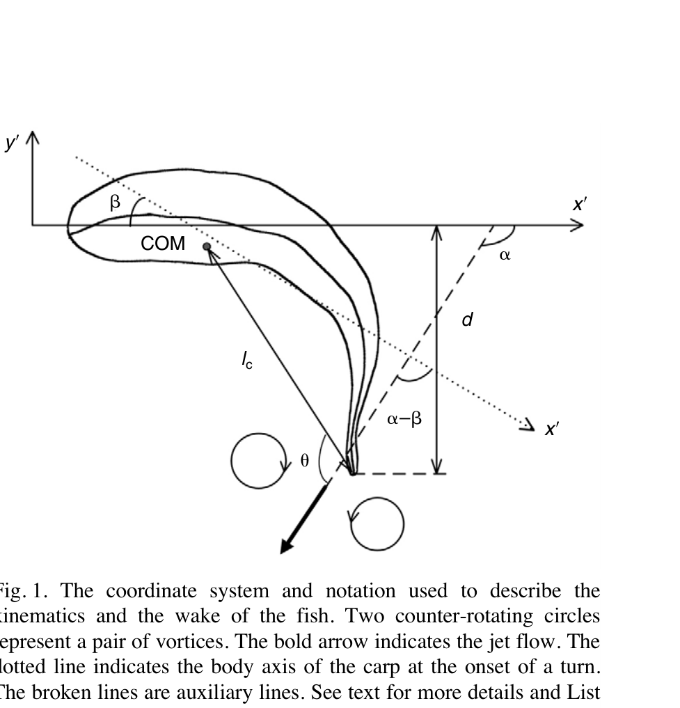

# Các biến động học của một cú rẽ

> **Nguồn chính:** Wu et al. (2007), Fig. 1, tr. 4380.

## Mục tiêu học tập
- Đọc được hệ tọa độ trong nghiên cứu.
- Hiểu β, d, dmax, Rt và U0.
- Phân biệt biến của stage 1 và stage 2.

## 1. Trục thân và góc rẽ

Trục thân được ước lượng từ nửa trước của đường giữa. Sự thay đổi hướng của trục này tạo ra **góc rẽ β**.

## 2. Biên độ uốn

Khoảng lệch ngang từ trục thân tới chóp đuôi là `d`; giá trị lớn nhất là `dmax`. `dmax` là chỉ báo mức thân–đuôi uốn mạnh đến đâu.

## 3. Quỹ đạo và tốc độ

`Rt` là bán kính quỹ đạo COM. `U0` là tốc độ tại thời điểm bắt đầu rẽ.

## 4. Biến theo stage

Nghiên cứu dùng các ký hiệu `β1`, `ω1`, `ΔU1` cho stage 1 và `β2`, `ω2`, `ΔU2` cho stage 2.

## Hình minh họa

## Bài tập tự luyện
1. Trong mô hình animation, biến nào gần nhất với góc xoay hướng của root?
2. Biến nào có thể dùng làm thước đo độ cong thân?
