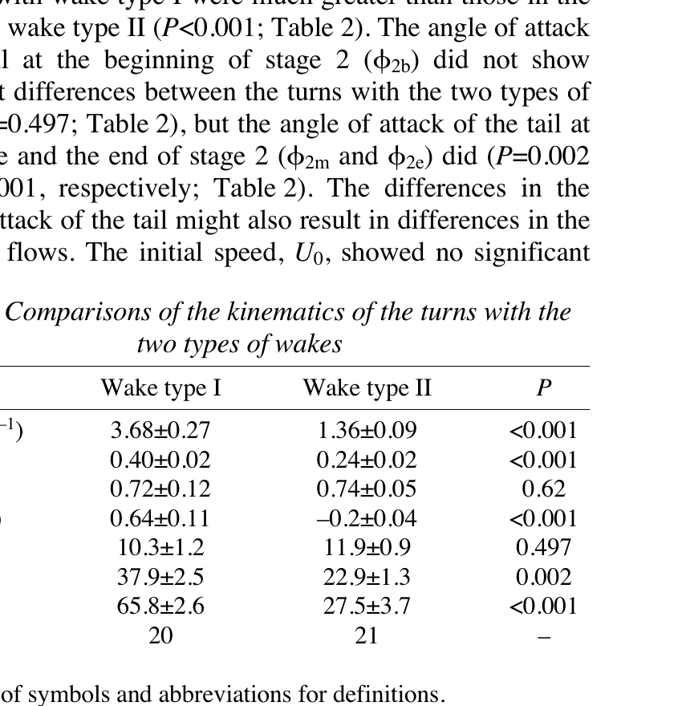

# Stage 2 — hồi thân, đuôi và điều chỉnh tốc độ

> **Nguồn chính:** Wu et al. (2007), tr. 4379, 4380, 4383–4384.

## Mục tiêu học tập
- Mô tả return flip.
- Phân biệt stage 2 của hai kiểu wake.
- Hiểu liên hệ với thrust jet.

## 1. Return flip

Stage 2 là pha thân và đuôi hồi khỏi tư thế cong cực đại.

## 2. Hai kết cục thủy động lực

- Nếu stage 2 tạo thêm vortex ring và **thrust jet**, cá có xu hướng tăng tốc.
- Nếu không tạo thrust jet đáng kể, cá có thể giảm tốc sau cú rẽ.

## 3. Dữ liệu so sánh

Trong các turn có wake type I, `ΔU2` trung bình khoảng **+0,64 L/s**; với wake type II, khoảng **−0,20 L/s**.

## Hình minh họa

## Bài tập tự luyện
1. Stage 2 có thrust jet sẽ ảnh hưởng tốc độ tiến như thế nào?
2. Tại sao hai cú rẽ có cùng ý định đổi hướng vẫn có thể kết thúc với tốc độ khác nhau?
