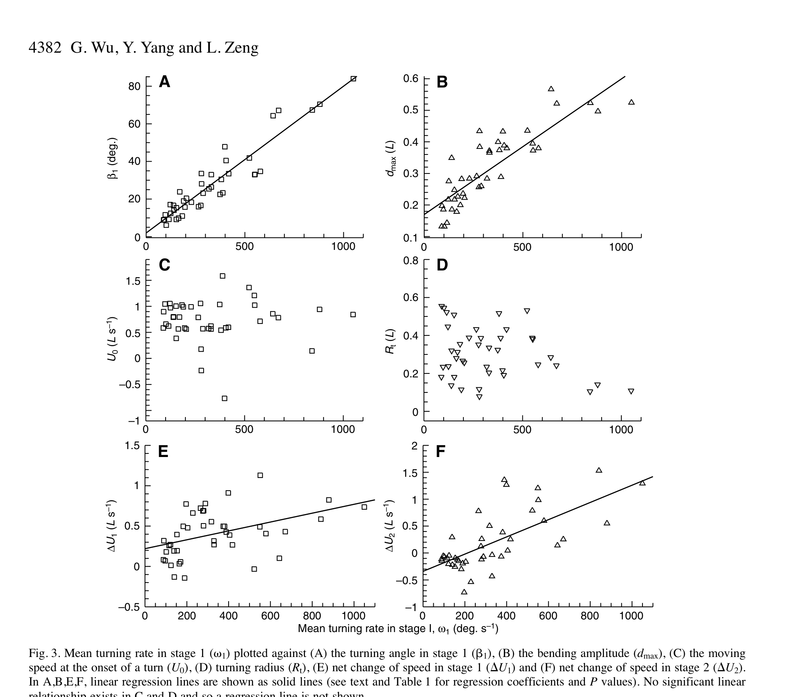

# Tốc độ rẽ, góc rẽ và biên độ uốn

> **Nguồn chính:** Wu et al. (2007), Fig. 3, Table 1, tr. 4382–4383.

## Mục tiêu học tập
- Đọc các quan hệ hồi quy chính.
- Hiểu β1 và dmax tăng theo ω1.
- Nhận biết biến không phụ thuộc rõ vào ω1.

## 1. Góc rẽ stage 1

`β1` có quan hệ tuyến tính mạnh với `ω1` (`r² = 0,887`, `P < 0,001`). Hồi quy trong Table 1 có dạng gần:

```text
β1 ≈ 2,0 + 0,078 · ω1
```

với `β1` tính bằng độ và `ω1` tính bằng độ/giây.

## 2. Biên độ uốn

`dmax/L` cũng tăng đáng kể theo `ω1` (`r² = 0,743`, `P < 0,001`). Cú rẽ càng nhanh, thân cá càng cong chặt.

## 3. Stage 2

`β2` không cho thấy quan hệ tuyến tính có ý nghĩa với `ω1`; điều này củng cố kết luận rằng đổi hướng chính xảy ra ở stage 1.

## Hình minh họa



## Bài tập tự luyện
1. Đọc Fig. 3A và giải thích xu hướng.
2. Vì sao dmax là biến quan trọng khi tái tạo thân cá bằng chuỗi xương?
