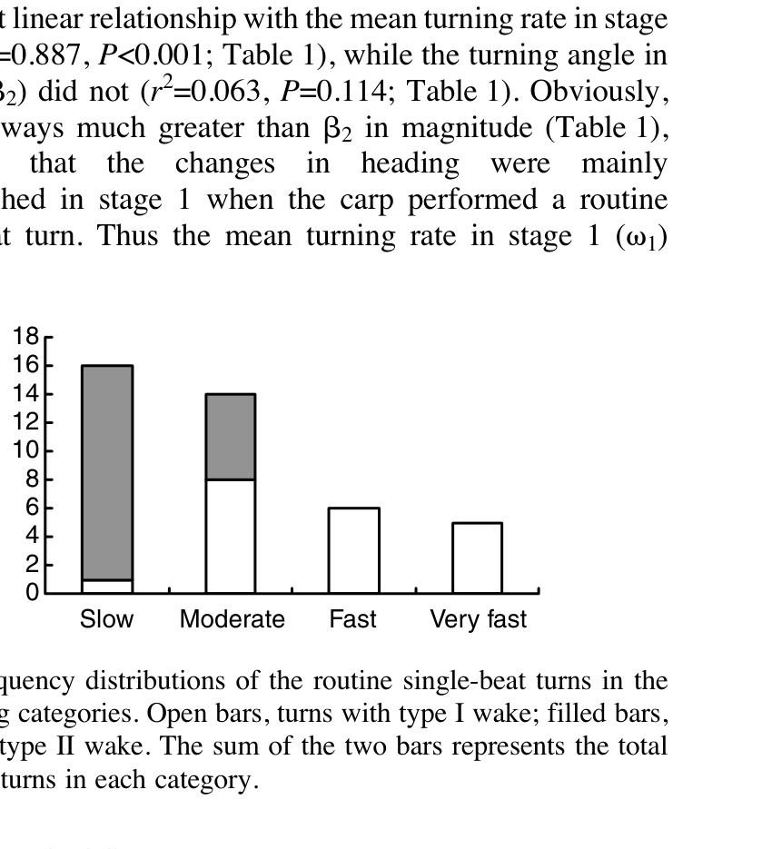

# Tốc độ bơi, bán kính rẽ và bốn mức cường độ

> **Nguồn chính:** Wu et al. (2007), Fig. 2–3, tr. 4381–4382.

## Mục tiêu học tập
- Nhớ bốn nhóm tốc độ rẽ.
- Hiểu quan hệ giữa U0 và ω1.
- Hiểu trường hợp very fast turn.

## 1. Bốn nhóm turning rate

- Slow: **0–200°/s**
- Moderate: **200–400°/s**
- Fast: **400–600°/s**
- Very fast: **>600°/s**

Trong quan sát tự phát, slow và moderate xuất hiện nhiều hơn fast và very fast.

## 2. Tốc độ ban đầu

`U0` trải rộng nhưng gần như không liên hệ với `ω1` (`r² ≈ 0,00007`, `P = 0,958`). Vì vậy, cá có thể thực hiện single-beat turn ở nhiều tốc độ tiến khác nhau.

## 3. Bán kính rẽ

`Rt` nằm khoảng **0,08–0,55 L**. Nhìn chung, bán kính không phụ thuộc rõ vào tốc độ bơi và cũng không phụ thuộc rõ vào turning rate, ngoại trừ nhóm very fast có bán kính nhỏ hơn đáng kể.

## Hình minh họa

## Bài tập tự luyện
1. Một cá đang bơi chậm có bắt buộc rẽ chậm không? Dựa trên dữ liệu nghiên cứu.
2. Nhóm nào có xu hướng bán kính rẽ nhỏ hơn?
