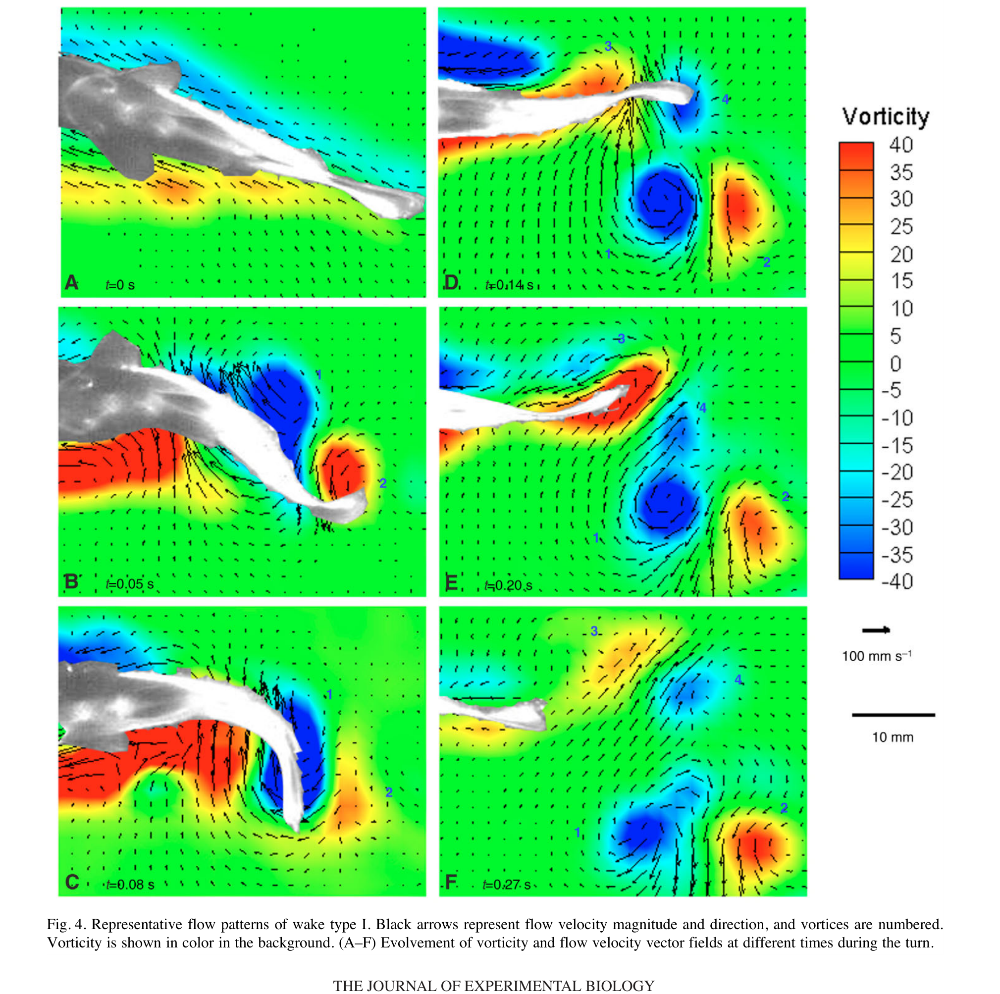

# Side jet, moment quay và hiệu quả đổi hướng

> **Nguồn chính:** Wu et al. (2007), tr. 4384–4387.

## Mục tiêu học tập
- Hiểu side jet hình thành ở stage 1.
- Nắm hai góc gần 90°.
- Giải thích ý nghĩa cơ học của chúng.

## 1. Side jet

Trong stage 1, các vortex được tách khỏi thân–đuôi và tạo một dòng jet gần phương ngang. Dòng này mang động lượng theo hướng phù hợp để tạo moment quay cho cá.

## 2. Góc tương đối với hướng ban đầu

Góc giữa side jet và hướng ban đầu của cá gần như ổn định: **94,2 ± 3,1°** (`N=41`).

## 3. Góc moment arm

Góc giữa jet và đường COM–mép sau đuôi cũng gần 90°: **95,3 ± 1,3°**. Hình học này làm `sin(θ)` gần 1, giúp moment xung lớn.

## Hình minh họa

## Bài tập tự luyện
1. Giải thích bằng công thức Li1 vì sao θ≈90° có lợi.
2. Side jet chủ yếu phục vụ đổi hướng hay tăng tốc tiến?
