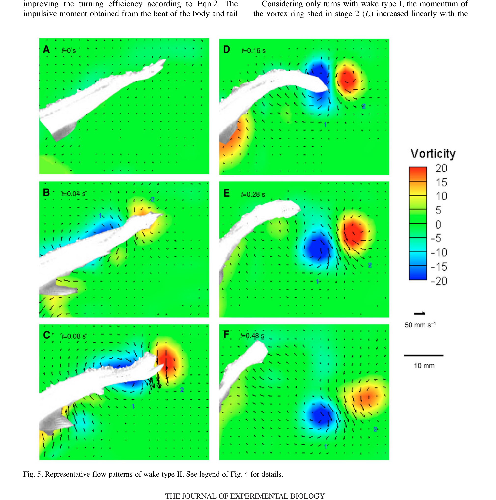

# Wake type I và wake type II

> **Nguồn chính:** Wu et al. (2007), Fig. 4–5, Table 2, tr. 4383–4385.

## Mục tiêu học tập
- Phân biệt hai wake.
- Nhận biết thrust jet.
- Liên hệ wake với mức cường độ rẽ.

## 1. Wake type I

Stage 1 tạo vortex pair và side jet. Trong stage 2 xuất hiện thêm vortex pair và **thrust jet** có thành phần hướng về sau, từ đó tạo lực đẩy tiến.

## 2. Wake type II

Stage 1 vẫn có side jet, nhưng stage 2 không hình thành vortex/thrust jet đáng kể.

## 3. Tần suất theo cường độ

Fast và very fast turn tạo type I trong mẫu nghiên cứu; type II xuất hiện thường xuyên hơn ở slow và moderate turn.

## Hình minh họa

## Bài tập tự luyện
1. Điểm khác biệt quyết định giữa type I và type II nằm ở stage nào?
2. Nếu animation chỉ cần cú rẽ nhẹ, wake type nào gần dữ liệu hơn?
