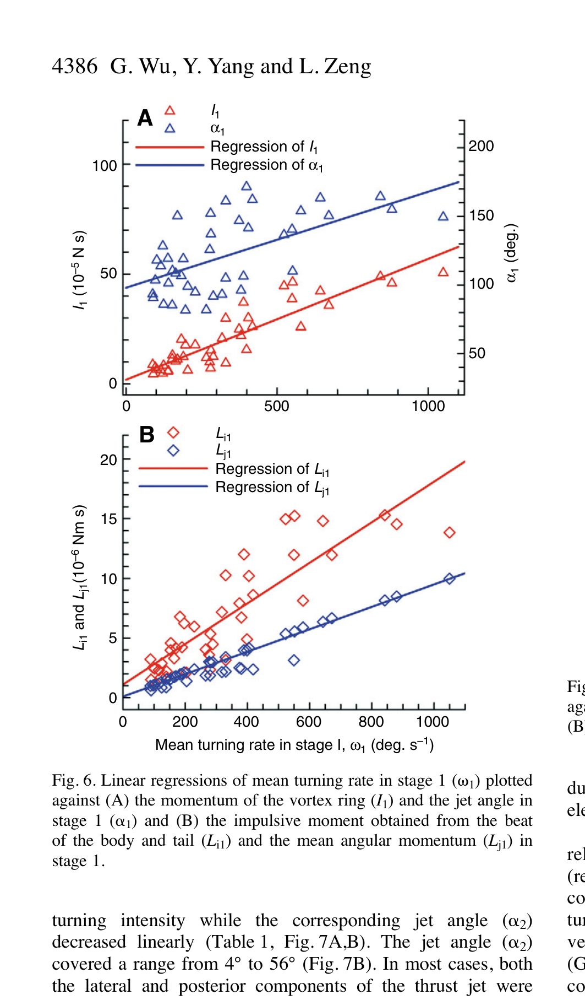

# Động lượng, phản lực và tổn thất moment

> **Nguồn chính:** Wu et al. (2007), Fig. 6–7, tr. 4385–4387.

## Mục tiêu học tập
- Hiểu I1 và Li1 tăng theo ω1.
- Hiểu chênh lệch Li1–Lj1.
- Mô tả xu hướng stage 2 khi cường độ rẽ tăng.

## 1. Stage 1

Động lượng vortex ring `I1`, moment xung `Li1` và động lượng góc của cá `Lj1` đều tăng khi `ω1` tăng.

## 2. Phần moment không chuyển thành chuyển động quay

Tỷ lệ `(Li1 − Lj1) / Li1` trung bình khoảng **0,52 ± 0,03** và không thay đổi có ý nghĩa theo turning rate. Bài báo quy phần chênh lệch lớn này chủ yếu cho drag và acceleration reaction, đồng thời thừa nhận sai số đo/ước lượng.

## 3. Stage 2

Ở các turn type I, `I2` tăng theo cường độ rẽ, còn jet angle stage 2 giảm. Khi jet dần hướng về phía sau hơn, thành phần tạo lực đẩy tiến tăng.

## Hình minh họa

## Bài tập tự luyện
1. Tại sao Li1 không bằng hoàn toàn Lj1?
2. Khi jet angle stage 2 giảm, thành phần lực theo phương tiến thay đổi thế nào?
