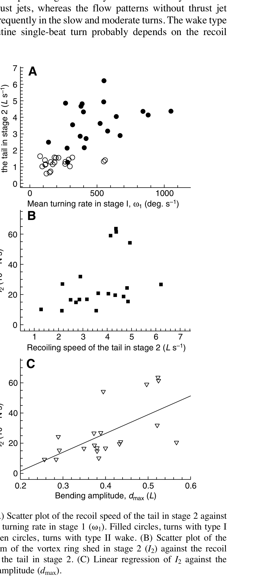

# Recoil speed, biên độ uốn và góc tấn của đuôi

> **Nguồn chính:** Wu et al. (2007), Table 2, Fig. 8, tr. 4383, 4387–4388.

## Mục tiêu học tập
- So sánh các biến giữa hai wake.
- Hiểu vai trò của recoil speed.
- Hiểu vai trò của angle of attack.

## 1. Recoil speed

Recoil speed của đuôi trong type I cao hơn rõ rệt type II:

- Type I: **3,68 ± 0,27 L/s**
- Type II: **1,36 ± 0,09 L/s**

## 2. Biên độ uốn

`dmax` trung bình:

- Type I: **0,40 ± 0,02 L**
- Type II: **0,24 ± 0,02 L**

## 3. Góc tấn của đuôi

Góc tấn ở đầu stage 2 không khác có ý nghĩa, nhưng ở giữa và cuối stage 2 thì type I lớn hơn rõ rệt. Vì vậy, không chỉ tốc độ hồi đuôi mà cả hướng tương tác của đuôi với nước đều liên quan đến wake.

## Hình minh họa

## Bài tập tự luyện
1. Biến nào cho thấy khác biệt lớn nhất trực quan giữa hai wake?
2. Vì sao angle of attack cần được kiểm soát trong mô phỏng vật lý?
