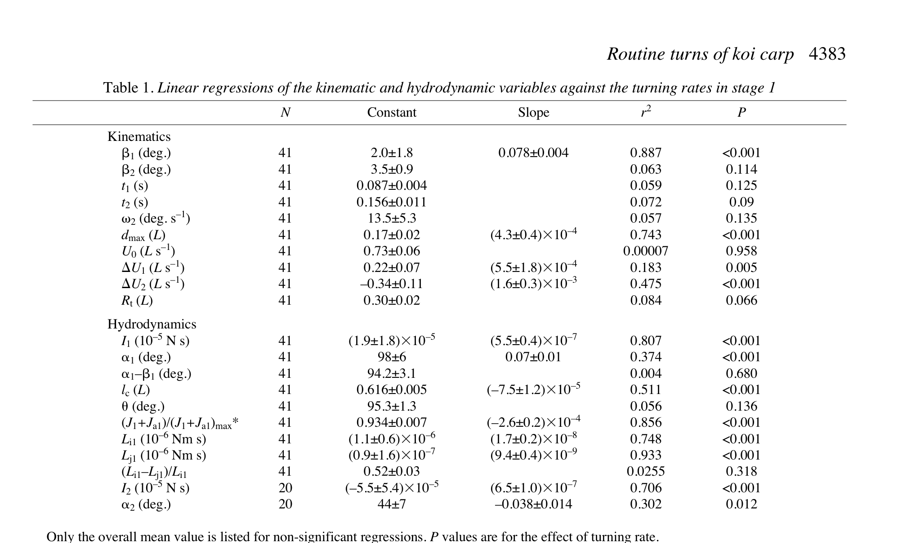

# Mini project — tái tạo routine single-beat turn

> **Nguồn chính:** Tổng hợp Wu et al. (2007), Fig. 1–8, Table 1–2.

## Mục tiêu học tập
- Tạo mô hình tham số cho một cú rẽ.
- Dùng số liệu nguồn để giải thích lựa chọn.
- Tự đánh giá sai lệch so với nghiên cứu.

## 1. Nhiệm vụ

Tạo một mô phỏng hoặc animation ngắn của routine single-beat turn với hai preset:

- **Preset A:** moderate / wake type II.
- **Preset B:** fast / wake type I.

## 2. Deliverables

Mỗi preset cần ghi:

- `ω1`;
- `β1`;
- `dmax/L`;
- `t1`, `t2`;
- `Rt/L`;
- recoil speed stage 2;
- trạng thái có/không có thrust-like acceleration sau rẽ.

## 3. Ràng buộc dữ liệu

Các biến phải nằm trong hoặc được giải thích dựa trên phạm vi của nghiên cứu. Nếu cố ý stylize vượt phạm vi, phải đánh dấu rõ là lựa chọn nghệ thuật.

## 4. Rubric

| Tiêu chí | Điểm |
|---|---:|
| Đúng cấu trúc stage 1/stage 2 | 25 |
| Quan hệ ω1–β1–dmax hợp lý | 20 |
| Quỹ đạo và Rt hợp lý | 15 |
| Phân biệt wake I/II trong stage 2 | 20 |
| Ghi nguồn và giải thích sai lệch | 20 |
| **Tổng** | **100** |

## Hình minh họa

## Bài tập tự luyện
1. Sau khi hoàn thành, viết 5 câu giải thích preset nào gần dữ liệu type I hơn và vì sao.
