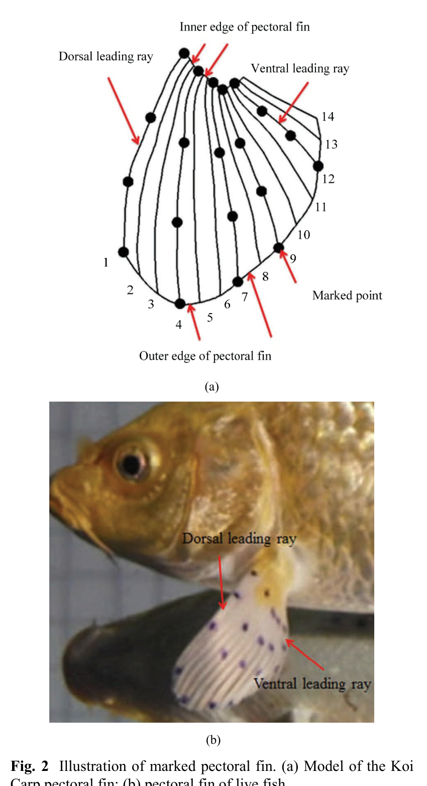

# Cấu trúc tia vây và hệ điểm theo dõi
## Mục tiêu học tập
- Nhận biết các vùng chính của vây ngực Koi.
- Hiểu cách paper chọn các tia vây đại diện.
- Giải thích lý do phải theo dõi nhiều tia vây.

## Nội dung bài học

### 14 tia vây

Theo Fig. 2, vây ngực cá Koi trong thí nghiệm có **14 fin rays**. Tia gần phía lưng được gọi là **dorsal leading ray**, tia gần phía bụng là **ventral leading ray**.

### Biên trong và biên ngoài

**Inner edge** là phần sát thân cá; **outer edge** là phần xa thân cá. Paper đánh dấu 20 điểm trên một mặt vây để theo dõi biến dạng.

### Năm tia đại diện

Để tái tạo chuyển động dạng sóng, paper chọn năm tia tại các vị trí 1, 4, 7, 9 và 12. Chúng tạo một tập mẫu trải từ phía dorsal tới phía ventral của vây.

## Điểm cần ghi nhớ
- Vây ngực được mô hình hóa như một hệ nhiều tia mềm chứ không phải tấm cứng.
- Dorsal leading ray và ventral leading ray có độ mềm và biến dạng khác nhau.
- Các tia 1, 4, 7, 9, 12 là tập đại diện chính trong phân tích góc.

## Bài tập tự luyện
1. Vẽ lại vây 14 tia và đánh dấu năm tia 1, 4, 7, 9, 12.
2. Nếu rig chỉ có 5 control bones, hãy đề xuất cách nội suy chuyển động cho các tia còn lại.

## Đối chiếu nguồn

Paper trang 212, Fig. 2 và phần đánh dấu fin rays.
