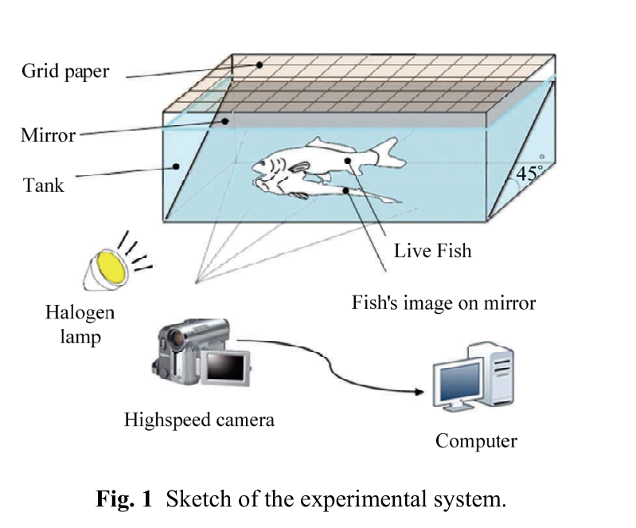

# Hệ thống chụp hai góc nhìn bằng một camera
## Mục tiêu học tập
- Mô tả hệ thí nghiệm.
- Hiểu vai trò của gương 45 độ.
- Nắm thông số chính của camera và bể.

## Nội dung bài học

### Bố trí thí nghiệm

Hệ thống gồm bể trong suốt, gương đặt nghiêng **45°**, camera tốc độ cao và hai đèn halogen. Gương cho phép ghi đồng thời hình thật và hình phản chiếu, từ đó tạo hai góc nhìn đồng bộ.

### Thông số

Bể có kích thước **90 × 45 × 35 cm**. Camera CASIO EX-F1 có thể ghi tới **60 fps** ở độ phân giải **2816 × 2112**. Lưới 10 × 10 mm được dùng làm tham chiếu không gian.

### Ý nghĩa đối với 3D

Hai hình chiếu đồng bộ giúp lấy hai cặp tọa độ 2D khác nhau của cùng một điểm trên tia vây, làm cơ sở dựng tọa độ 3D.

## Điểm cần ghi nhớ
- Gương 45° giải quyết bài toán đồng bộ hai góc nhìn với chỉ một camera.
- Lưới chuẩn là cơ sở quy đổi từ pixel sang kích thước thực.
- Thí nghiệm ưu tiên theo dõi vây ngực trong môi trường bơi tự do.

## Bài tập tự luyện
1. Vì sao dùng hai camera độc lập có thể tạo sai số đồng bộ?
2. Thiết kế sơ đồ tương tự nếu muốn quay ở 120 fps.

## Đối chiếu nguồn

Paper trang 211, mục 2.1 và Fig. 1.
