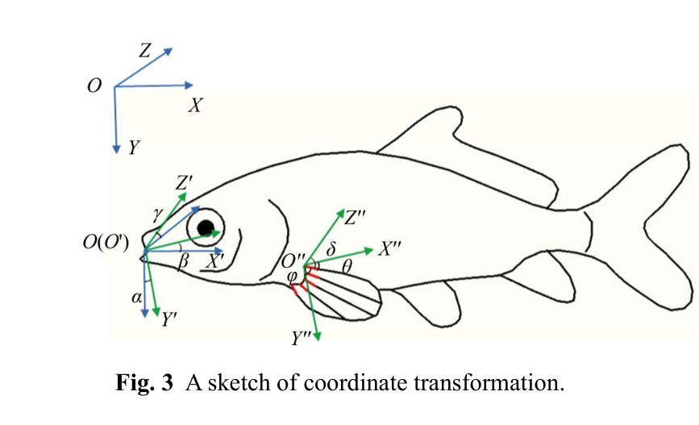

# Hệ tọa độ và biến đổi 3D của vây ngực
## Mục tiêu học tập
- Phân biệt hệ tọa độ bể và hệ tọa độ gắn với cá.
- Hiểu ý nghĩa các góc định hướng.
- Biết cách hai hình chiếu tạo một điểm 3D.

## Nội dung bài học

### Ba hệ tọa độ

Paper dùng hệ cố định **OXYZ**, hệ cục bộ gắn với thân cá **O'X'Y'Z'**, và hệ tịnh tiến **O''X''Y''Z''**. Trục $X'$ luôn hướng từ đầu tới đuôi; $Y'$ theo chiều dorsal tới ventral; $Z'$ vuông góc thân.

### Các góc định hướng

Các góc $\alpha$, $\beta$, $\gamma$ mô tả quan hệ định hướng giữa hệ toàn cục và hệ cục bộ. Các góc $\theta$, $\phi$, $\delta$ mô tả hướng gốc tia vây đối với ba trục cục bộ.

### Ghép hai hình chiếu

Hình nhìn trước cung cấp $X',Y'$, còn hình phản chiếu/bottom view cung cấp $X',Z'$. Từ đó có thể suy ra tọa độ 3D của điểm và chuyển về hệ OXYZ bằng ma trận quay-tịnh tiến.

## Điểm cần ghi nhớ
- Phải tách chuyển động của cá khỏi chuyển động tương đối của vây.
- Một hệ rig tốt nên có local coordinates gắn với thân cá.
- Các góc gốc tia vây là tham số điều khiển hữu ích hơn tọa độ thế giới.

## Bài tập tự luyện
1. Vẽ lại ba hệ tọa độ OXYZ, O'X'Y'Z' và O''X''Y''Z''.
2. Giải thích tại sao animation vây nên được authored trong local space.

## Đối chiếu nguồn

Paper trang 212-213, Fig. 3 và phương trình (4).
