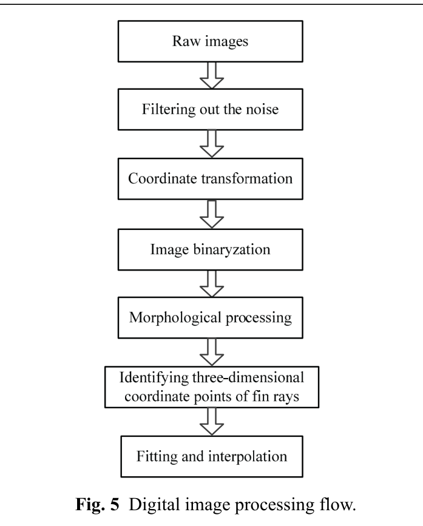

# Quy trình xử lý ảnh và tái tạo bề mặt vây
## Mục tiêu học tập
- Nắm pipeline xử lý ảnh của nghiên cứu.
- Hiểu vai trò của morphology.
- Biết cách từ marker 2D dựng surface 3D.

## Nội dung bài học

### Pipeline

Quy trình gồm: ảnh thô → lọc nhiễu → biến đổi tọa độ → nhị phân hóa → xử lý hình thái → nhận diện điểm 3D của tia vây → fitting và interpolation.

### Xử lý hình thái

Do các gốc tia vây chồng lên nhau, ảnh nhị phân đơn thuần chưa đủ. Paper dùng dilation, erosion, opening và closing để tách cấu trúc.

### Dựng bề mặt

Sau khi lấy tọa độ 3D các marker, các điểm được nội suy theo hướng span-wise và chord-wise để tái tạo bề mặt vây.

## Điểm cần ghi nhớ
- Tái tạo vây cần cả bước đo, làm sạch dữ liệu và nội suy.
- Morphological operations xử lý vấn đề các tia vây chồng nhau.
- Bề mặt 3D là kết quả của các marker, không phải quét toàn bộ vây liên tục.

## Bài tập tự luyện
1. Viết lại pipeline thành pseudocode 7 bước.
2. Nêu một nguồn sai số khi marker bị che khuất.

## Đối chiếu nguồn

Paper trang 213-214, mục 2.3 và Fig. 5.
