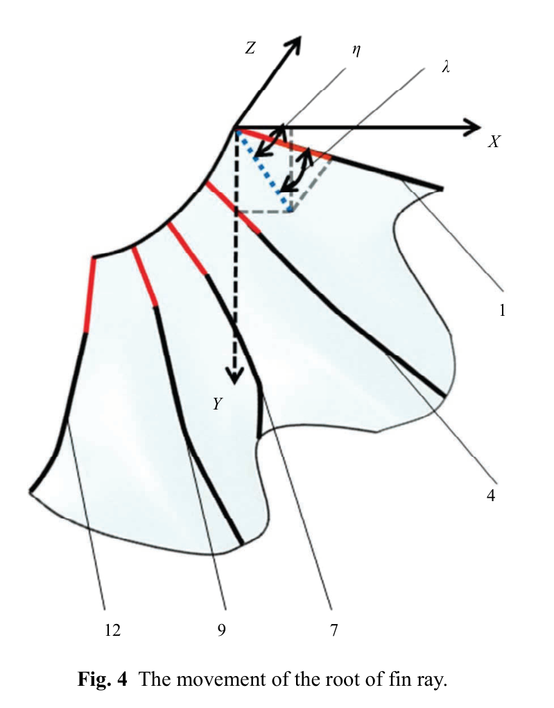

# Tham số hóa chuyển động gốc tia vây
## Mục tiêu học tập
- Hiểu vì sao paper tập trung vào root của fin ray.
- Nắm ý nghĩa $\theta,\phi,\delta,\eta,\lambda$.
- Liên hệ các góc với location và deformation.

## Nội dung bài học

### Tại sao đo root

Gốc tia vây dày và cứng hơn đầu tia, nên biến dạng do thủy động lực nhỏ hơn. Paper vì thế dùng chuyển động gốc tia để mô tả điều khiển chủ động tốt hơn.

### Hai lớp tham số

$\theta,\phi,\delta$ xác định **location/orientation** của fin ray. Trong khi đó $\eta$ và $\lambda$ đặc trưng cho **expansion** và **undulation** của bề mặt.

### Cơ chế uốn

Tia vây có cấu trúc bi-laminar; tác động cơ ở gốc hemitrichs gây uốn. Chuyển động quan sát được là kết quả đồng thời của lực cơ và lực thủy động.

## Điểm cần ghi nhớ
- Không nên điều khiển toàn bộ vây chỉ bằng một Euler rotation.
- Cần phân biệt pose gốc tia và biến dạng dọc tia.
- $\eta$ và $\lambda$ là hai tín hiệu quan trọng để dựng deformation field.

## Bài tập tự luyện
1. Lập bảng ánh xạ mỗi góc sang một property trong rig.
2. Nêu lý do đầu tia nên có độ trễ lớn hơn gốc tia.

## Đối chiếu nguồn

Paper trang 213, Fig. 4 và phần mô tả fin-ray root.
