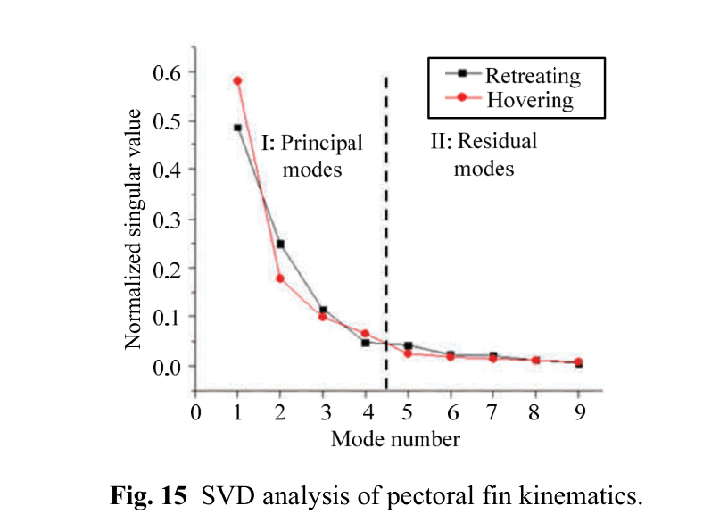

# SVD và mô hình hóa chuyển động chiều thấp
## Mục tiêu học tập
- Hiểu mục đích SVD trong paper.
- Nắm cách trích mode từ chuỗi 3D.
- Hiểu kết quả bốn mode đầu chiếm hơn 90%.

## Nội dung bài học

### Ma trận dữ liệu

Mỗi chu kỳ dùng 9 ảnh và 20 marker; mỗi marker đóng góp tọa độ 3D. Dữ liệu được xếp vào ma trận và phân rã theo $G=UDV^*$.

### Trích mode

Các singular values được xếp giảm dần. Muốn tái tạo mode thứ $K$, paper giữ singular value tương ứng và đặt các singular values khác về 0 rồi tái tạo.

### Kết quả chiều thấp

Trong cả retreating và hovering, **Modes 1-4 chiếm trên 90% tổng singular values**. Điều này cho phép mô tả phần lớn hình thái chuyển động bằng một tập mode nhỏ.

## Điểm cần ghi nhớ
- SVD biến chuỗi biến dạng phức tạp thành vài mode có ý nghĩa.
- Modes 5-9 được xem là residual modes trong phân tích của paper.
- Mô hình low-dimensional là cơ sở tốt cho controller gọn.

## Bài tập tự luyện
1. Giải thích tại sao SVD phù hợp với animation blendshape.
2. Nếu 4 mode chiếm >90%, đề xuất cách phân bổ 4 custom properties.

## Đối chiếu nguồn

Paper trang 214, 219-220, mục 2.4, Fig. 15.
