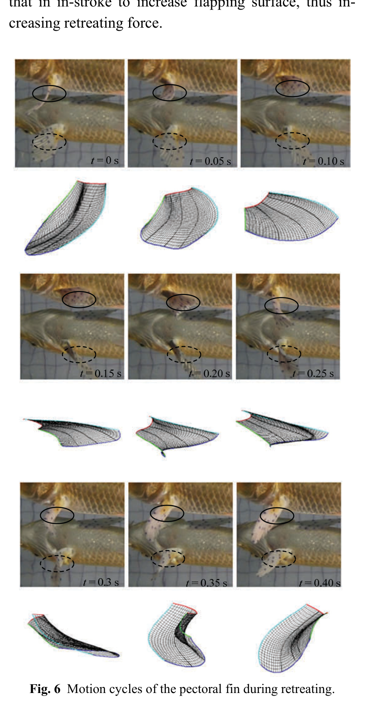

# Chu kỳ vây ngực khi cá Koi lùi
## Mục tiêu học tập
- Phân chia chu kỳ retreating theo thời gian.
- Hiểu khác biệt in-stroke và out-stroke.
- Nắm nguyên lý thay đổi diện tích quạt.

## Nội dung bài học

### Chu kỳ 0,4 giây

Các ảnh liên tiếp cách nhau 50 ms. In-stroke được quan sát ở 0, 0.05, 0.10, 0.15 s; 0.20 s là tư thế chuyển tiếp; out-stroke ở 0.25-0.40 s.

### In-stroke

Vây **co nhanh** để giảm diện tích quạt, nhờ đó giảm lực cản trong pha thu vây.

### Out-stroke

Vây **mở chậm hơn** để tăng diện tích bề mặt và tăng lực phục vụ chuyển động lùi.

## Điểm cần ghi nhớ
- Retreating là chu kỳ bất đối xứng về tốc độ co/mở.
- Thời điểm 0.20 s đóng vai trò chuyển tiếp rõ rệt.
- Diện tích vây được điều biến chủ động giữa hai pha.

## Bài tập tự luyện
1. Chuyển chu kỳ 0,4 s sang số frame ở 24 fps và 30 fps.
2. Thiết kế easing khác nhau cho in-stroke và out-stroke.

## Đối chiếu nguồn

Paper trang 215, mục 3.1.1 và Fig. 6.
