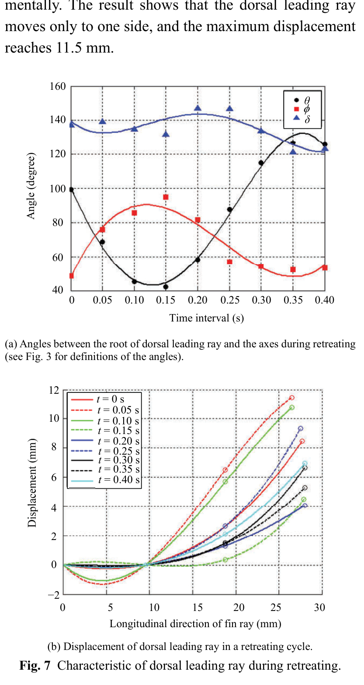

# Dorsal leading ray trong retreating
## Mục tiêu học tập
- Đọc xu hướng góc của dorsal leading ray.
- Nắm độ biến dạng tối đa được báo cáo.
- Hiểu sự khác nhau giữa các pha.

## Nội dung bài học

### Xu hướng góc

Trong in-stroke, $\theta$ giảm còn $\phi$ tăng. Sang out-stroke, $\theta$ tăng dần tới cực đại còn $\phi$ giảm về gần giá trị ban đầu. $\delta$ thay đổi không rõ rệt.

### Độ lệch

Dorsal leading ray chủ yếu lệch về **một phía** trong chu kỳ. Độ dịch chuyển lớn nhất được báo cáo khoảng **11,5 mm**.

### Ý nghĩa

Dorsal leading ray đóng vai trò như biên dẫn cứng hơn, giúp định hình tổng thể vây trong khi các tia mềm hơn theo sau.

## Điểm cần ghi nhớ
- Dorsal leading ray có quỹ đạo khá có cấu trúc.
- Biến dạng không đồng nhất giữa các tia.
- 11,5 mm là giá trị đo trên mẫu thí nghiệm, không phải scale cố định cho mọi cá Koi.

## Bài tập tự luyện
1. Mô tả bằng lời một curve animation cho $\theta(t)$.
2. Giải thích vì sao không nên copy cùng curve sang ventral leading ray.

## Đối chiếu nguồn

Paper trang 215, Fig. 7.
