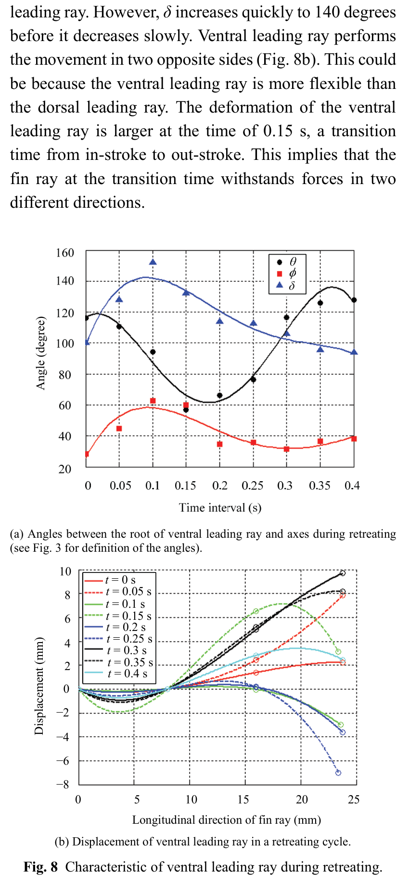

# Ventral leading ray trong retreating
## Mục tiêu học tập
- So sánh ventral với dorsal leading ray.
- Nắm đặc điểm biến dạng hai phía.
- Hiểu sự kiện chuyển pha tại 0,15 s.

## Nội dung bài học

### Độ mềm cao hơn

Paper nhận thấy ventral leading ray linh hoạt hơn dorsal leading ray. $\delta$ tăng nhanh tới khoảng **140°** rồi giảm chậm.

### Chuyển động hai phía

Khác dorsal leading ray, ventral leading ray biến dạng theo **hai phía đối nhau**.

### Thời điểm 0,15 s

Biến dạng lớn xuất hiện quanh 0,15 s, là thời điểm chuyển từ in-stroke sang out-stroke. Tác giả diễn giải đây là lúc tia chịu lực theo hai hướng khác nhau.

## Điểm cần ghi nhớ
- Ventral leading ray không nên rig cứng giống dorsal leading ray.
- Transition frame là điểm quan trọng của deformation.
- Độ mềm tăng từ dorsal toward ventral là một gợi ý thiết kế controller.

## Bài tập tự luyện
1. Đề xuất stiffness ratio tương đối giữa dorsal và ventral control mà không gán giá trị vật lý tuyệt đối.
2. Mô tả cách tạo overshoot ở transition 0,15 s.

## Đối chiếu nguồn

Paper trang 216, Fig. 8.
