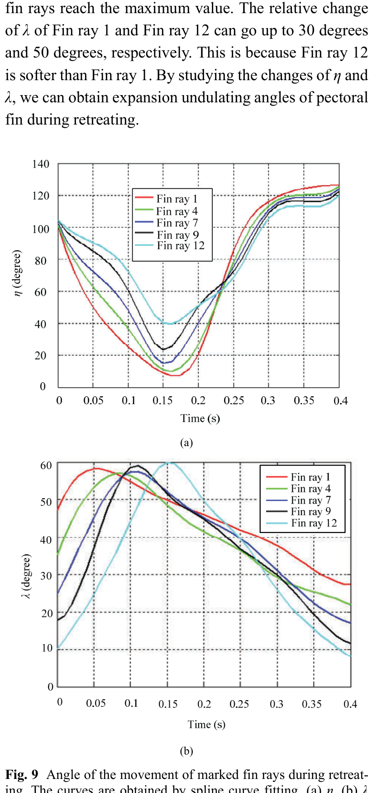

# Expansion và undulation trong retreating
## Mục tiêu học tập
- Hiểu diễn biến $\eta$ và $\lambda$.
- Nắm sự trễ pha giữa các tia.
- Biết các biên độ tương đối quan trọng.

## Nội dung bài học

### Expansion angle $\eta$

Từ 0 đến 0,15 s, $\eta$ giảm; từ 0,15 đến 0,4 s, $\eta$ tăng. Ở 0,15 s, fin ray 1 đạt khoảng 10° còn fin ray 12 khoảng 40°.

### Biên độ thay đổi

Trong một chu kỳ, độ thay đổi tương đối của $\eta$ ở fin ray 1 và fin ray 12 lần lượt đạt khoảng **120°** và **80°**.

### Undulation angle $\lambda$

Các tia không đạt cực đại cùng lúc mà có **delay** từ fin ray 1 tới fin ray 12. Độ thay đổi $\lambda$ có thể tới khoảng 30° ở ray 1 và 50° ở ray 12.

## Điểm cần ghi nhớ
- Undulation là hiệu ứng lan pha, không phải các tia đồng bộ tuyệt đối.
- Fin ray 12 mềm hơn và có biên độ $\lambda$ lớn hơn.
- Expansion và undulation phối hợp để tạo diện tích và hình dạng quạt.

## Bài tập tự luyện
1. Tạo bảng keyframe phase offset cho 5 tia 1,4,7,9,12.
2. Giải thích vì sao delay giữa các tia làm vây trông tự nhiên hơn.

## Đối chiếu nguồn

Paper trang 216, Fig. 9.
