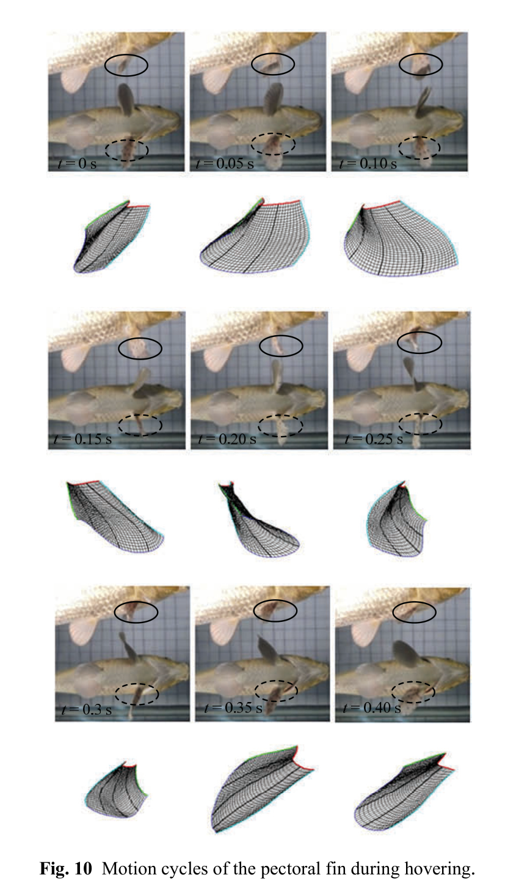

# Chu kỳ vây ngực khi hovering
## Mục tiêu học tập
- Phân chia chu kỳ hovering.
- So sánh với retreating.
- Hiểu mục đích điều biến diện tích vây.

## Nội dung bài học

### Hai pha

Hovering cũng được chia thành hai pha: **out-stroke** ở 0-0,15 s và **in-stroke** ở 0,20-0,40 s.

### Out-stroke

Vây mở **đột ngột** để tăng diện tích quạt, sau đó diện tích dần giảm.

### In-stroke

Trong in-stroke, vây mở/điều chỉnh chậm hơn. Sự biến thiên tuần hoàn diện tích vây hỗ trợ cá duy trì vị trí trong nước.

## Điểm cần ghi nhớ
- Thứ tự pha của hovering khác retreating.
- Hovering dựa mạnh vào vây ngực trong quan sát của paper; các vây khác gần như đứng yên.
- Biến thiên diện tích là tín hiệu điều khiển quan trọng.

## Bài tập tự luyện
1. So sánh sơ đồ timing retreating và hovering.
2. Tạo một loop hovering 0,4 s không có snap ở điểm nối.

## Đối chiếu nguồn

Paper trang 217, mục 3.1.2 và Fig. 10.
