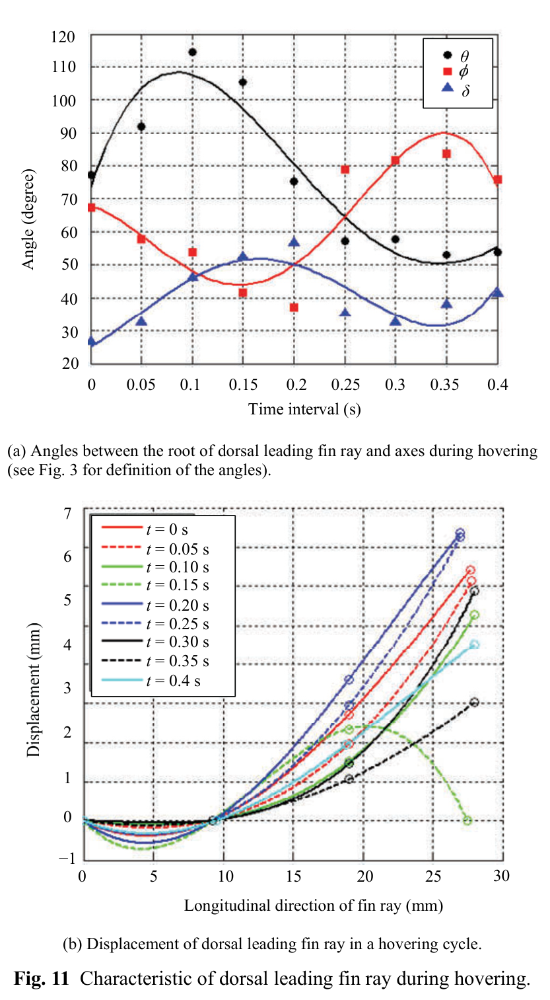

# Dorsal và ventral leading rays trong hovering
## Mục tiêu học tập
- Nắm xu hướng các góc trong hovering.
- So sánh độ biến dạng dorsal/ventral.
- Xác định các transition quan trọng.

## Nội dung bài học

### Dorsal leading ray

Ở dorsal leading ray, $\theta$ và $\delta$ tăng trong out-stroke rồi giảm trong in-stroke; $\phi$ có xu hướng ngược lại. Tia chủ yếu lệch một phía, ngoại trừ vùng chuyển tiếp khoảng 0,15 s.

### Ventral leading ray

Ở ventral leading ray, $\phi$ và $\delta$ giảm rồi tăng; $\theta$ có thể tiến gần **90°**. Biến dạng ventral lớn hơn dorsal.

### Transition

Paper nhấn mạnh các thời điểm chuyển pha có biến dạng mạnh, cho thấy thay đổi hướng lực trên tia vây.

## Điểm cần ghi nhớ
- Hai leading rays không có cùng compliance.
- Hovering cũng cần phase transition rõ, không phải sinus đơn giản.
- Các góc orientation và deformation nên được điều khiển tách biệt.

## Bài tập tự luyện
1. Tạo một sơ đồ qualitative curve cho $\theta,\phi,\delta$.
2. Nêu 2 cách làm transition mềm trong Graph Editor.

## Đối chiếu nguồn

Paper trang 217-218, Fig. 11 và Fig. 12.
