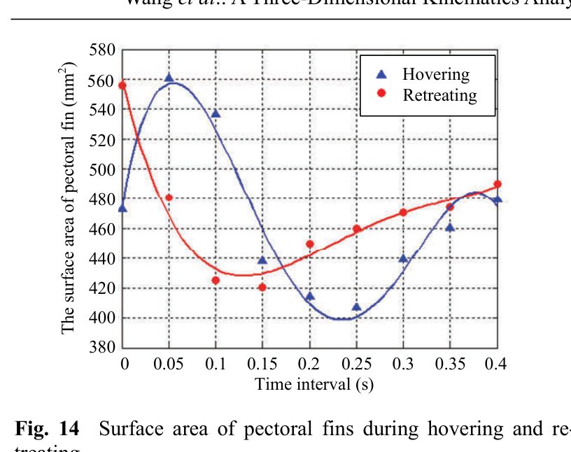

# Expansion, undulation và diện tích vây trong hovering
## Mục tiêu học tập
- Nắm biên độ góc trong hovering.
- Hiểu quan hệ giữa mode biến dạng và diện tích.
- So sánh với retreating.

## Nội dung bài học

### Góc $\eta$ và $\lambda$

Trong hovering, thay đổi $\eta$ của fin ray 1 và 12 đạt khoảng **95°** và **45°**. Độ thay đổi $\lambda$ của cả hai có thể khoảng **25°**, nhỏ hơn mức được báo cáo trong retreating.

### Độ trễ pha

Tương tự retreating, các tia đạt cực trị $\lambda$ với độ trễ khác nhau. Điều này duy trì cảm giác sóng chạy trên vây.

### Diện tích bề mặt

Fig. 14 cho thấy diện tích vây biến thiên theo chu kỳ khác nhau giữa hovering và retreating. Paper dùng MATLAB tri-mesh để ước lượng area từ bề mặt 3D tái tạo.

## Điểm cần ghi nhớ
- Hovering có undulation nhẹ hơn retreating theo dữ liệu paper.
- Diện tích vây là đại lượng tổng hợp quan trọng để mô tả gait.
- Không nên đồng nhất 'mở vây' với một góc duy nhất.

## Bài tập tự luyện
1. So sánh định tính hai đường area ở Fig. 14.
2. Đề xuất một driver lấy expansion làm biến chính và cupping làm hiệu chỉnh area.

## Đối chiếu nguồn

Paper trang 218-219, Fig. 13 và Fig. 14.
