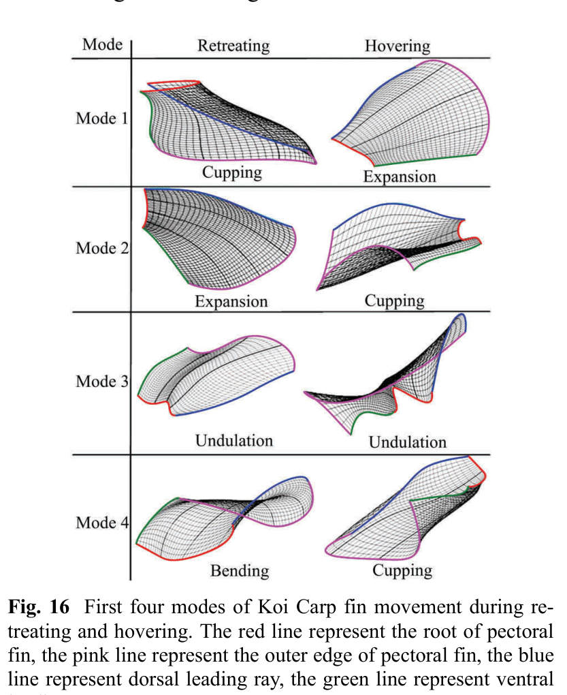

# Bốn mode cơ bản của vây ngực Koi
## Mục tiêu học tập
- Nhận biết hình học của bốn mode.
- Hiểu khác biệt mode trong retreating và hovering.
- Nắm ý nghĩa của mô hình low-dimensional.

## Nội dung bài học

### Expansion

Các tia mở theo hướng span-wise, làm tăng bề mặt quạt.

### Cupping

Hai leading rays cùng tạo độ cong theo phương vuông góc bề mặt, khiến vây có dạng lòng/chén hoặc gần hình trụ cong.

### Undulation

Các tia kề nhau chuyển động với phase khác nhau, tạo bề mặt dạng **W** và sóng lan qua vây.

### Bending

Các tia cùng uốn làm bề mặt vây có dạng gần parabolic.

### Khác nhau giữa gait

Trong retreating, Mode 1-4 lần lượt được mô tả là cupping, expansion, undulation, bending. Trong hovering, Mode 1 là expansion, Mode 2 cupping, Mode 3 undulation và Mode 4 lại có dạng cupping.

## Điểm cần ghi nhớ
- Bốn mode là basis shapes, không phải bốn animation độc lập bắt buộc.
- Một chuyển động thực có thể là tổ hợp nhiều mode.
- Mode labels không đồng nhất hoàn toàn giữa retreating và hovering.

## Bài tập tự luyện
1. Vẽ 4 thumbnail shape từ Fig. 16.
2. Tạo công thức blend giả định $S=w_1E+w_2C+w_3U+w_4B$ và nêu cách giới hạn weight.

## Đối chiếu nguồn

Paper trang 219-220, Fig. 16.
