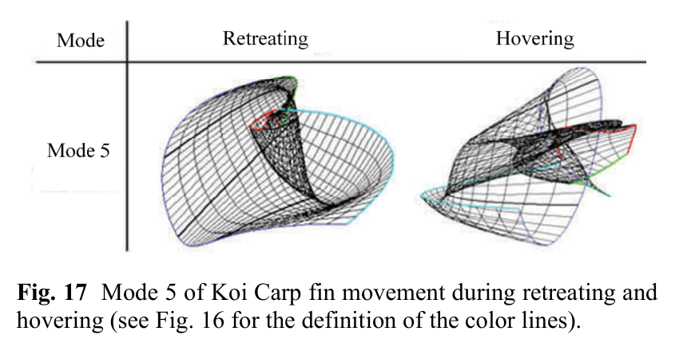

# Residual modes và giới hạn của mô hình bốn mode
## Mục tiêu học tập
- Hiểu Modes 5-9.
- Biết vì sao paper không phân tích chi tiết các mode này.
- Tránh hiểu sai mô hình SVD.

## Nội dung bài học

### Residual modes

Modes 5-9 nằm ở vùng residual trong phổ singular values. Mode 5 đã có hình dạng phức tạp và khó gán ý nghĩa trực quan; các mode 6-9 còn phức tạp hơn.

### Tại sao bỏ qua

Vì bốn mode đầu đã chiếm trên 90% tổng singular values, paper tập trung vào chúng để đạt mô hình gọn và diễn giải được.

### Giới hạn

Bốn mode không có nghĩa là mọi chi tiết thật của vây đều được tái hiện. Các biến thiên nhỏ, nhiễu, tương tác dòng chảy hoặc chuyển động phức tạp có thể nằm trong residual modes.

## Điểm cần ghi nhớ
- Low-dimensional model là xấp xỉ có chủ đích.
- Residual modes vẫn có thể hữu ích khi cần độ chân thực rất cao.
- Không nên coi mode 5-9 là 'sai' hay 'noise' tuyệt đối.

## Bài tập tự luyện
1. Giải thích trade-off giữa 4 mode và 9 mode.
2. Nêu tiêu chí khi nào animation nên thêm secondary deformation ngoài 4 mode.

## Đối chiếu nguồn

Paper trang 220, Fig. 17 và phần kết luận.
