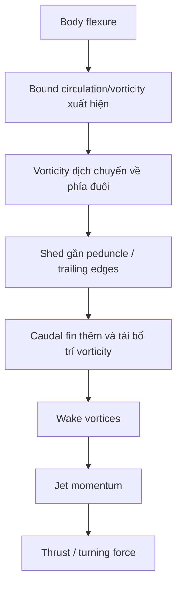

# Bài 01 — Câu hỏi khoa học và ý tưởng trung tâm

**Loại:** lesson  
**Nguồn chính:** PDF trang 1–2 và phần Discussion/Conclusions  
**Hình nên xem:** Figure 15–17

> **Phạm vi nguồn:** Nội dung khoa học trong bài học được biên soạn từ *Near-body flow dynamics in swimming fish* (Wolfgang et al., 1999). Phần diễn giải được viết lại theo dạng giáo trình; không thay thế bài báo gốc khi cần đối chiếu số liệu hoặc phương pháp chi tiết.

## Hình minh họa chính

## 1. Tóm tắt bài học

Nghiên cứu bắt đầu từ một vấn đề: các lý thuyết tuyến tính kinh điển giúp hiểu lực đẩy cơ bản của vật thể uốn và foil dao động, nhưng cá thật thường chuyển động với biên độ lớn, hình học ba chiều và wake phi tuyến. Vì vậy, muốn hiểu cơ chế bơi phải quan sát **dòng gần thân** chứ không chỉ wake xa phía sau.

Wolfgang và cộng sự kết hợp DPIV trên cá sống với mô hình số ba chiều. Kết quả dẫn đến một cách nhìn quan trọng: **thân cá chủ động tạo và tổ chức vorticity, còn vây đuôi thao tác lên vorticity đó để hình thành các vortex lớn với ít năng lượng lãng phí**.

## 2. Mục tiêu

Sau bài này, người học có thể:

- phân biệt câu hỏi “đuôi tạo thrust thế nào?” với câu hỏi rộng hơn “toàn thân cá tổ chức vorticity thế nào?”;
- giải thích vì sao near-body flow là vùng dữ liệu quan trọng;
- nhận biết ba khái niệm trung tâm: body-bound vorticity, shed vorticity và reverse Kármán street;
- tóm tắt hai bài toán của paper: bơi thẳng đều và rẽ nhanh 60°.

## 3. Bối cảnh lý thuyết

Các công trình trước đó dùng linearized potential-flow/slender-body approaches để ước lượng lực đẩy. Bài báo lưu ý rằng các giả định tuyến tính có thể bị vi phạm khi cá có biên độ lateral motion lớn. Đặc biệt, vấn đề không chỉ là bao nhiêu lực đẩy được tạo ra, mà là **cấu trúc xoáy được sinh ra, điều khiển và thải vào wake như thế nào**.

Một hướng nghiên cứu khác cho thấy foil dao động có thể tương tác với shear/vorticity đã có trong dòng và thu hồi năng lượng. Điều này gợi ý rằng vây đuôi cá không nhất thiết luôn làm việc với “nước sạch”; nó có thể nhận một trường dòng đã được thân và các vây phía trước chuẩn bị.

## 4. Câu hỏi nghiên cứu

Paper giải quyết ba câu hỏi liên kết:

1. Dòng gần thân giant danio trong bơi thẳng có cấu trúc gì?
2. Cấu trúc wake quan sát bằng DPIV có thể được tái tạo bằng mô hình số ba chiều hay không?
3. Trong cú rẽ nhanh, cá tổ chức và vector hóa vorticity/lực đẩy ra sao để đổi hướng trong thời gian ngắn?

## 5. Luận điểm trung tâm

### 5.1. Xoáy không chỉ sinh ở trailing edge của vây đuôi

Trong bơi thẳng, các vùng circular flow bắt đầu hình thành từ phần thân trước peduncle. Chuyển động lateral ngày càng tăng về phía sau làm circulation mạnh lên. Sau đó vorticity được shed gần peduncle và tương tác với vây đuôi.

### 5.2. Vây đuôi là bộ điều khiển và gia cường

Vây đuôi vẫn rất quan trọng vì nó chịu tải lớn, shed vorticity riêng và định hình vortex wake. Nhưng kết luận của paper nhấn mạnh vai trò **tương tác**: body-generated vorticity được đưa tới vây đuôi trong pha thuận lợi, rồi vây đuôi reinforce/merge với nó.

### 5.3. Cơ chế tương tự được tái sử dụng khi rẽ

Khi rẽ, cá tạm dừng pattern bơi thẳng, uốn thành chữ C, tạo cặp vorticity đối dấu, sau đó duỗi thân và dùng vây đuôi để giải phóng chúng thành một thrust jet có hướng mới. Đây là một hình thức **thrust vectoring bằng kiểm soát vorticity**.

## 6. Sơ đồ cơ chế

## 7. Sai lầm cần tránh

- **Sai:** “Reverse Kármán street chứng minh đuôi là nguồn duy nhất của vortex.”  
  **Đúng:** paper cho thấy phần thân tham gia tạo vorticity từ phía trước tail.
- **Sai:** “DPIV cho toàn bộ dòng ba chiều.”  
  **Đúng:** thực nghiệm chủ yếu đo một mặt phẳng 2D ở mid-depth; 3D structure được bổ sung bằng mô phỏng.
- **Sai:** “Inviscid model nghĩa là paper phủ nhận viscosity.”  
  **Đúng:** mô hình giả định viscous effects tập trung trong thin boundary layer và wake ở Reynolds number lớn.

## 8. Tự kiểm tra

1. Tại sao quan sát wake phía sau không đủ để suy luận nguồn gốc của vorticity?
2. “Body-bound vorticity” và “free wake vorticity” khác nhau về vị trí và trạng thái như thế nào?
3. Vai trò của vây đuôi trong paper tinh tế hơn câu “vây đuôi tạo thrust” ở điểm nào?
