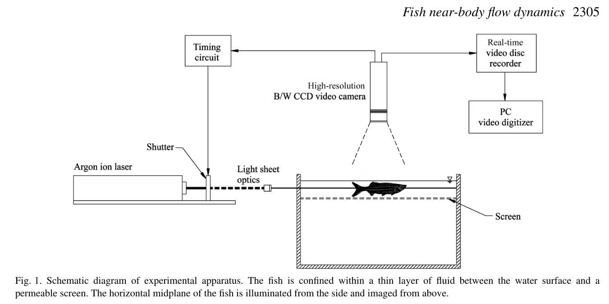

# Bài 03 — DPIV và thiết kế thí nghiệm

**Loại:** lesson  
**Nguồn chính:** PDF trang 2–3  
**Hình nên xem:** `../../assets/figures/figure_01.png`

> **Phạm vi nguồn:** Nội dung khoa học trong bài học được biên soạn từ *Near-body flow dynamics in swimming fish* (Wolfgang et al., 1999). Phần diễn giải được viết lại theo dạng giáo trình; không thay thế bài báo gốc khi cần đối chiếu số liệu hoặc phương pháp chi tiết.

## 1. Mục tiêu

- giải thích nguyên lý cross-correlation của DPIV;
- mô tả setup quang học và vùng đo của paper;
- hiểu vì sao near-body DPIV khó hơn PIV trong dòng không có vật thể biến dạng;
- diễn giải đúng độ phân giải không gian và sai số được báo cáo.

## 2. Nguyên lý DPIV

DPIV so sánh **hai ảnh của cùng một vùng dòng cách nhau một khoảng thời gian nhỏ**. Mỗi ảnh được chia thành interrogation windows. Với từng window, thuật toán tính spatial cross-correlation giữa hai thời điểm. Đỉnh của correlation cho biết displacement của particle pattern. Chia displacement cho thời gian giữa hai ảnh cho ta velocity vector cục bộ.

Điều kiện quan trọng là seeding đủ và phân bố ngẫu nhiên. Paper dẫn hướng dẫn trước đó rằng khoảng **10–20 particles per interrogation window** là đủ để tạo correlation tốt.

## 3. Setup thí nghiệm

Tank kính có kích thước xấp xỉ **51 cm × 25 cm × 28 cm**. Dòng được seed bằng các hạt polymer fluorescent trung tính nổi, đường kính **20–40 µm**. Một laser argon-ion **6 W** tạo light sheet dày khoảng **3 mm**.

Camera CCD đen trắng có độ phân giải **768 × 480 pixels**. Ảnh được ghi ở camera frame rate **30 Hz**; image pairs được thu ở 15 Hz, nhưng asynchronous shuttering cho phép khoảng thời gian giữa hai ảnh trong một pair nhỏ khoảng **5 ms**.

Cá bị giới hạn trong một lớp nước dày khoảng **3 cm**, giữa mặt thoáng và một permeable screen. Light sheet nằm ở mid-depth, nhằm cắt gần symmetry plane của cá.

## 4. Vì sao phải confinement?

Mục tiêu là giữ cá đi qua cùng vùng laser/camera và làm cho mặt phẳng đo ổn định. Tuy nhiên confinement phải đủ “mở” để không tạo wall effect đáng kể. Nhóm nghiên cứu sử dụng screen có lỗ lớn kết hợp mesh mịn để nước vẫn đi qua.

## 5. Vấn đề near-body measurement

Khi body đang chuyển động và biến dạng, interrogation window có thể chứa cả particle image lẫn boundary của cá. Cross-correlation khi đó bị bias về displacement của boundary, tạo spurious velocity ngay sát thân.

Cách xử lý của paper gồm:

- loại bỏ dữ liệu rõ ràng bị nhiễm bởi image của cá;
- xử lý cẩn thận vùng lân cận trước khi smoothing;
- chấp nhận rằng velocity cực sát boundary không được hiển thị ở một số kết quả.

## 6. Độ phân giải không gian

Ảnh được xử lý bằng **32×32 pixel windows**, dịch **8 pixels** mỗi bước, tức oversampling 4 lần. Kích thước window tương đương khoảng **0.076L**, nên paper cho rằng flow scales khoảng **0.15L trở lên** có thể được đo đáng tin cậy.

Điều này rất quan trọng: các chi tiết nhỏ hơn khoảng hai lần window size có thể bị attenuation mạnh. Vì vậy không được diễn giải các vortex cores rất nhỏ như thể DPIV đã resolve hoàn hảo.

## 7. Sai số

Calibration cho thấy relative displacement error thường dưới **5%**, và thường dưới **2%** khi displacement lớn hơn 1 pixel ở mức vừa phải. Nhưng sai số kinematics của cá còn chứa variability hành vi thực sự, ví dụ tail-beat amplitude/frequency không giữ hằng tuyệt đối.

## 8. Từ velocity đến vorticity

Sau khi có velocity field trong plane, paper tính thành phần vorticity vuông góc với mặt phẳng DPIV. Điều này cho phép nhìn các large-scale vortical structures dọc thân và trong wake.

## 9. Checklist đọc hình DPIV

Khi xem Figure 3 hoặc 8:

1. Xác định orientation và hướng chuyển động của cá.
2. Phân biệt arrow length (velocity magnitude) với vortex sign.
3. Xem vùng sát thân có bị mask do contamination/shadow không.
4. Theo dõi vortex qua nhiều frame, không suy luận từ một frame đơn lẻ.
5. Nhớ rằng đây là lát cắt 2D của một flow 3D.
