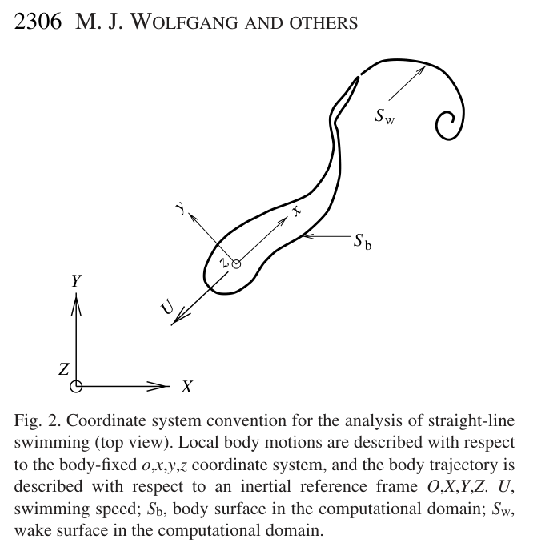
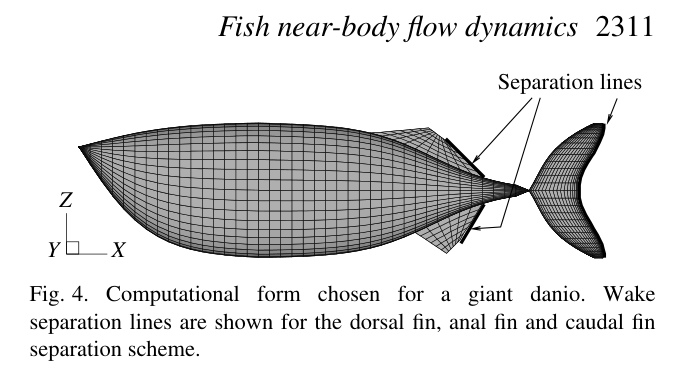
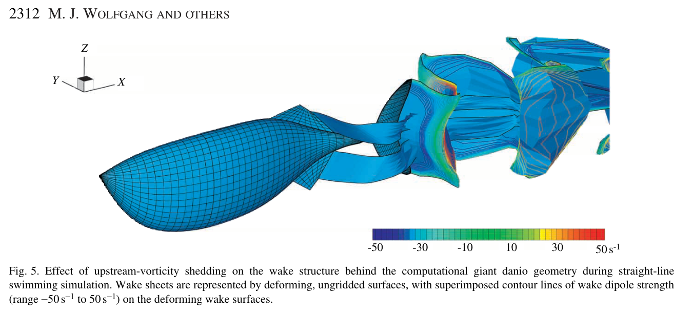

# Bài 04 — Mô hình số: panel method, wake và thin fins

**Loại:** lesson  
**Nguồn chính:** PDF trang 4–7 và Appendix A  
**Hình nên xem:** Figure 2, 4, 5

> **Phạm vi nguồn:** Nội dung khoa học trong bài học được biên soạn từ *Near-body flow dynamics in swimming fish* (Wolfgang et al., 1999). Phần diễn giải được viết lại theo dạng giáo trình; không thay thế bài báo gốc khi cần đối chiếu số liệu hoặc phương pháp chi tiết.

## Hình minh họa chính

## 1. Mục tiêu

- hiểu các giả định vật lý của mô hình;
- mô tả vai trò của body panels, wake panels và vortex-lattice fins;
- hiểu tại sao cần Kutta condition và wake convection;
- phân biệt local body frame với inertial global frame.

## 2. Miền dòng và giả định

Mô hình xem cá như một flexible three-dimensional body có prescribed motion. Ngoài thin boundary layer và wake, fluid được giả định:

- incompressible;
- inviscid;
- irrotational.

Vì vậy tồn tại velocity potential \(\Phi(\mathbf{x},t)\) thỏa Laplace equation:

\[
\nabla^2 \Phi = 0
\]

Pressure được lấy từ unsteady Bernoulli equation.

## 3. Hai hệ tọa độ

Figure 2 dùng:

- **O,X,Y,Z:** inertial/global frame cố định trong fluid;
- **o,x,y,z:** local body frame gắn với fish mean line.

Body undulation được mô tả thuận tiện trong local frame, còn translation/rotation/trajectory của cá được mô tả trong global frame.

## 4. Boundary surfaces

Computational domain được xem là bị giới hạn bởi:

- \(S_b\): body surface;
- \(S_w\): infinitesimally thin wake sheet;
- \(S_\infty\): far field.

Velocity potential được tách thành body perturbation và wake perturbation:

\[
\Phi = \Phi_b + \Phi_w
\]

Wake cũ có strength đã biết từ các time step trước; phần wake mới shed ở trailing edge có strength chưa biết và phải xác định bằng Kutta condition.

## 5. Source–dipole panel representation

Thân và wake được chia thành quadrilateral panels. Trên mỗi panel, source/dipole distribution được xấp xỉ piecewise constant. Collocation point nằm tại geometric center của panel.

Khi áp dụng Green’s theorem và boundary condition, bài toán trở thành linear system dạng tổng quát:

\[
[\tilde Q]\{\phi_b\}=[\tilde P]
\]

Trong đó \(\tilde Q\) chứa influence coefficients, còn \(\tilde P\) liên quan đến normal velocities do prescribed body motion và wake influence.

## 6. Kutta condition và wake shedding

Ở sharp trailing edge, flow phải tách trơn. Paper dùng unsteady Kutta condition để liên hệ jump của body perturbation potential với strength của wake mới shed.

Ý nghĩa vật lý: thay đổi circulation quanh lifting surface phải đi kèm vorticity shed vào wake sao cho tổng circulation của miền dòng phù hợp Kelvin’s theorem.

## 7. Thin fins và vortex lattice

Dorsal/anal fins mỏng khó mô hình như thick finite-thickness body khi mesh rất mảnh. Vì vậy paper dùng **zero-thickness vortex-lattice surfaces** cho các vây này.

Các thin fin trailing edges cũng shed wake theo Kutta condition. Nhờ đó mô hình có thể khảo sát ảnh hưởng của upstream-shed vorticity lên caudal fin.

## 8. Wake convection và desingularization

Wake endpoints được convect bởi velocity field theo dạng desingularized Biot–Savart law. Desingularization radius ngăn singular velocity vô hạn khi field point tiến sát vortex element và giúp tránh instability số.

Tương tự, body/thin-fin panels cũng được desingularize để giảm vấn đề khi wake tiến rất gần hoặc đi xuyên body do lỗi số.

## 9. Time integration

Scheme được tích phân theo thời gian bằng fourth-order Runge–Kutta. Số wake panels tăng theo thời gian vì mỗi time step tạo thêm wake từ trailing edges.

## 10. Điểm cần nhớ

Mô hình không “giải Navier–Stokes đầy đủ”. Sức mạnh của nó nằm ở việc cho phép:

- exact moving-body boundary conditions;
- geometry ba chiều;
- nonlinear free-wake evolution;
- chi phí tính toán thấp hơn fully viscous model ở Reynolds number lớn.

Đổi lại, near-body viscous details và turbulence nhỏ không được resolve trực tiếp.
