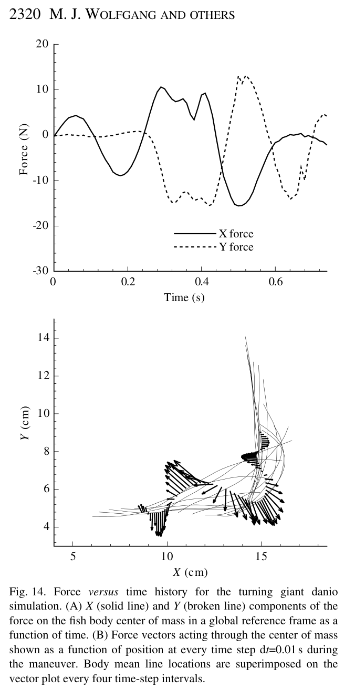

# Bài 05 — Lực, công suất và hiệu suất thủy động lực

**Loại:** lesson  
**Nguồn chính:** PDF trang 6–7, 18  
**Hình nên xem:** Figure 14

> **Phạm vi nguồn:** Nội dung khoa học trong bài học được biên soạn từ *Near-body flow dynamics in swimming fish* (Wolfgang et al., 1999). Phần diễn giải được viết lại theo dạng giáo trình; không thay thế bài báo gốc khi cần đối chiếu số liệu hoặc phương pháp chi tiết.

## Hình minh họa chính

## 1. Mục tiêu

- mô tả cách pressure được suy ra từ potential solution;
- hiểu cách tích phân pressure thành lực tổng;
- phân biệt side force và longitudinal force;
- hiểu định nghĩa propulsive efficiency dùng trong paper.

## 2. Từ potential đến surface velocity

Khi \(\phi_b\) đã biết trên body panels, tangential surface velocity được suy ra bằng spatial differentiation. Sau đó pressure coefficient \(C_P\) được tính bằng unsteady Bernoulli equation, trong đó có cả term không ổn định \(\partial \phi_b/\partial t\).

## 3. Tích phân pressure thành lực

Lực tổng trên body được tính bằng tích phân pressure theo surface normal:

\[
\mathbf F_b = \int_{S_b} p\,\mathbf n\,dS
\]

Trong implementation của paper, biểu thức được viết theo \(C_P\), fluid density và reference speed.

Với thin fins, lực liên quan trực tiếp đến **pressure jump giữa hai mặt**. Caudal fin được mô hình như finite-thickness foil, còn dorsal/anal fins có thể dùng thin-lifting-surface treatment.

## 4. Hai thành phần lực khi bơi thẳng

- **Side force \(L_b\):** vuông góc hướng bơi; temporal mean kỳ vọng gần 0 trong periodic straight swimming.
- **Longitudinal force \(T_b\):** theo hướng bơi; temporal mean có thể là thrust hoặc drag.

Paper không mô hình skin-friction drag đầy đủ trong inviscid formulation, vì vậy cần cẩn thận khi diễn giải “net efficiency” như hiệu suất toàn bộ cơ thể sinh học.

## 5. Công suất truyền vào fluid

Power do body truyền vào fluid được lấy từ tích phân local force nhân với imposed body velocity:

\[
P_b = \int \mathbf f(\mathbf x,t)\cdot \mathbf V_b(\mathbf x,t)\,dS
\]

Dạng time history có thể rất phức tạp ngay cả khi motion sinusoidal.

## 6. Propulsive efficiency

Với periodic swimming, paper dùng classical hydrodynamic efficiency:

\[
\eta=\frac{U\,\overline{T}_b}{\overline{P}_b}
\]

Trong đó \(\overline{T}_b\) và \(\overline{P}_b\) là mean thrust và mean power qua một chu kỳ.

## 7. Force history trong cú rẽ

Figure 14 cho thấy lực trong global X–Y frame. Pattern chính:

1. lực ban đầu ở mức vừa khi cá chấm dứt straight-swimming oscillation và shed residual body-bound vorticity;
2. lực tăng mạnh khi body contorts thành tight C-curve và caudal fin quét;
3. các oscillatory forces giảm dần khi cá hoàn tất turn và quay lại bơi thẳng.

Mục tiêu động lực học ở đây không phải duy trì mean thrust ổn định, mà tạo **large short-duration force** có hướng phù hợp để thay đổi quỹ đạo.

## 8. Bài tập ngắn

Giả sử hai case có cùng \(U\) và \(\overline T\), nhưng case B cần \(\overline P\) lớn gấp 1.25 lần case A. Hãy biểu diễn \(\eta_B/\eta_A\).  
**Đáp án:** \(\eta_B/\eta_A=1/1.25=0.8\).
