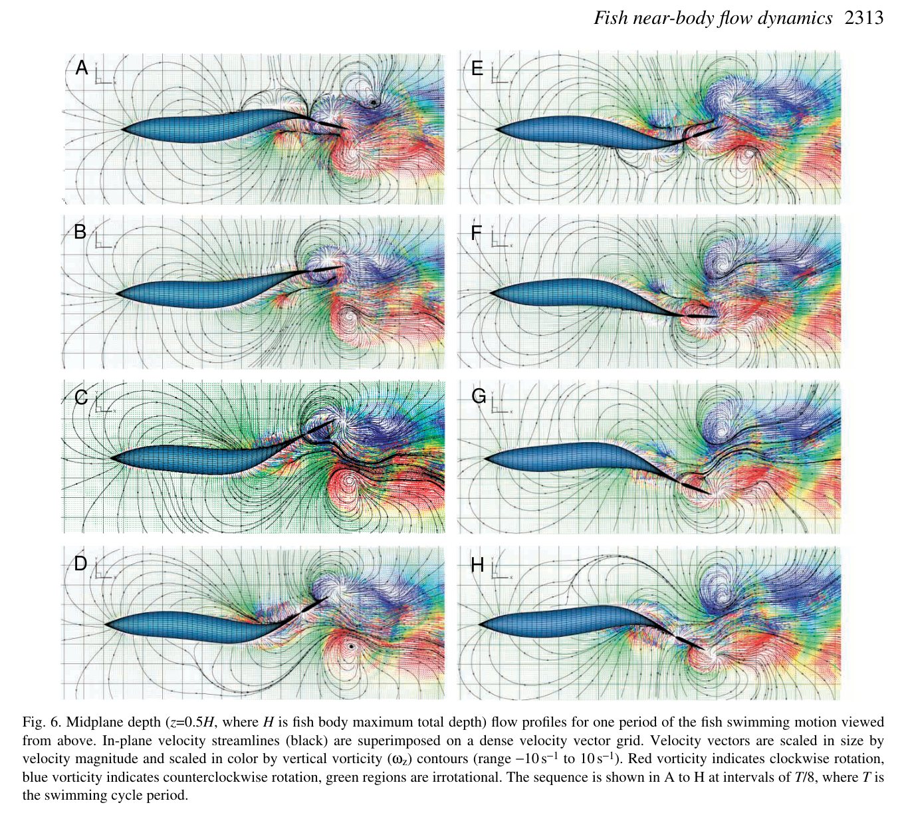
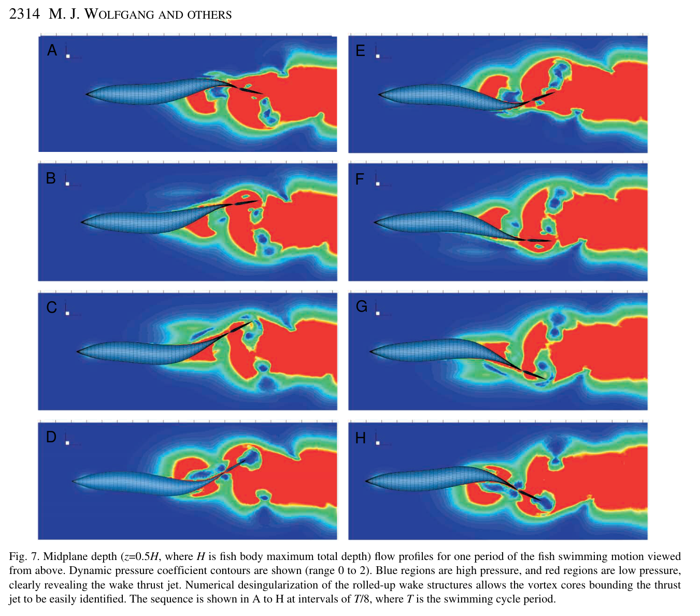

# Bài 06 — Bơi thẳng: reverse Kármán street và thrust jet

**Loại:** lesson  
**Nguồn chính:** PDF trang 7–12  
**Hình nên xem:** Figure 3, 6, 7

> **Phạm vi nguồn:** Nội dung khoa học trong bài học được biên soạn từ *Near-body flow dynamics in swimming fish* (Wolfgang et al., 1999). Phần diễn giải được viết lại theo dạng giáo trình; không thay thế bài báo gốc khi cần đối chiếu số liệu hoặc phương pháp chi tiết.

## Hình minh họa chính

## 1. Mục tiêu

- theo dõi một chu kỳ hình thành vortex trong straight swimming;
- giải thích reverse Kármán street khác wake drag street ở ý nghĩa momentum;
- đọc các giá trị velocity/circulation trong case thí nghiệm;
- nối body undulation với wake jet.

## 2. Kinematics quan sát được

Trong các thí nghiệm, tail double amplitude nằm khoảng **0.11L–0.21L**, frequency lên tới **6.2 Hz**. Một sequence rõ có mean speed khoảng **8.9 cm/s**, tương đương **1.1 L/s**, trong 0.23 s được ghi lại.

## 3. Chu kỳ vortex trong Figure 3

### 3.1. Tail lệch cực đại sang một bên

Một vortex đã bắt đầu hình thành gần tail tip trước khi tail bắt đầu stroke ngược lại. Đồng thời, upstream hơn ở posterior/mid-body xuất hiện flow pattern báo hiệu bound vorticity mới.

### 3.2. Tail quét qua

Vortex cũ được đưa vào wake. Dòng longitudinal và circular flow mới dịch chuyển cùng body wave.

### 3.3. Tail đạt cực đại phía đối diện

Circular flow phía bên kia thân trở thành vortex đối dấu tiếp theo. Quá trình này lặp lại theo từng half-cycle.

## 4. Reverse Kármán street

Các wake vortices sắp xếp staggered theo dấu luân phiên và tạo một **jet ở centerline**. Đây là signature của thrust-producing wake. Trong case Figure 3, maximum wake velocity khoảng **0.88U** khi averaging theo cách paper mô tả; phần thảo luận ở frame cụ thể mô tả centerline jet có thể đạt xấp xỉ 90% mean fish speed.

Near body:

- maximum longitudinal perturbation velocity khoảng **0.14U**;
- maximum transverse velocity khoảng **0.39U**.

Average nondimensional vortex circulation được báo cáo khoảng:

\[
\overline{\Gamma}_e/(LU)=0.3
\]

với core radius xấp xỉ \(0.1L\).

## 5. Điểm mới: vortex “bắt đầu” trước tail

Một observation nổi bật là circular flow/vorticity precursor xuất hiện khoảng 3/4 body length từ mũi trước khi gặp tail. Posterior body có lateral motion lớn hơn nên circulation tăng lên. Vorticity sau đó được shed trước/ở peduncle và tail tiếp tục thao tác lên nó.

## 6. Figure 6 và 7 cho thêm gì?

- **Figure 6:** streamlines + velocity + vorticity cho thấy sự tiến triển của near-body vortical structure qua một chu kỳ.
- **Figure 7:** dynamic pressure contours giúp nhìn regions of high/low momentum và cách caudal fin đi qua các pressure regions trong từng pha.

## 7. Không được đọc hình theo cách tĩnh

Wake là kết quả của quá trình theo thời gian. Một vortex nhìn thấy ở tail ở frame hiện tại có thể đã được “chuẩn bị” bởi body motion ở frame trước. Vì vậy phân tích đúng phải theo sequence A→B→C→D, không phải chỉ gắn nguyên nhân vào vị trí hiện tại.

## 8. Câu hỏi tự luyện

1. Reverse Kármán street cho biết hướng momentum jet như thế nào?
2. Tại sao vortex bắt đầu hình thành trước tail lại làm thay đổi diễn giải truyền thống về thrust production?
3. Trong case này, transverse near-body velocity lớn hơn longitudinal perturbation velocity bao nhiêu lần xấp xỉ?
