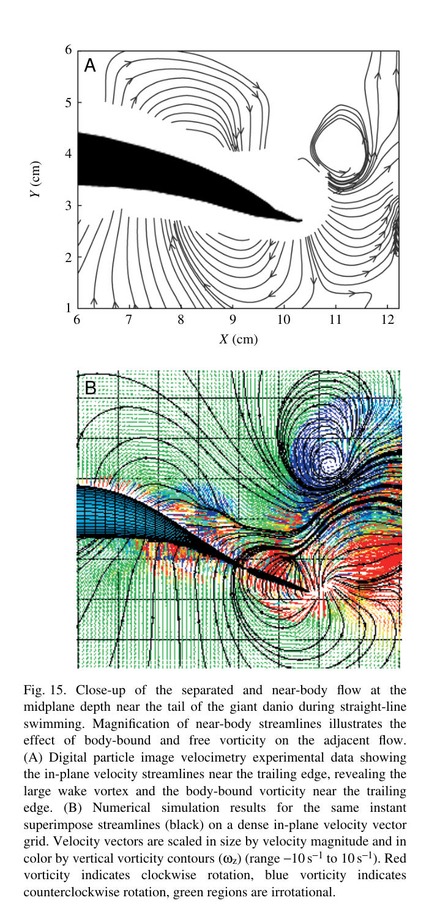
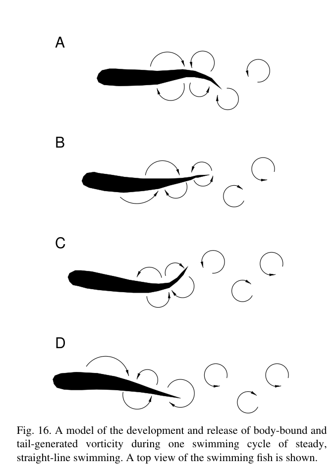

# Bài 07 — Body-bound vorticity và vai trò thực sự của vây đuôi

**Loại:** lesson  
**Nguồn chính:** PDF trang 9–12 và Discussion trang 18–20  
**Hình nên xem:** Figure 5, 15, 16

> **Phạm vi nguồn:** Nội dung khoa học trong bài học được biên soạn từ *Near-body flow dynamics in swimming fish* (Wolfgang et al., 1999). Phần diễn giải được viết lại theo dạng giáo trình; không thay thế bài báo gốc khi cần đối chiếu số liệu hoặc phương pháp chi tiết.

## Hình minh họa chính

## 1. Mục tiêu

- mô tả cơ chế hình thành, vận chuyển và release vorticity;
- giải thích “tail manipulation” bằng ngôn ngữ flow mechanics;
- hiểu khả năng upstream-vorticity interaction từ dorsal/anal fins;
- trình bày kết luận quan trọng của paper về nguồn gốc wake vortex.

## 2. Ba lớp vorticity cần phân biệt

### 2.1. Body-bound vorticity

Gắn với circulation/flow tổ chức quanh body đang uốn. Nó chưa phải một free vortex tách khỏi cơ thể.

### 2.2. Shed body-generated vorticity

Khi flow tách gần contraction/peduncle region, một phần vorticity đi vào wake và trở thành free structure.

### 2.3. Tail-generated vorticity

Oscillating caudal fin là một lifting surface mạnh và cũng shed vorticity ở trailing edge. Vorticity này có thể cùng dấu và merge/reinforce với structure do body tạo trước đó.

## 3. Vì sao nói tail có “secondary role” trong nguồn gốc vortex?

Phần Conclusions lập luận rằng nhiều wake vortices **không bắt đầu từ con số 0 ở tail**. Vorticity hình thành upstream do body undulation, rồi đến tail trong timing thuận lợi. Tail làm ba việc:

1. thay đổi vị trí của vorticity;
2. reinforce circulation bằng chính vorticity shed của nó;
3. quyết định cách structure cuối cùng đi vào wake/thrust jet.

“Secondary role” ở đây không có nghĩa tail không quan trọng về lực. Discussion cho biết **tail sustains over 90% of longitudinal force** trong simulation của straight swimming, trong khi side force phân bố gần đều giữa tail và main body.

## 4. Tương tác với dorsal và anal fins

Numerical model thử cho dorsal/anal fins shed vortex sheets. Vì các fin wakes này còn chưa roll up hoàn toàn khi tới caudal leading edge, chúng có thể ảnh hưởng một vùng rộng của inflow và có khả năng tăng leading-edge suction/energy recapture.

Paper đặt đây như một cơ chế cần khảo sát bằng mô phỏng; không nên biến nó thành kết luận rằng mọi upstream fin wake luôn làm tăng hiệu suất.

## 5. Figure 15: so sánh thí nghiệm–mô phỏng sát tail

Figure 15 đặt cạnh:

- DPIV streamlines sát trailing-edge region;
- numerical streamlines/velocity/vorticity ở cùng instant.

Hai trường dòng có qualitative similarity, hỗ trợ cách giải thích về bound-vorticity release và wake formation.

## 6. Figure 16: mô hình một chu kỳ

Chu trình đơn giản hóa:

1. một dấu vorticity được shed vào wake;
2. vorticity đối dấu phát triển ở contraction region do body undulation và peduncle stroke;
3. bound vorticity dịch dần về tail;
4. tail interaction giải phóng nó;
5. các free vortices trái dấu xếp thành reverse Kármán street.

## 7. Cơ chế điều phối pha

Điểm quyết định là **synchronization**. Nếu body-generated vortex đến tail sai pha, tail có thể không reinforce nó theo cách tạo thrust jet tối ưu. Vì vậy kinematics, wake spacing và frequency không phải các thông số độc lập.

## 8. Gợi ý phân tích mô hình cá/animation

Nếu dùng paper này để kiểm tra một animation cá, tiêu chí khoa học quan trọng không chỉ là “đuôi vẫy đẹp”, mà là:

- biên độ phải tăng dọc posterior body;
- peduncle motion phải liên tục với body wave;
- tail stroke phải có pha hợp lý với wave đến từ thân;
- khi rẽ, toàn thân phải đổi pattern, không chỉ xoay root của đuôi.

Đây là suy luận ứng dụng từ cơ chế trong paper, không phải một rig specification được paper cung cấp.
