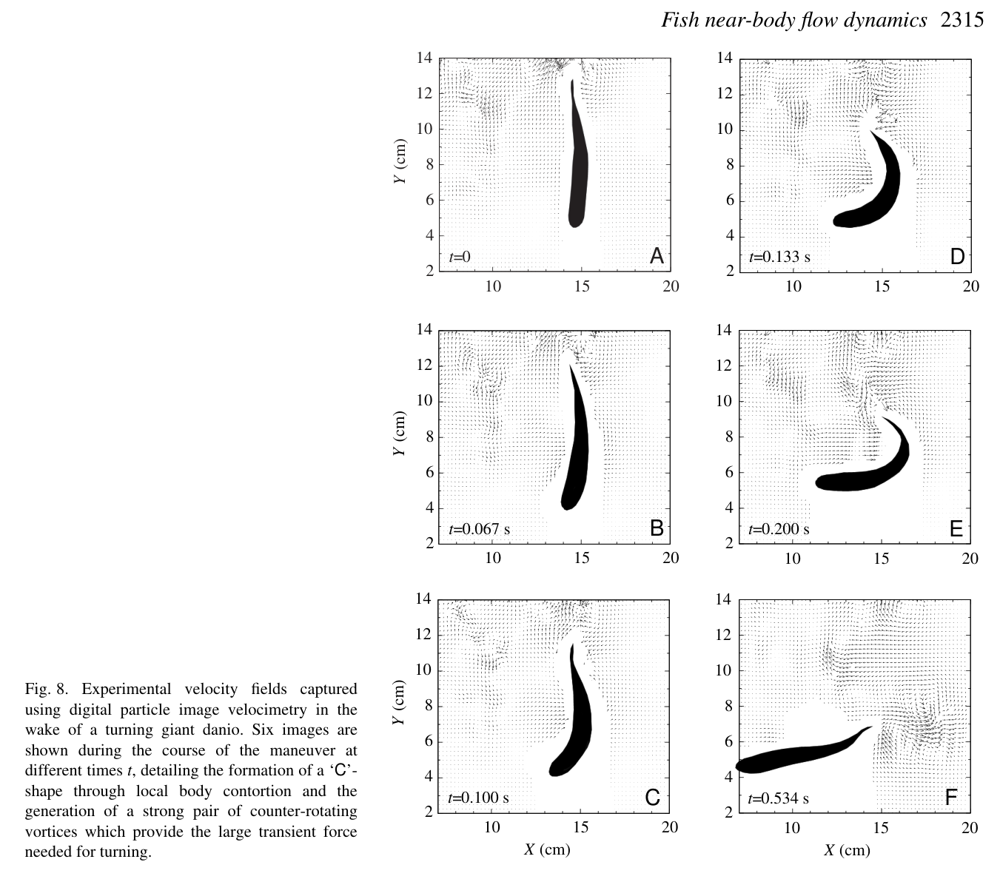
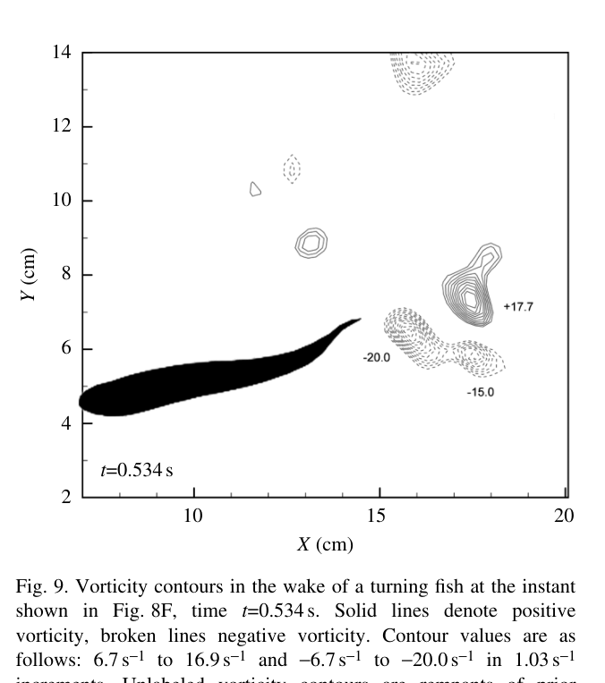

# Bài 08 — Thí nghiệm cú rẽ 60°

**Loại:** lesson  
**Nguồn chính:** PDF trang 13–14  
**Hình nên xem:** Figure 8–9

> **Phạm vi nguồn:** Nội dung khoa học trong bài học được biên soạn từ *Near-body flow dynamics in swimming fish* (Wolfgang et al., 1999). Phần diễn giải được viết lại theo dạng giáo trình; không thay thế bài báo gốc khi cần đối chiếu số liệu hoặc phương pháp chi tiết.

## Hình minh họa chính

## 1. Mục tiêu

- tái dựng sequence của cú rẽ từ DPIV;
- mô tả C-bend và sự hình thành vortex pair;
- so sánh wake vortex của turning với straight swimming;
- giải thích hướng jet theo momentum balance.

## 2. Dữ liệu chuyển động

Cá có \(L=8.32\,cm\). Trước maneuver, nó coast với khoảng **1.50 L/s**; sau đó uốn thành tight C-curve và tiếp tục bơi ở hướng mới lệch **60°**, với speed khoảng **1.58 L/s** trong mô tả sequence.

Thí nghiệm ghi **25 images**, mỗi **0.0333 s**, tổng khoảng **0.8 s**. Backbone được digitize từ 13 frame, cách nhau **0.0667 s**, mỗi backbone chia thành 20 equal arc-length segments để phục vụ phân tích và simulation input.

## 3. Sequence thủy động lực

### 3.1. Bắt đầu uốn

Head di chuyển về hướng bơi mới trong khi tail đi theo hướng đối lại, tạo hình chữ C. Dòng ở concave side đi về phía body, còn convex side đẩy fluid ra ngoài.

### 3.2. C-curve gần hoàn chỉnh

Hai circular flow regions rõ dần: một gần tail, một gần head. Đây là tiền thân của cặp vorticity đối dấu.

### 3.3. Tail stroke và shed vortex thứ nhất

Khi tail quét, vortex counterclockwise đã hình thành được shed vào wake.

### 3.4. Return stroke và vortex thứ hai

Vorticity còn lại ở anterior/midbody chuyển posteriorly và được giải phóng ở stroke tiếp theo.

### 3.5. Vortex pair tạo jet

Kết quả cuối là một cặp counter-rotating vortices mạnh tạo jet có hướng mới. Cú turn quan sát được hoàn thành trong khoảng hơn **0.5 s** đối với phần maneuver chính.

## 4. So sánh với straight swimming

Paper báo cáo turning-jet vortices có average nondimensional circulation:

\[
\Gamma_e^*=\Gamma_e/(LU)=0.43
\]

cao hơn khoảng **42%** so với typical straight-swimming wake vortex ở tốc độ tương tự. Core radius cũng lớn hơn hơn gấp đôi. Jet width khoảng **0.34L**, maximum jet velocity \(u_j\approx U\).

## 5. Ý nghĩa của jet direction

Jet được định hướng xấp xỉ theo hướng cần để cân bằng horizontal momentum trong turn. Nói cách khác, cá không chỉ “uốn thân để quay”; nó tạo một impulse fluid có vector thích hợp, và reaction force đổi hướng quỹ đạo của cơ thể.

## 6. Giới hạn dữ liệu

- Fish shadow làm mất một số velocity data.
- Reflection từ body che flow gần head ở một số frame.
- Maneuver mạnh có 3D effects đáng kể, trong khi DPIV là một plane 2D.

Do đó Figure 8–9 cho dominant planar mechanism, không phải toàn bộ three-dimensional flow topology.

## 7. Câu hỏi tự luyện

1. Vì sao cặp counter-rotating vortices thích hợp để tạo một jet định hướng?
2. Circulation turning vortex mạnh hơn straight-swimming vortex nói gì về impulse ngắn hạn cần cho maneuver?
3. Tại sao digitize backbone trajectory là bước cần thiết trước khi simulation?
