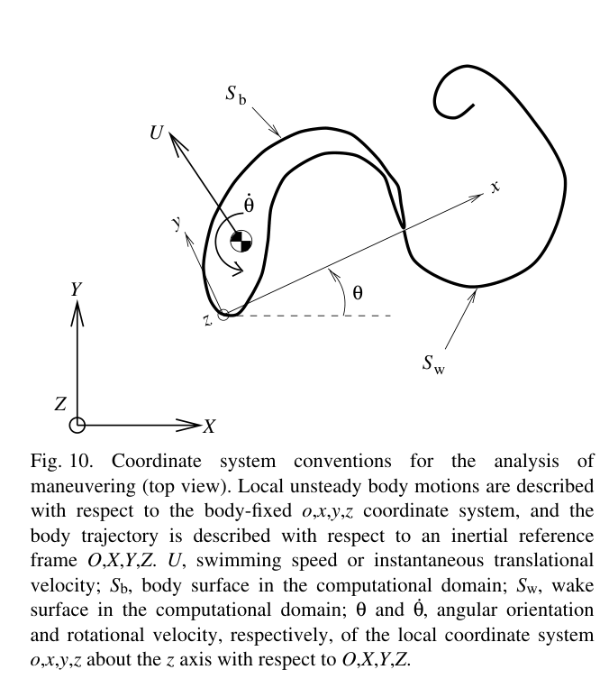
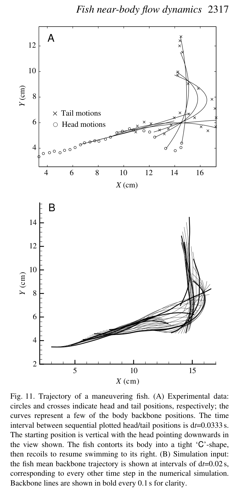
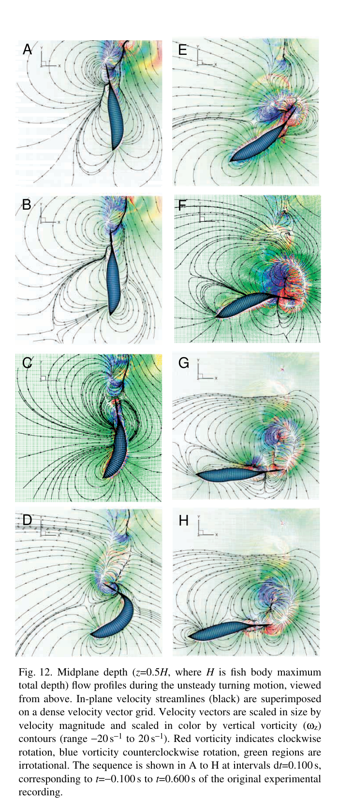
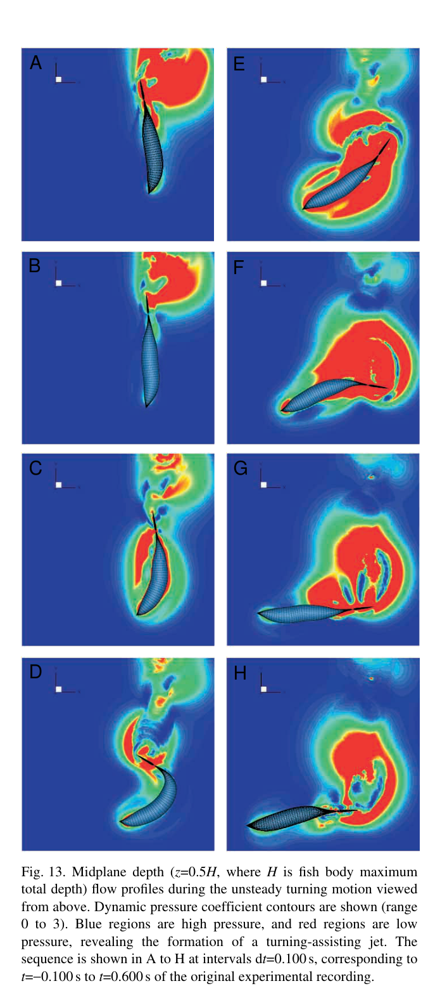

# Bài 09 — Mô phỏng rẽ, pressure field và force vectoring

**Loại:** lesson  
**Nguồn chính:** PDF trang 14–18  
**Hình nên xem:** Figure 10–14

> **Phạm vi nguồn:** Nội dung khoa học trong bài học được biên soạn từ *Near-body flow dynamics in swimming fish* (Wolfgang et al., 1999). Phần diễn giải được viết lại theo dạng giáo trình; không thay thế bài báo gốc khi cần đối chiếu số liệu hoặc phương pháp chi tiết.

## Hình minh họa chính

## 1. Mục tiêu

- hiểu cách reconstruct trajectory từ sparse experimental frames;
- đọc Figure 12–14 như một chuỗi kinematics → flow → pressure → force;
- giải thích energy interaction khi tail đi qua vùng high-momentum flow;
- mô tả force vectoring trong maneuver.

## 2. Hệ tọa độ cho maneuver

Figure 10 dùng global frame để mô tả trajectory và local frame gắn ở nose để mô tả flexible body shape. Khi cá quay, local frame vừa translate vừa rotate trong global frame.

13 backbone snapshots không đủ mịn cho free-wake simulation nên paper xây interpolation/Fourier representations theo space và time để tạo intermediate shapes.

## 3. Simulation setup của turn

Các chi tiết được paper nêu:

- time step \(dt=0.01\,s\);
- 15 temporal modes và 10 spatial modes cho mean-line shapes;
- 10 temporal modes cho local-frame trajectories;
- wake desingularization radius \(\delta_w=0.02\);
- body desingularization radius \(\delta_b=0.025\), với \(L=1\).

Simulation thêm một ramping/coasting period trước turn để giảm ảnh hưởng artificial starting vorticity.

## 4. Figure 12: vorticity + streamlines

Khi cá tạo tight C-shape, flow tổ chức thành ba circular patterns quanh head, midbody và tail. Sau đó:

1. tail sweep shed một dấu vorticity;
2. bound vorticity dấu đối lại đi từ contraction region về tail;
3. pressure/velocity structure đi qua tail;
4. second vortex được shed và pair với vortex trước;
5. jet mạnh được hình thành.

## 5. Figure 13: dynamic pressure

Dynamic pressure contours cho thấy các high/low-pressure regions đi cùng maneuver. Một low-pressure region quét qua caudal fin và đóng vai trò trong việc tạo/ghép jet. Trong return stroke, tail đi qua một vùng fluid momentum cao khác.

Paper diễn giải rằng caudal fin có thể **recover energy from the jet** khi đi qua vùng này, đồng thời tăng separation/vorticity shed và tail loading.

## 6. Figure 14: force vectoring

Force time history không sinusoidal như straight swimming. Lực tăng mạnh trong giai đoạn C-bend/tail sweep, rồi giảm khi turn hoàn tất.

Vector plot cho thấy hướng force thay đổi liên tục cùng trajectory. Đây là “thrust vectoring” theo nghĩa thủy động lực: cá tái định hướng momentum flux của wake để tạo reaction force theo hướng mới.

## 7. Chuỗi nhân quả hoàn chỉnh

## 8. Câu hỏi tự luyện

1. Tại sao simulation phải có pre-turn ramp/coast?
2. Pressure contours bổ sung thông tin gì mà vorticity contours không cho trực tiếp?
3. Thrust vectoring trong paper dựa trên cơ chế flow nào, thay vì chỉ là geometric rotation của body?
