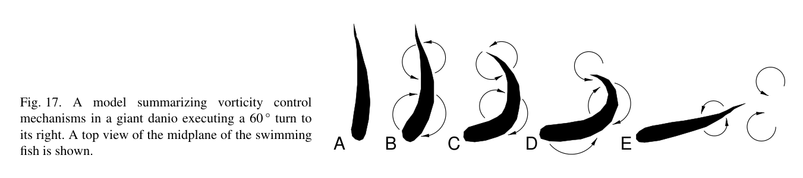

# Bài 10 — Cơ chế thống nhất cho bơi thẳng và rẽ

**Loại:** lesson  
**Nguồn chính:** Discussion và Conclusions, PDF trang 17–20  
**Hình nên xem:** Figure 15–17

> **Phạm vi nguồn:** Nội dung khoa học trong bài học được biên soạn từ *Near-body flow dynamics in swimming fish* (Wolfgang et al., 1999). Phần diễn giải được viết lại theo dạng giáo trình; không thay thế bài báo gốc khi cần đối chiếu số liệu hoặc phương pháp chi tiết.

## Hình minh họa chính

## 1. Mục tiêu

- xây dựng một mental model duy nhất giải thích cả steady propulsion và maneuvering;
- phân biệt yếu tố giữ nguyên và yếu tố thay đổi giữa hai chế độ;
- diễn giải Figure 16–17 như hai state machines thủy động lực.

## 2. Cái gì giống nhau?

Cả bơi thẳng lẫn rẽ đều dùng cùng logic cơ bản:

1. flexible body motion tạo bound circulation/vorticity;
2. vorticity được vận chuyển dọc thân;
3. release xảy ra có kiểm soát;
4. caudal fin tương tác với vorticity tới từ upstream và vorticity do chính nó shed;
5. wake vortex arrangement quyết định momentum jet.

## 3. Cái gì khác nhau?

| Thuộc tính | Bơi thẳng | Rẽ nhanh |
|---|---|---|
| Kinematics | periodic traveling wave | transient localized C-bend + recoil |
| Wake | periodic reverse Kármán street | strong finite vortex pair / turning jet |
| Force | oscillatory, mean thrust theo hướng bơi | large short-duration force đổi hướng |
| Vorticity timing | lặp theo chu kỳ | không tuần hoàn, pha được tổ chức cho impulse |
| Quỹ đạo | gần thẳng | đổi hướng ~60° |

## 4. Figure 16 như một cycle machine

A→B→C→D mô tả vortex sign luân phiên. Sau D, state quay về A. Đây là periodic control loop.

## 5. Figure 17 như một maneuver state machine

A: dừng straight-swimming oscillation.  
B: bắt đầu backbone curve, tạo paired bound vorticity.  
C: C-shape hoàn chỉnh, vortex pair tách về mặt không gian.  
D: duỗi thân, release một dấu vorticity qua tail manipulation.  
E: release dấu còn lại, ghép thành jet, rồi quay lại straight swimming.

## 6. Kết luận cơ chế

Paper đề xuất rằng **fish actively control the formation and evolution of vorticity**. Đây là câu mạnh hơn “cá vẫy đuôi để đẩy nước”. Nó mô tả propulsion như một bài toán điều khiển trường dòng theo không gian–thời gian.

## 7. Liên hệ thiết kế bio-inspired systems

Từ chính cơ chế của paper có thể rút ra ba nguyên tắc thiết kế ở mức khái niệm:

- actuation nên phân bố dọc flexible body thay vì tập trung vào một hinge duy nhất;
- timing giữa body wave và tail motion quan trọng không kém amplitude;
- maneuver cần khả năng tạo localized high-curvature body shape để thay đổi vorticity topology nhanh.

Đây là phần **suy luận ứng dụng**, không phải thông số thiết kế trực tiếp được paper kiểm chứng.
