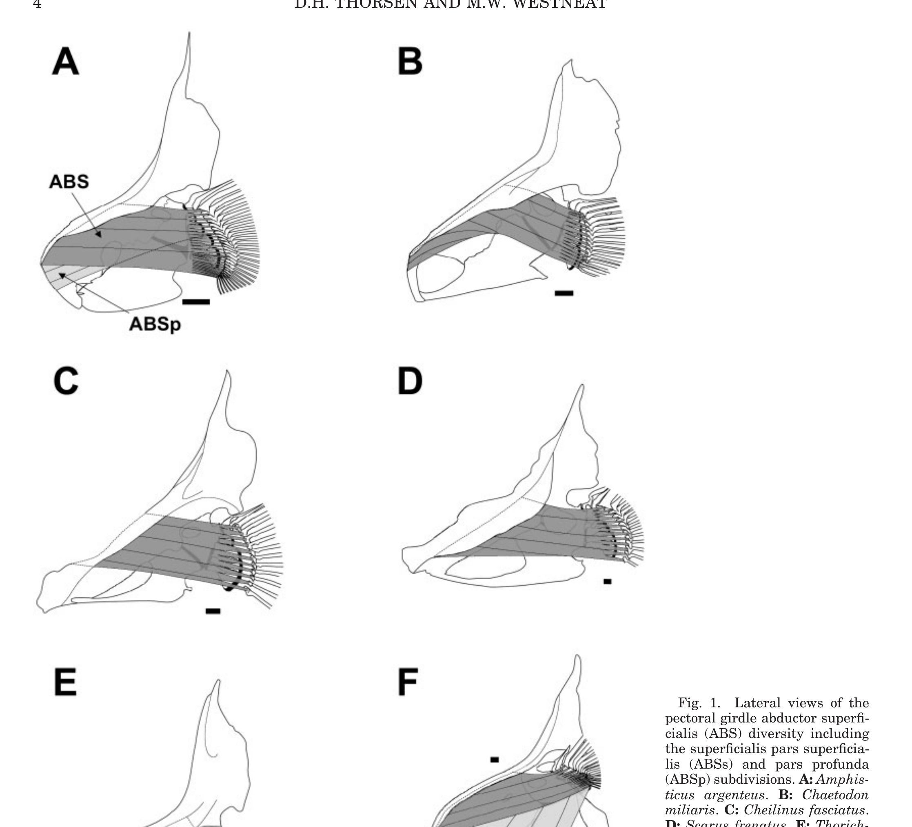
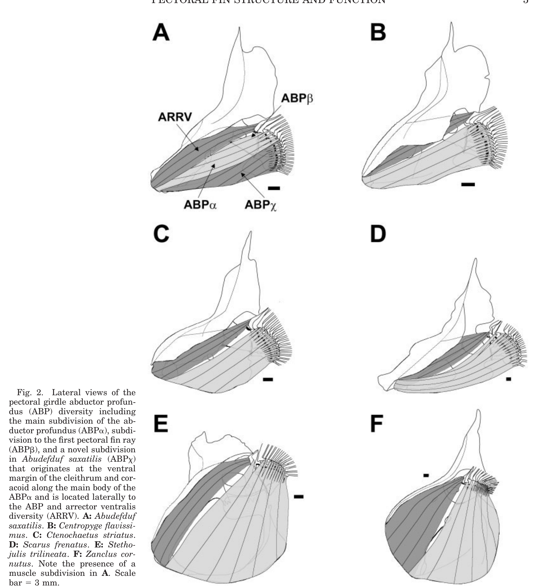
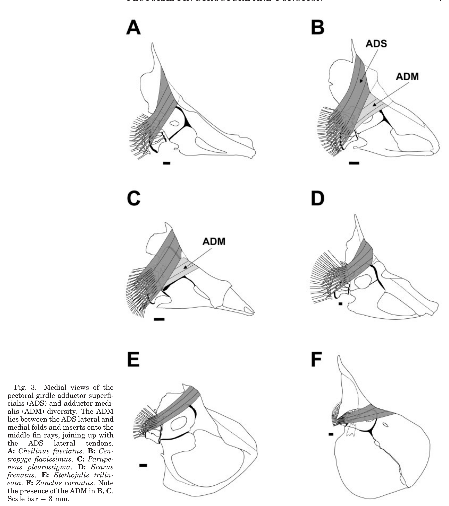
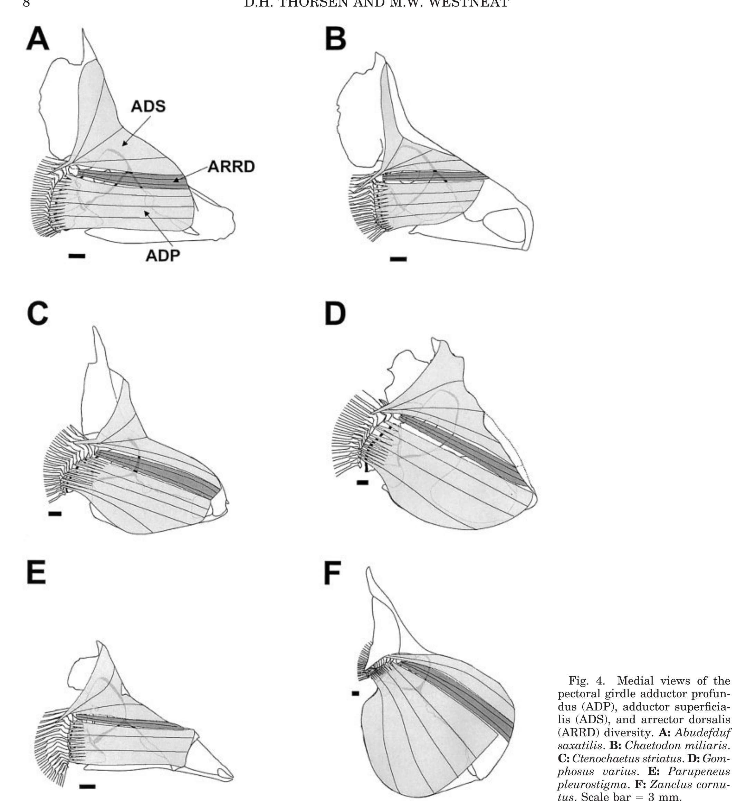

# Bài 03 - Kiến trúc hệ cơ vây ngực

**Loại:** Lesson  
**Module:** 02 - Hệ cơ và điều khiển

## 1. Mục tiêu học tập

Sau bài này, người học có thể nhận diện các nhóm cơ chính, phân biệt abductor và adductor, và giải thích cách các subdivision làm tăng mức độ điều khiển của vây.

## 2. Sơ đồ tổ chức chung

Các loài khảo sát chia sẻ một thiết kế tổng quát gồm **abductors ở phía lateral** và **adductors ở phía medial** của đai vây. Sáu nhóm cơ chính được mô tả là:

- abductor superficialis (ABS);
- abductor profundus (ABP);
- arrector ventralis (ARRV);
- adductor superficialis (ADS);
- adductor profundus (ADP);
- arrector dorsalis (ARRD).

Ngoài ra, adductor medialis (ADM) xuất hiện ở một số loài, và adductor radialis (ADR) được mô tả như một cơ nhỏ nằm medial hơn các adductors khác.

## 3. ABS: lớp abductor nông

ABS là lớp abductor nông nhất. Nó bám qua gân gần gốc phần lớn tia vây lateral, ngoại trừ tia đầu tiên P1. Nghiên cứu phát hiện các subdivision ABSs và ABSp ở một số loài, gợi ý rằng cùng một “khối cơ lớn” có thể được phân vùng để điều khiển các phần khác nhau của vây.

## 4. ABP: lớp abductor sâu

ABP nằm sâu hơn ABS, gần ARRV, có nguyên ủy liên hệ với cleithrum và coracoid và bám lên các mỏm gần gốc tia vây. Hình 2 cho thấy ABP không đơn giản là một bó cơ đồng nhất; bài báo ký hiệu các subdivision bằng chữ Hy Lạp và chỉ ra một subdivision chuyên đến P1 cùng một subdivision mới ở *Abudefduf saxatilis*.

## 5. ARRV và ARRD: điều khiển leading edge

ARRV và ARRD có vị trí và bám tương đối bảo thủ giữa các loài. Bài báo liên hệ hai cơ này với việc điều khiển **leading edge** - vùng thủy động lực học quan trọng của vây.

Theo mô tả của tác giả, downstroke bắt đầu với hoạt động ARRV, còn upstroke bắt đầu với hoạt động ARRD trước khi các adductors khác hoạt động gần đồng bộ. Đây là một ví dụ cho thấy thứ tự kích hoạt cơ có thể tổ chức cả chu kỳ stroke.

## 6. ADS, ADM và ADP

ADS nằm medial, có cấu trúc gấp, với các sợi hướng tới leading-edge rays và trailing-edge rays tạo các hướng kéo khác nhau. ADM chỉ hiện diện ở *Centropyge flavissimus*, *Chaetodon miliaris*, *Ctenochaetus striatus* và *Parupeneus pleurostigma* trong mẫu nghiên cứu; từ vị trí nguyên ủy-bám tận, tác giả đề xuất ADM giúp điều khiển các tia trung tâm và phía sau.

ADP cho thấy khác biệt đáng kể về pattern bám lên tia vây giữa các loài. Điều này quan trọng vì thay đổi điểm bám có thể thay đổi tia nào nhận lực và mức độc lập của từng vùng vây.

## 7. Từ giải phẫu đến chức năng

Một nguyên tắc quan trọng là **đường tác dụng lực**. Hai bó cơ có thể có khối lượng tương tự nhưng nếu chúng kéo theo hướng khác hoặc bám vào các tia khác, kết quả cơ học sẽ khác. Vì vậy, khi đọc một hình giải phẫu, luôn hỏi ba câu:

1. cơ bắt đầu ở đâu?
2. gân kết thúc ở đâu?
3. đường kéo nằm phía nào so với trục quay của tia vây?

## 8. Tự kiểm tra

1. ABS và ABP khác nhau chủ yếu ở lớp giải phẫu nào?
2. Vì sao subdivision có thể tăng khả năng điều khiển vây?
3. Vai trò được đề xuất của ARRV và ARRD liên quan đến phần nào của vây?
4. ADM có hiện diện ở mọi loài không?

## 9. Bài tập

Dựa vào Figures 1-4, chọn một panel bất kỳ và ghi chú tối thiểu bốn thành phần: cơ, xương, tia vây và hướng truyền lực dự đoán. Mọi dự đoán phải được đánh dấu là “giả thuyết từ hình thái”.

## 10. Tham chiếu học thuật

Nguồn chính: PDF trang 3-8 và 14-15.
