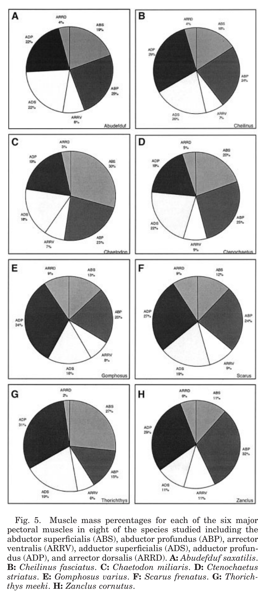
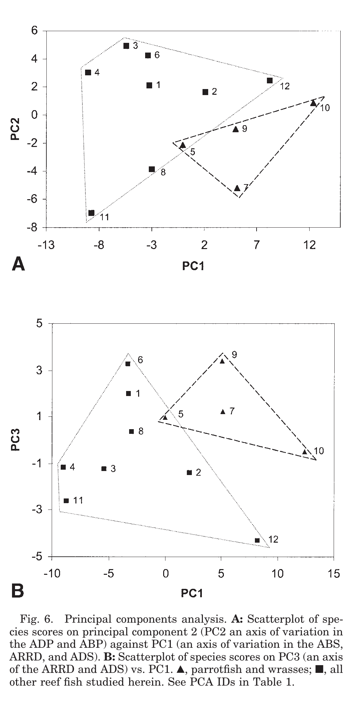

# Bài 04 - Khối lượng cơ, lực tiềm năng và PCA

**Loại:** Lesson  
**Module:** 02 - Hệ cơ và điều khiển

## 1. Mục tiêu học tập

Sau bài này, người học có thể đọc Figure 5 và Figure 6, giải thích logic dùng tỷ lệ khối lượng cơ và nhận diện các trục biến thiên chính trong PCA.

## 2. Vì sao so sánh khối lượng cơ?

Khối lượng cơ được dùng để ước lượng **năng lực tạo lực tương đối** của các nhóm cơ. Khi một nhóm cơ chiếm tỷ lệ lớn hơn trong tổng khối lượng cơ vây ngực, nó có thể phản ánh mức đầu tư cấu trúc lớn hơn vào một pha stroke hoặc chức năng điều khiển nào đó.

Bài báo ghi nhận sự biến thiên đáng kể giữa các loài, đặc biệt ở ABS, ABP, ADP và ARRD.

## 3. Đọc Figure 5

Figure 5 là tám biểu đồ tròn, mỗi biểu đồ thể hiện tỷ lệ sáu nhóm cơ chính. Không nên chỉ nhìn “miếng lớn nhất”; cần so sánh cả cấu hình tương đối giữa abductor, adductor và arrector.

Một kết quả nổi bật được tác giả nhấn mạnh là ba loài có flapping hiệu suất cao - *Gomphosus varius*, *Scarus frenatus* và *Stethojulis trilineata* - có tổng ARRV + ARRD gần gấp đôi nhiều loài còn lại trong tập khảo sát.

## 4. PCA: biến nhiều cơ thành một morphospace

Bài báo báo cáo ba principal components đầu giải thích 95,8% phương sai. Cách diễn giải trục được mô tả như sau:

- PC1: biến thiên mạnh liên quan ABS, ADS và ARRD;
- PC2: biến thiên liên quan ADP và ABP;
- PC3: biến thiên liên quan ARRD và ADS.

Wrasses có xu hướng chiếm một vùng riêng trong PCA, cho thấy một cấu hình khối lượng cơ có tính đặc trưng tương đối trong tập mẫu.

## 5. Abductor/adductor ratio

Tỷ lệ tổng abductor so với adductor là một cách nhìn về mức đầu tư tương đối vào hai phía của chu kỳ. Bài báo dùng sự khác nhau này để đề xuất rằng ở một số nhóm, upstroke có thể đóng vai trò lớn hơn trong tạo lực; ở nhóm khác, downstroke có thể nổi bật hơn.

Đây là **suy luận chức năng từ hình thái và tỷ lệ cơ**, không phải phép đo lực trực tiếp cho từng stroke.

## 6. Lưu ý về số liệu trong bài báo

Phần văn bản của bài báo nêu rằng cơ vây ngực chiếm 0,7-8,2% khối lượng cơ thể, đồng thời nêu đa số loài nằm khoảng 0,3-1,2%. Hai khoảng này không hoàn toàn nhất quán về cận dưới. Khóa học giữ nguyên các phát biểu như được trình bày trong bài báo và không tự sửa số liệu. Khi cần phân tích định lượng, ưu tiên đối chiếu Table 3 và Appendix.

## 7. Tự kiểm tra

1. Figure 5 và Figure 6 trả lời hai loại câu hỏi khác nhau như thế nào?
2. Tại sao tỷ lệ cơ không phải là bằng chứng trực tiếp của lực thủy động lực?
3. PC2 được bài báo liên hệ chủ yếu với những cơ nào?
4. Vì sao cần kiểm tra dữ liệu bảng khi văn bản và con số có dấu hiệu không nhất quán?

## 8. Bài tập

Dùng `../data/appendix-raw-muscle-masses.csv`, chọn một loài có từ ba specimen. Tính tỷ lệ từng cơ trên tổng sáu cơ cho từng specimen và so sánh mức biến thiên nội loài. Viết kết luận ở mức dữ liệu, không suy diễn vượt quá mẫu.

## 9. Tham chiếu học thuật

Nguồn chính: PDF trang 6, 9-11 và 15.
