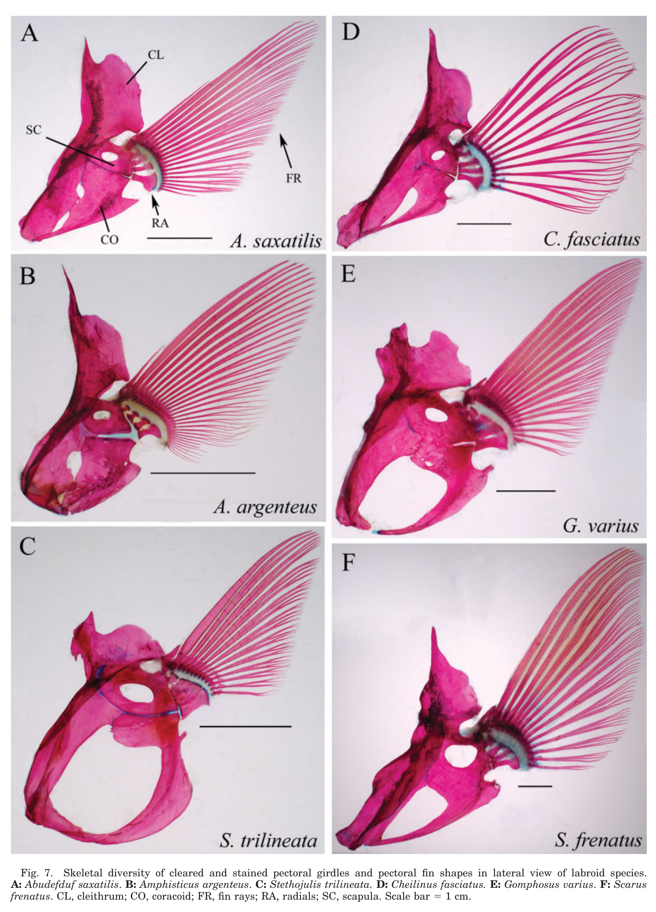
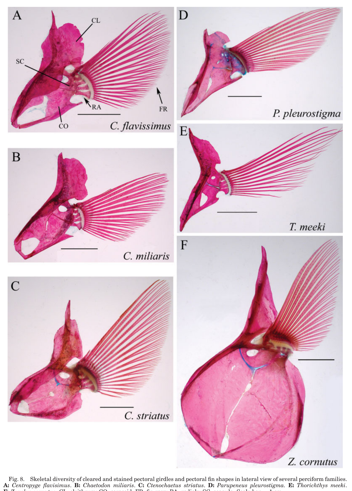

# Bài 05 - Đai vây ngực, tia vây và các mỏm bám gân

**Loại:** Lesson  
**Module:** 03 - Hệ xương và cơ học truyền lực

## 1. Mục tiêu học tập

Sau bài này, người học có thể nhận diện cleithrum, coracoid, scapula, radials và fin rays; giải thích cấu tạo hemitrichia; và liên hệ các mỏm ở gốc tia với truyền lực cơ.

## 2. Đai vây ngực

Đai vây ngực là nền cơ học để cơ bám và truyền lực sang vây. Ba thành phần nổi bật trong hình của bài báo là:

- cleithrum;
- coracoid;
- scapula.

Hình 7 và 8 cho thấy các thành phần này giữ cùng vai trò tổng quát nhưng hình dạng có thể khác rõ giữa loài.

## 3. Tia vây và hemitrichia

Mỗi tia vây gồm hai **hemitrichia**. Tia có thể phân nhánh hoặc không phân nhánh. Trong mẫu nghiên cứu, hai tia đầu thường không phân nhánh và tạo phần leading edge. *Thorichthys meeki* là trường hợp cực đoan: ba tia đầu và ba tia cuối không phân nhánh.

Tính cứng của leading edge được tác giả liên hệ với hình dạng vây: vây aspect ratio cao, dạng cánh có xu hướng cứng hơn vây rộng.

## 4. Mỏm ở gốc tia vây

Mỗi hemitrichium có một hoặc nhiều mỏm gần gốc, nơi gân của abductor hoặc adductor bám. Bài báo mô tả mỏm thường nổi rõ hơn ở leading edge và nhỏ dần về trailing edge ở nhiều flappers.

Sự khác nhau này quan trọng vì mỏm bám gân quyết định **cánh tay đòn**, hướng lực và mức độ kiểm soát của cơ trên từng tia.

## 5. Điều khiển độc lập từng tia

Bài báo đối chiếu *Cheilinus fasciatus* với *Gomphosus varius*. Ở *C. fasciatus*, cấu hình mỏm và điểm bám cho phép tác động của gân tạo mức kiểm soát đáng kể trên một tia riêng. Ở *G. varius*, tác động của một gân riêng lẻ cho ít kiểm soát độc lập hơn.

Đây là ví dụ điển hình cho việc hai loài có cùng “bộ phận cơ bản” nhưng khác **độ phân giải điều khiển cơ học**.

## 6. Tự kiểm tra

1. Cleithrum, coracoid và scapula đóng vai trò gì trong hệ thống?
2. Hemitrichia là gì?
3. Vì sao tia không phân nhánh ở leading edge có thể quan trọng về cơ học?
4. Mỏm bám gân ảnh hưởng đến truyền lực như thế nào?

## 7. Bài tập

Mở Figure 7 và Figure 8. Chọn hai loài có hình dạng đai vây rất khác nhau và lập bảng so sánh ba đặc điểm quan sát trực tiếp. Không gán chức năng nếu bài báo không cung cấp hoặc không đề xuất rõ.

## 8. Tham chiếu học thuật

Nguồn chính: PDF trang 7-8, 10, 12-13 và 15-16.
