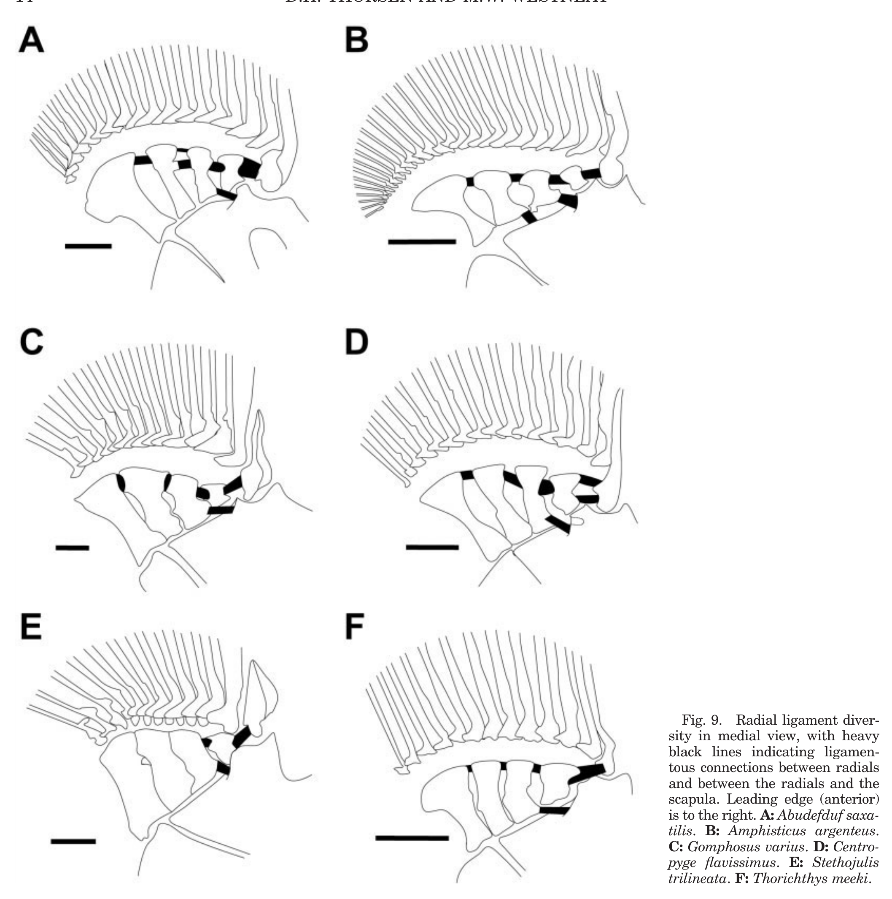

# Bài 06 - Radials và hệ dây chằng intraradial

**Loại:** Lesson  
**Module:** 03 - Hệ xương và cơ học truyền lực

## 1. Mục tiêu học tập

Sau bài này, người học có thể mô tả bốn proximal radials, giải thích hệ dây chằng intraradial và phân tích vì sao cấu hình radial có thể thay đổi cách các vùng vây quay.

## 2. Bốn proximal radials

Bài báo mô tả proximal radials của 12 loài gồm **bốn phần tử xương** khớp với coracoid và scapula. Kích thước của chúng tăng dần về phía trailing edge, còn đầu xa nằm trong một đệm fibrocartilage.

Radials là “khâu trung gian” giữa đai vây và mặt vây: nếu cơ tạo lực ở đai vây nhưng radials không truyền chuyển động theo cùng một hướng, hình dạng stroke của toàn vây sẽ thay đổi.

## 3. Phát hiện hệ dây chằng intraradial

Một đóng góp nổi bật của nghiên cứu là mô tả một hệ dây chằng trước đó chưa được ghi nhận, nối:

- radial với radial;
- radial đầu với tia P1;
- radial một hoặc hai với scapula.

Tác giả đề xuất hệ dây chằng này giúp **ổn định radial complex** để hoạt động như một đơn vị quay.

## 4. Đa dạng cấu hình

Không phải mọi loài có cùng cấu hình. Ở một số loài, dây chằng nằm ở bờ sau của radials; ở một số trường hợp, radials 2-4 có thể được nối kiểu suture thay vì bằng dây chằng. Số kết nối giữa P1-radial và scapula-radial cũng thay đổi.

Sự khác nhau này tạo cơ sở cho giả thuyết rằng các loài có thể khác nhau về **độ đồng bộ quay** giữa các tia vây.

## 5. Quay đồng nhất và quay phân vùng

Trong mẫu bảo quản, tác giả quan sát có trường hợp các radials cùng hướng và tạo quay tương đối đồng nhất cho các tia. Trường hợp khác, radial thứ ba hoặc thứ tư lệch góc, khiến các vùng của vây quay với biên độ hoặc hướng hơi khác.

Tác giả gợi ý chuyển động của các tia trailing edge theo hướng khác có thể liên quan đến cơ động hoặc dừng nhanh. Đây vẫn là giả thuyết cần kiểm chứng trên cá sống.

## 6. Tự kiểm tra

1. Radials nằm ở đâu trong chuỗi truyền lực từ cơ đến mặt vây?
2. Hệ intraradial ligament được đề xuất có chức năng gì?
3. Vì sao khác góc giữa các radials có thể tạo chuyển động phân vùng của vây?
4. Bằng chứng nào còn thiếu để khẳng định chức năng trên cá sống?

## 7. Bài tập

Dựa vào Figure 9, vẽ lại bằng sơ đồ đơn giản hai cấu hình: một cấu hình radials quay tương đối đồng nhất và một cấu hình có radial sau lệch hướng. Chú thích vùng tia vây nào có thể bị ảnh hưởng.

## 8. Tham chiếu học thuật

Nguồn chính: PDF trang 10-11, 14 và 16.
