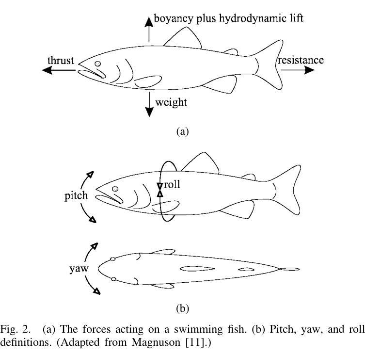

## 3. Các lực tác dụng lên cá đang bơi

Nước có hai đặc tính đặc biệt quan trọng đối với vận động của cá: gần như **không nén được** và có **khối lượng riêng cao**, khoảng 800 lần không khí theo cách diễn đạt của bài báo. Vì khối lượng riêng cơ thể động vật biển gần với nước, lực nổi có thể cân bằng phần lớn trọng lượng; do đó cơ thể không phải dành một cấu trúc lớn chỉ để “đỡ trọng lượng” như động vật trên cạn hay chim bay.

### 3.1. Ba cơ chế truyền động lượng chính

Bơi là quá trình trao đổi động lượng giữa cá và nước. Paper nhóm các cơ chế lực chính thành:

#### 3.1.1. Drag

**Friction/viscous drag** xuất phát từ độ nhớt và gradient vận tốc trong lớp biên. Nó phụ thuộc diện tích bề mặt ướt, tốc độ và trạng thái lớp biên.

**Form drag** xuất phát từ sự méo dòng chảy khi nước phải vòng qua cơ thể. Cá bơi hành trình nhanh thường có thân thuôn để giảm thành phần này.

**Induced/vortex drag** gắn với năng lượng đi vào các xoáy được tạo bởi vây đuôi, vây ngực hoặc bề mặt sinh lift/thrust. Hình dạng vây ảnh hưởng mạnh đến induced drag.

Paper gọi form drag và induced drag chung là **pressure drag**.

#### 3.1.2. Lift

Lift hình thành do bất đối xứng trường áp suất quanh bề mặt và tác dụng vuông góc với hướng dòng chảy tương đối. Trong cá, lift không chỉ là “lực nâng” theo phương đứng; tùy hướng vây, thành phần lift có thể được chuyển thành lực đẩy tiến, lực đổi hướng hoặc lực giữ độ sâu.

#### 3.1.3. Acceleration reaction

Đây là lực quán tính do khối nước xung quanh chống lại sự thay đổi vận tốc của thân/vây. Nó đặc biệt quan trọng trong chuyển động không ổn định, khi tăng tốc, khởi động nhanh, quay gấp hoặc khi tần số vây cao.

### 3.2. Cân bằng lực và ổn định

Theo Hình 2:

- phương đứng gồm **weight**, **buoyancy** và **hydrodynamic lift**;
- phương dọc gồm **thrust** và **resistance**;
- định hướng được mô tả bằng **pitch**, **yaw**, **roll**.

Cá có độ nổi âm phải liên tục tạo thêm lift để không chìm. Một cách là mở vây ngực khi bơi, nhưng việc tạo lift lại gây induced drag, vì vậy cân bằng dọc và đứng có liên hệ chặt chẽ.

Tốc độ bơi thường được chuẩn hóa bằng **BL/s — body lengths per second**, giúp so sánh cá có kích thước khác nhau.

Ở vận tốc trung bình không đổi, tổng lực và mômen phải cân bằng: lực đẩy trung bình bằng tổng lực cản trung bình. Viscous drag luôn góp vào cản; pressure drag, lift và acceleration reaction có thể đóng vai trò khác nhau tùy trạng thái và mục tiêu điều khiển.

---
