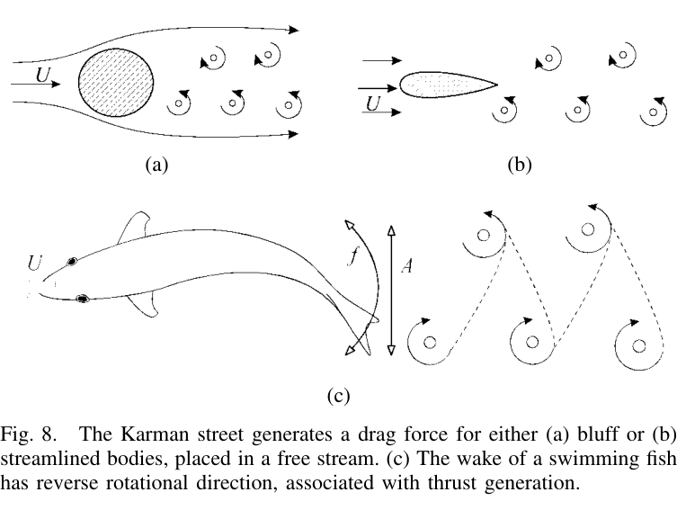
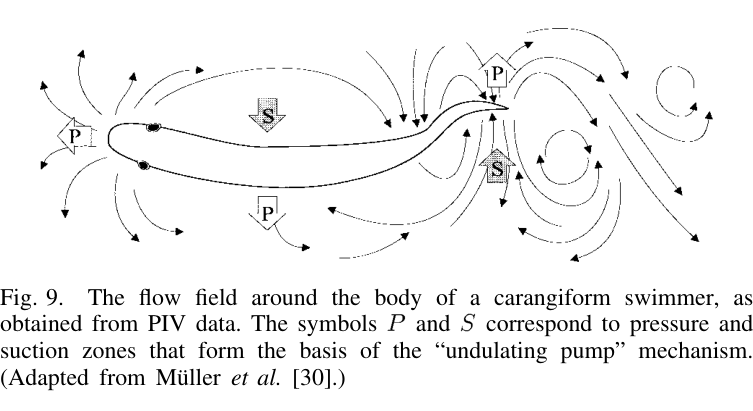
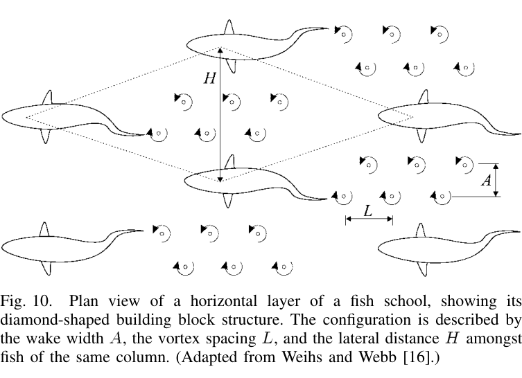

## 8. Wake và vortex của BCF

Vây đuôi đi qua lại tạo một chuỗi vortex dấu luân phiên. Wake của cá bơi tạo thrust có chiều quay ngược với Kármán vortex street điển hình phía sau vật cản tạo drag — thường gọi là **reverse Kármán street**.

### 8.1. Strouhal number

Paper dùng:

$$
St = \frac{fA}{U}
$$

với:

- $f$: tail-beat frequency;
- $A$: wake width, thường xấp xỉ peak-to-peak tail amplitude;
- $U$: vận tốc tiến trung bình.

Các nghiên cứu foil dao động của Triantafyllou et al. cho vùng thrust tối ưu xấp xỉ:

$$
0.25 < St < 0.40
$$

Dữ liệu cá bơi nhanh trong nhiều nhóm — không chỉ thunniform mà cả subcarangiform/carangiform — nằm trong vùng này, làm tăng tầm quan trọng của phân tích vorticity đối với BCF.

### 8.2. Ba cách giải thích hình thành wake

Paper trình bày nhiều giả thuyết, chưa coi một giả thuyết nào là kết luận tuyệt đối:

- **Tail-only interpretation:** reverse Kármán street có thể hình thành từ chính vây đuôi, vì foil dao động tách khỏi thân cũng tạo wake tương tự.
- **Vortex peg (Rosen):** vortex gắn trên phần trước cơ thể tạo “điểm tựa” để cá khai thác năng lượng xoáy.
- **Undulating pump (Müller et al.):** các vùng pressure/suction tạo tuần hoàn quanh các điểm uốn của thân, sau đó đi về đuôi và tương tác với bound vortices của tail.

Dữ liệu PIV được trích dẫn cho rằng khoảng **một phần ba năng lượng** truyền ra nước có nguồn từ phần thân trước, cho thấy tail không phải lúc nào cũng là cơ quan duy nhất quyết định wake.

### 8.3. Gray’s Paradox và thu hồi năng lượng vortex

Gray từng ước lượng công suất cần cho dolphin hành trình và thấy lớn hơn ước lượng công suất cơ bắp khoảng **7 lần**. Đây là Gray’s Paradox. Bài báo tổng thuật các hướng giải thích, trong đó có giả thuyết cơ thể/vây có thể tương tác với vortex đến để **tái thu năng lượng**, làm drag biểu kiến giảm ít nhất khoảng 50% trong một số lập luận/đo lường được trích dẫn.

Điều này trái với giả định truyền thống rằng thân uốn có apparent drag lớn gấp 3–5 lần thân cứng do friction drag + recoil losses. Paper kết luận ở thời điểm đó cần xem xét lại dữ liệu cũ dưới ánh sáng của cơ chế vorticity mới.

### 8.4. Schooling

Vortex phía sau một con cá tạo dòng ngược hướng bơi ngay sau nó nhưng có thể tạo vùng dòng thuận ở hai bên. Vì vậy một cá thể ở hàng sau có lợi nếu nằm lệch ngang giữa hai cá thể trước hơn là bám thẳng sau một con. Cấu hình được dự đoán có dạng **diamond** kéo dài; bơi lệch pha giữa các láng giềng cùng cột có thể tăng lợi ích.

Magnuson được paper trích dẫn với mức tiết kiệm năng lượng trung bình ước tính **10–20%** do schooling, mặc dù lợi ích thay đổi theo vị trí và sự triệt tiêu vortex.

---
