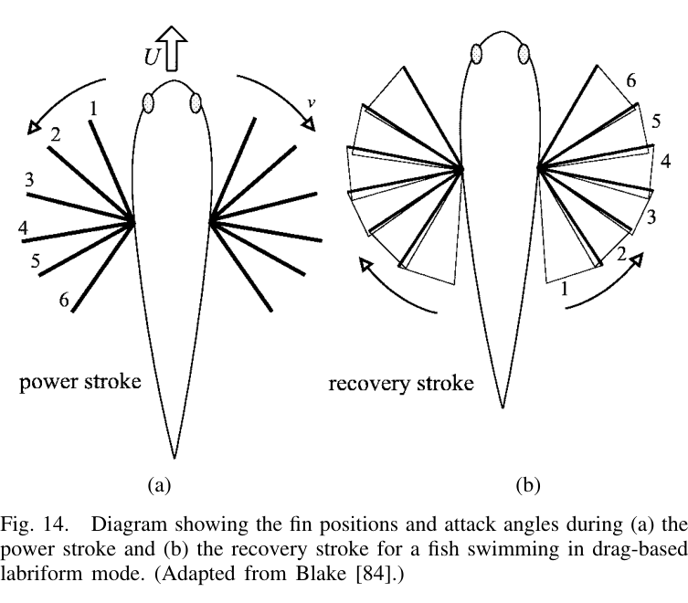

## 15. Drag-based labriform — rowing

Một chu kỳ rowing có hai pha:

### 15.1. Power stroke

- vây chuyển về sau;
- hướng chuyển gần vuông góc thân;
- angle of attack lớn;
- vận tốc vây có thể lớn hơn vận tốc tiến của cá.

Thrust đến từ drag trên vây và acceleration reaction khi một khối nước bị kéo/gia tốc nhanh ở đầu stroke.

### 15.2. Recovery stroke

Vây được **feather** để giảm diện tích/góc cản rồi đưa về phía trước. Vì phần lớn thrust chỉ có ở power stroke nên lực đẩy **không liên tục**, khác BCF nơi thrust hữu ích có thể sinh trong phần lớn tailbeat cycle.

### 15.3. Số liệu angelfish

Blade-element analysis trong paper dẫn ví dụ **angelfish dài 8 cm** bơi khoảng **0.5 BL/s**:

- **40% diện tích ngoài cùng của vây** tạo **hơn 80% tổng lực thủy động**;
- efficiency toàn rowing cycle khoảng **16%** trong tính toán Blake.

Các tính toán/đo Kato & Inaba cho rigid pectoral-fin model cũng ở mức **không quá 10%**. Dù thấp, rowing vẫn có thể hữu ích ở tốc độ rất chậm vì BCF efficiency giảm mạnh khi tốc độ giảm, ngoài ra còn có lợi về maneuverability và tính kín đáo.

Một loài *Notothenia neglecta* được paper dẫn chuyển từ labriform sang BCF khoảng **0.8 BL/s**.

Triangular pectoral fins được mô hình dự đoán gây ít interference drag lên thân hơn square/rectangular fins cùng planform area, phù hợp hình dạng thường thấy ở drag-based labriform swimmers.

---
