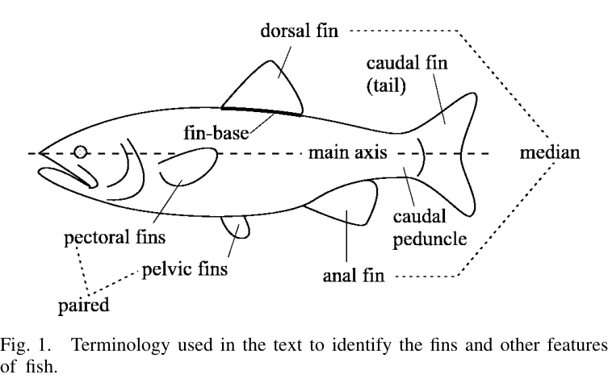
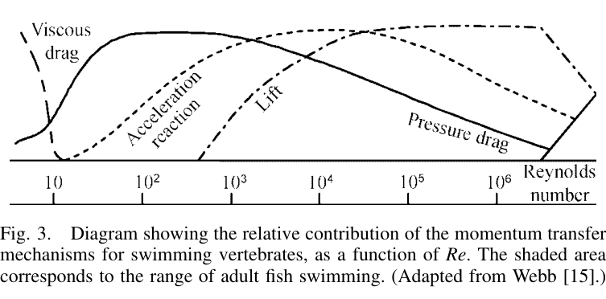
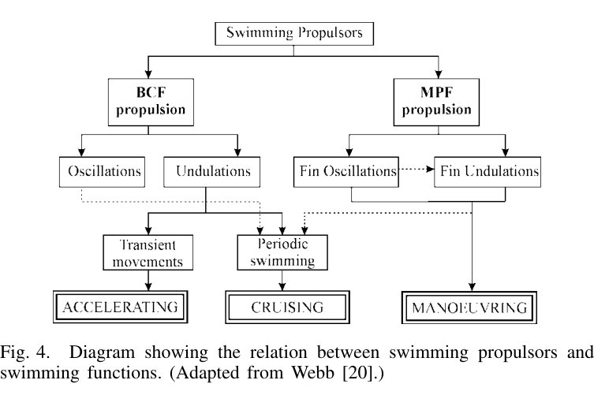
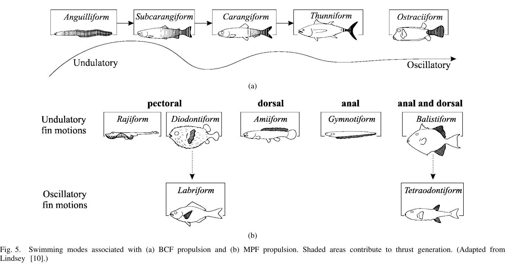
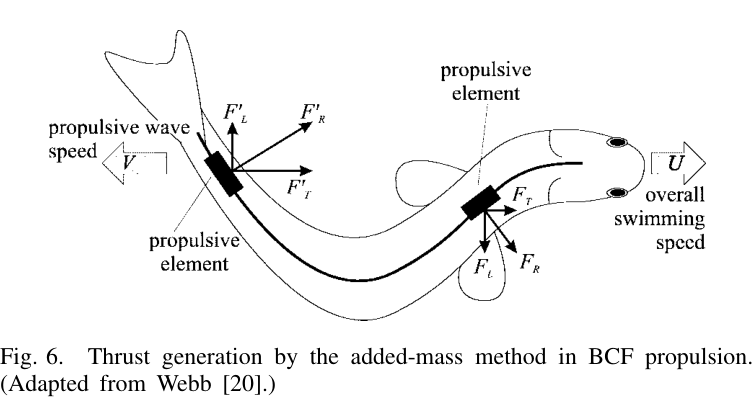
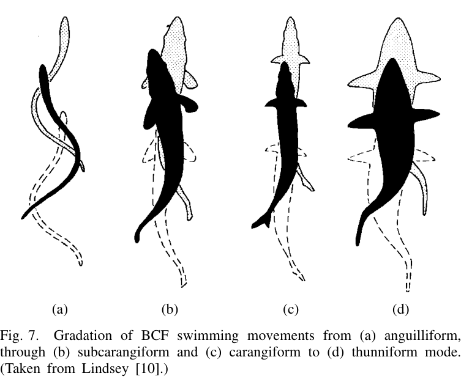
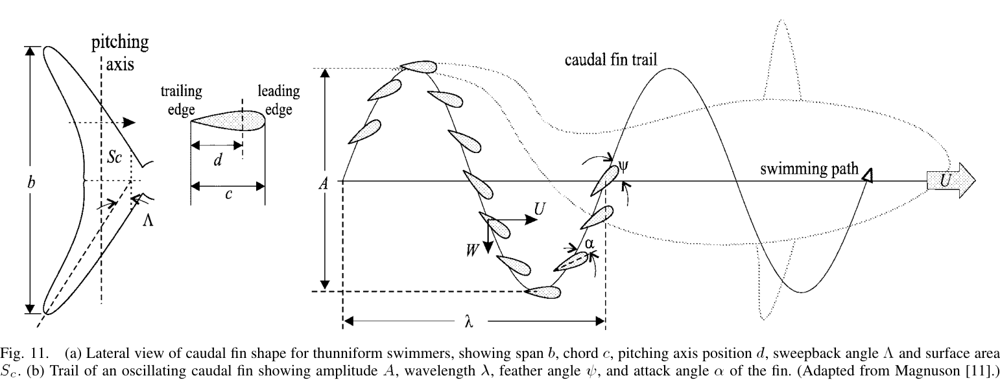
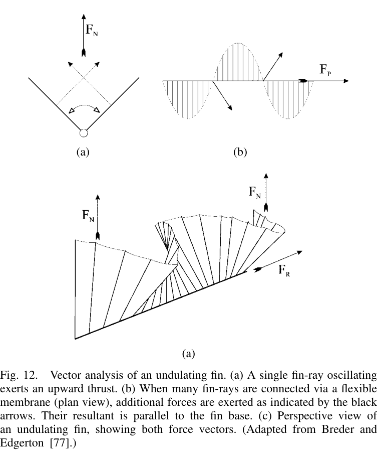
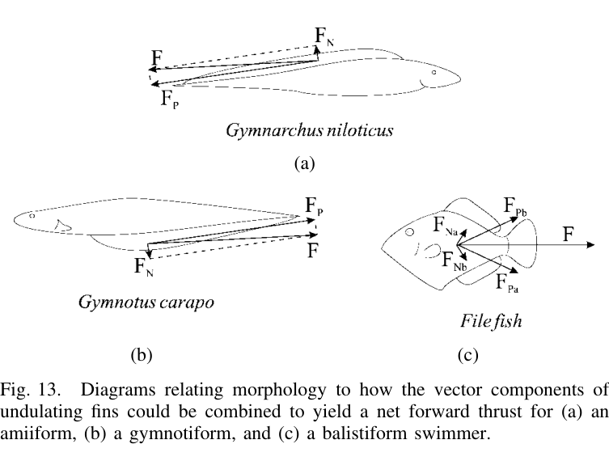

# Review of Fish Swimming Modes for Aquatic Locomotion — Tài liệu diễn giải chi tiết bằng tiếng Việt

> **Nguồn chính:** Michael Sfakiotakis, David M. Lane, J. Bruce C. Davies, *Review of Fish Swimming Modes for Aquatic Locomotion*, IEEE Journal of Oceanic Engineering, Vol. 24, No. 2, April 1999, pp. 237–252.
>
> **Loại tài liệu:** Bài học/tài liệu tham khảo độc lập được biên soạn lại từ toàn bộ PDF. Nội dung dưới đây giữ cấu trúc, thuật ngữ, số liệu, lập luận và phạm vi của bài báo; không phải bản chép nguyên văn. Những chỗ có ghi **“diễn giải ứng dụng”** là phần suy ra để dễ dùng cho mô phỏng/robotics, không phải câu chữ nguyên bản của paper.
>
> **Ảnh:** 15 hình chính đã được cắt riêng ở thư mục `figures/`. Toàn bộ raster/ảnh nhúng tìm thấy trong PDF được giữ thêm ở `images_raw/`.

---

## 1. Thông tin và mục tiêu của bài báo

Bài báo tổng quan các cơ chế bơi của cá dưới góc nhìn cơ sinh học và thủy động lực học, với mục tiêu đặc biệt là giúp kỹ sư thiết kế phương tiện dưới nước và robot mô phỏng sinh học hiểu các “bộ đẩy” tự nhiên của cá. Tác giả nhấn mạnh rằng các cấu trúc tiến hóa ở cá không nhất thiết là tối ưu tuyệt đối, nhưng đã được thích nghi rất hiệu quả với môi trường sống và cách sống của từng loài.

Hai họ cơ chế lớn được dùng xuyên suốt tài liệu:

- **BCF — Body and/or Caudal Fin propulsion:** tạo lực đẩy bằng thân và/hoặc vây đuôi.
- **MPF — Median and/or Paired Fin propulsion:** tạo lực đẩy bằng các vây giữa và/hoặc vây đôi, đặc biệt là vây ngực.

Theo tổng quan, MPF thường phù hợp hơn ở tốc độ thấp, cho khả năng cơ động và hiệu suất tốt trong các nhiệm vụ tinh chỉnh vị trí; BCF thường tạo lực đẩy và gia tốc lớn hơn. Các chế độ tiếp tục được phân biệt thành **undulatory** — chuyển động dạng sóng lan truyền dọc cơ quan đẩy — và **oscillatory** — cơ quan đẩy dao động quanh gốc mà không hình thành một sóng rõ rệt.

Ba nhóm được bài báo đánh giá có tiềm năng đặc biệt đối với hệ nhân tạo là:

1. **Lunate-tail / thunniform propulsion** — vây đuôi lưỡi liềm dao động kiểu hydrofoil.
2. **Undulating fins** — các vây dài tạo sóng lan truyền.
3. **Labriform swimming** — bơi bằng dao động vây ngực.

### 1.1. Ý nghĩa đối với AUV và robot cá

Các AUV truyền thống cần tăng thời gian hoạt động, giảm tiêu thụ năng lượng, cải thiện hover, đổi hướng, giữ vị trí và thao tác gần vật thể. Cá là một tập hợp “mẫu tham chiếu” hấp dẫn vì có thể kết hợp lực đẩy, ổn định và cơ động bằng các bề mặt mềm, đồng thời tạo tiếng ồn và wake ít lộ hơn chân vịt thông thường.

Điểm quan trọng của bài báo là không chỉ liệt kê kiểu bơi; nó còn liên hệ:

- hình thái cơ thể;
- động học của thân/vây;
- drag, lift, acceleration reaction;
- vortex/wake;
- các chỉ số vô thứ nguyên như Reynolds, reduced frequency, Strouhal;
- các mô hình toán học từ lý thuyết tấm uốn đến elongated-body theory, lifting-surface theory và CFD.

---

## 2. Thuật ngữ hình thái của cá

**Hình 1** của paper chuẩn hóa các thuật ngữ sử dụng trong toàn bộ bài:

- **dorsal fin:** vây lưng;
- **caudal fin / tail:** vây đuôi;
- **caudal peduncle:** cuống đuôi, đoạn thân hẹp ngay trước vây đuôi;
- **anal fin:** vây hậu môn;
- **pelvic fins:** vây bụng;
- **pectoral fins:** vây ngực;
- **median fins:** các vây nằm trên mặt phẳng giữa của cơ thể như dorsal/anal/caudal;
- **paired fins:** vây đôi trái–phải, chủ yếu pectoral và pelvic;
- **fin base:** phần gốc vây gắn với cơ thể;
- **main axis:** trục dọc chính của cá.

Vây còn được mô tả là **short-based** hoặc **long-based** tùy chiều dài gốc vây so với chiều dài toàn thân. Trong mô tả hydrofoil:

- **span** là kích thước vuông góc với dòng chảy;
- **chord** là kích thước gần song song với dòng chảy.

Các khái niệm này rất quan trọng khi phân tích aspect ratio, góc tấn, pitching, heaving và hiệu suất vây.

---

## 3. Các lực tác dụng lên cá đang bơi

Nước có hai đặc tính đặc biệt quan trọng đối với vận động của cá: gần như **không nén được** và có **khối lượng riêng cao**, khoảng 800 lần không khí theo cách diễn đạt của bài báo. Vì khối lượng riêng cơ thể động vật biển gần với nước, lực nổi có thể cân bằng phần lớn trọng lượng; do đó cơ thể không phải dành một cấu trúc lớn chỉ để “đỡ trọng lượng” như động vật trên cạn hay chim bay.

### 3.1. Ba cơ chế truyền động lượng chính

Bơi là quá trình trao đổi động lượng giữa cá và nước. Paper nhóm các cơ chế lực chính thành:

#### 3.1.1. Drag

**Friction/viscous drag** xuất phát từ độ nhớt và gradient vận tốc trong lớp biên. Nó phụ thuộc diện tích bề mặt ướt, tốc độ và trạng thái lớp biên.

**Form drag** xuất phát từ sự méo dòng chảy khi nước phải vòng qua cơ thể. Cá bơi hành trình nhanh thường có thân thuôn để giảm thành phần này.

**Induced/vortex drag** gắn với năng lượng đi vào các xoáy được tạo bởi vây đuôi, vây ngực hoặc bề mặt sinh lift/thrust. Hình dạng vây ảnh hưởng mạnh đến induced drag.

Paper gọi form drag và induced drag chung là **pressure drag**.

#### 3.1.2. Lift

Lift hình thành do bất đối xứng trường áp suất quanh bề mặt và tác dụng vuông góc với hướng dòng chảy tương đối. Trong cá, lift không chỉ là “lực nâng” theo phương đứng; tùy hướng vây, thành phần lift có thể được chuyển thành lực đẩy tiến, lực đổi hướng hoặc lực giữ độ sâu.

#### 3.1.3. Acceleration reaction

Đây là lực quán tính do khối nước xung quanh chống lại sự thay đổi vận tốc của thân/vây. Nó đặc biệt quan trọng trong chuyển động không ổn định, khi tăng tốc, khởi động nhanh, quay gấp hoặc khi tần số vây cao.

### 3.2. Cân bằng lực và ổn định

Theo Hình 2:

- phương đứng gồm **weight**, **buoyancy** và **hydrodynamic lift**;
- phương dọc gồm **thrust** và **resistance**;
- định hướng được mô tả bằng **pitch**, **yaw**, **roll**.

Cá có độ nổi âm phải liên tục tạo thêm lift để không chìm. Một cách là mở vây ngực khi bơi, nhưng việc tạo lift lại gây induced drag, vì vậy cân bằng dọc và đứng có liên hệ chặt chẽ.

Tốc độ bơi thường được chuẩn hóa bằng **BL/s — body lengths per second**, giúp so sánh cá có kích thước khác nhau.

Ở vận tốc trung bình không đổi, tổng lực và mômen phải cân bằng: lực đẩy trung bình bằng tổng lực cản trung bình. Viscous drag luôn góp vào cản; pressure drag, lift và acceleration reaction có thể đóng vai trò khác nhau tùy trạng thái và mục tiêu điều khiển.

---

## 4. Các đại lượng vô thứ nguyên và hiệu suất

### 4.1. Reynolds number

Paper định nghĩa:

$$
Re = \frac{LU}{\nu}
$$

trong đó:

- $L$: chiều dài đặc trưng của thân hoặc cơ quan đẩy;
- $U$: vận tốc bơi;
- $\nu$: độ nhớt động học của nước.

Đối với vùng điển hình của cá trưởng thành mà paper nêu:

$$
10^3 < Re < 5\times 10^6
$$

lực quán tính chiếm ưu thế và lực nhớt thường có thể bị bỏ qua trong một số mô hình bậc đầu. Tuy vậy, paper cũng chỉ ra rằng bỏ hoàn toàn viscous effects không phải lúc nào cũng phù hợp, nhất là ở anguilliform hoặc khi thân uốn với biên độ lớn.

### 4.2. Reduced frequency

Reduced frequency đo tầm quan trọng của hiệu ứng không ổn định:

$$
\sigma = \frac{2\pi fL}{U}
$$

với $f$ là tần số dao động. Trực giác của đại lượng này là so sánh thời gian nước đi qua một chiều dài đặc trưng với thời gian hoàn tất một chu kỳ chuyển động.

- $\sigma < 0.1$: chuyển động tương đối gần steady; acceleration reaction ít quan trọng.
- khoảng $0.1 < \sigma < 0.4$: acceleration reaction, pressure drag và lift đều có thể quan trọng.
- $\sigma$ lớn hơn: acceleration reaction ngày càng chi phối.

Paper lưu ý rằng với phần lớn cơ quan đẩy của cá, reduced frequency hiếm khi thấp hơn ngưỡng 0.1.

### 4.3. Froude efficiency

Một thước đo hiệu suất bơi được paper dùng là:

$$
\eta = \frac{\langle T \rangle U}{\langle P \rangle}
$$

trong đó $\langle T\rangle$ là lực đẩy trung bình theo thời gian, $U$ là vận tốc tiến trung bình và $\langle P\rangle$ là công suất trung bình cần cung cấp.

---

## 5. Phân loại tổng thể các chế độ bơi

### 5.1. Periodic và transient

Theo đặc điểm thời gian, chuyển động bơi được chia thành:

- **Periodic / steady / sustained swimming:** lặp lại chu kỳ, dùng để đi quãng đường tương đối dài ở tốc độ gần ổn định.
- **Transient / unsteady movements:** khởi động nhanh, thoát hiểm, quay gấp; thường kéo dài rất ngắn và phục vụ bắt mồi hoặc né kẻ săn mồi.

Bài báo tập trung nhiều hơn vào periodic swimming vì dễ đo lặp và mô hình hóa, nhưng vẫn đề cập các chuyển động transient khi liên quan.

### 5.2. BCF và MPF

Khoảng **15% họ cá** theo ước lượng trong paper sử dụng các chế độ không-BCF như phương thức đẩy thường lệ; số lượng lớn hơn nhiều dùng BCF để đi nhanh nhưng chuyển sang MPF để cơ động và ổn định.

### 5.3. Undulatory và oscillatory

- **Undulatory:** một sóng lan dọc cơ thể hoặc vây.
- **Oscillatory:** vây/thân xoay hoặc lắc quanh gốc mà không biểu hiện sóng lan rõ ràng.

Paper nhấn mạnh đây là một **continuum**, không phải hai hộp tách rời tuyệt đối. Khi bước sóng tăng dần, một chuyển động undulatory có thể tiến gần dạng oscillatory.

### 5.4. Hình thái và chức năng

Webb được trích dẫn với ba hướng chuyên hóa hình thái: **accelerating**, **cruising**, **maneuvering**. Các thiết kế này có xung đột; không có một loài tối ưu đồng thời ở cả ba. Phần lớn là các “generalist” pha trộn đặc điểm của nhiều chiến lược.

Bản đồ chế độ chính trong paper:

| Nhóm | Cơ quan chính | Dạng chuyển động | Mode tiêu biểu |
|---|---|---|---|
| BCF | thân + vây đuôi | undulatory | anguilliform, subcarangiform, carangiform, thunniform |
| BCF | vây đuôi | oscillatory | ostraciiform |
| MPF | vây ngực | undulatory | rajiform, diodontiform |
| MPF | vây lưng | undulatory | amiiform |
| MPF | vây hậu môn | undulatory | gymnotiform |
| MPF | dorsal + anal | undulatory | balistiform |
| MPF | vây ngực | oscillatory | labriform |
| MPF | dorsal + anal | oscillatory | tetraodontiform |

Các mode là những điểm nổi bật trên một phổ liên tục. Một con cá có thể dùng nhiều mode ở cùng thời điểm hoặc đổi mode theo tốc độ.

---

# 6. BCF propulsion — thân và vây đuôi

## 6.1. Nguyên lý sóng đẩy

Trong các BCF undulatory mode, sóng biến dạng chạy dọc thân về phía sau theo hướng ngược với chuyển động tiến, với tốc độ lan sóng lớn hơn vận tốc bơi. Biên độ thường tăng dần về phía đuôi.

Paper phân biệt hai cơ chế sinh thrust:

1. **Added-mass / reactive mechanism** — thân/vây gia tốc một lượng nước; phản lực của nước lên từng phần thân có thành phần dọc tạo thrust và thành phần ngang gây thất thoát/recoil.
2. **Lift/vorticity mechanism** — đặc biệt nổi bật ở thunniform; vây đuôi hoạt động gần như một foil dao động tạo lift và cấu trúc vortex có lợi.

Các nghiên cứu mới hơn tại thời điểm 1999 cho thấy vorticity cũng quan trọng ở subcarangiform và carangiform, không chỉ thunniform.

Khi sóng đi về sau, mỗi **propulsive element** làm tăng động lượng của nước. Phản lực $F_R$ tác dụng gần vuông góc phần tử, sau đó được phân giải thành:

- thành phần tạo **thrust**;
- thành phần **lateral**, làm nước bị đẩy ngang, gây mất năng lượng và tendency sideslip/yaw.

Các đoạn gần đuôi có quãng đường ngang và tốc độ lớn hơn, nên thường gia tốc nhiều nước hơn. Đồng thời vì biên độ tăng về đuôi, hướng của phần tử sau thuận lợi hơn để phản lực có tỷ lệ thành phần thrust cao.

Tỷ số giữa vận tốc bơi $U$ và vận tốc lan sóng $V$ từng được dùng như một chỉ báo hiệu suất.

## 6.2. Anguilliform

Đặc điểm:

- toàn bộ thân tham gia uốn với biên độ lớn;
- ít nhất khoảng một bước sóng đầy đủ hiện diện dọc cơ thể;
- các lực ngang ở nhiều đoạn có khả năng triệt tiêu nhau tốt, giảm recoil;
- có thể bơi lùi bằng cách đảo hướng lan của sóng, nhưng cần độ mềm thân và displacement ngang lớn.

Ví dụ: **eel** và **lamprey**.

Đây là kiểu rất phù hợp khi cần thân mềm, chui luồn hoặc đổi hướng trên quỹ đạo hẹp; đổi lại thân tham gia uốn lớn làm bài toán friction drag và điều khiển phức tạp hơn.

## 6.3. Subcarangiform

Ví dụ điển hình trong paper là **trout**. Dao động ở phần trước bị hạn chế; biên độ tăng chủ yếu ở **nửa sau cơ thể**. Đây là bước chuyển giữa thân uốn rộng của anguilliform và thân tương đối cứng của carangiform.

## 6.4. Carangiform

Đặc điểm:

- undulation chủ yếu bị giới hạn ở **1/3 cuối thân**;
- vây đuôi tương đối cứng đóng vai trò tạo thrust lớn;
- thường nhanh hơn anguilliform/subcarangiform;
- giảm khả năng quay gấp và tăng tốc vì phần lớn thân cứng hơn;
- lateral force tập trung phía sau nên tendency recoil tăng.

Hai thích nghi hình thái được Lighthill nêu để giảm recoil:

1. **caudal peduncle hẹp/nông**;
2. độ sâu và khối lượng cơ thể tập trung về phía trước.

## 6.5. Thunniform

Paper mô tả thunniform là đỉnh cao của thiết kế bơi hành trình hiệu suất cao trong môi trường nước. Ở cá xương, nó xuất hiện ở nhóm scombrid như **tuna** và **mackerel**.

Đặc điểm:

- phần thân trước gần như không lắc ngang;
- chuyển động ngang đáng kể tập trung ở cuống đuôi và vây đuôi;
- vây đuôi cung cấp **hơn 90% thrust** theo mô tả của paper;
- thân thuôn giảm pressure drag;
- caudal peduncle hẹp;
- vây đuôi cứng, cao, hình lưỡi liềm (**lunate**).

Đổi lại, một hình thái tối ưu cho hành trình nhanh trong nước tương đối yên không tối ưu cho bơi chậm, quay gắt, khởi động mạnh từ đứng yên hoặc môi trường nhiễu/turbulent.

## 6.6. Ostraciiform

Đây là **BCF mode thuần oscillatory** trong phân loại của paper:

- cơ thể gần như cứng;
- vây đuôi cứng lắc kiểu con lắc;
- thường gặp ở cá có thân bọc cứng;
- MPF được dùng nhiều để kiếm ăn/cơ động; caudal oscillation bổ trợ khi cần thêm thrust.

Hiệu suất thủy động lực được đánh giá thấp hơn rõ so với thunniform. Mô hình của Blake cho hiệu suất khoảng **0.5**.

---

## 7. Uốn thân và friction drag

Viscous drag được viết theo dạng Newton:

$$
D_v = \frac{1}{2} C_f S\rho U^2
$$

trong đó $C_f$ là drag coefficient, $S$ là diện tích bề mặt ướt và $\rho$ là khối lượng riêng nước.

Khi thân uốn, vận tốc tương đối của từng phần cơ thể so với nước tăng, làm lớp biên mỏng hơn và gradient vận tốc/shear stress tăng. Paper gọi đây là **boundary-layer thinning effect**.

Các ước lượng lịch sử từng cho rằng drag của thân đang uốn lớn gấp **4–9 lần** thân cứng tương đương. Webb cho rằng con số này có thể bị phóng đại và recoil losses đáng chú ý hơn. Một mô phỏng 3D trên nòng nọc cho kết quả không thể áp dụng trực tiếp cho cá trưởng thành vì Reynolds khác; khi mô hình được đổi sang kinematics của saithe, hệ số tăng drag được giảm xuống khoảng **1.12**, nhấn mạnh mối liên hệ giữa biên độ ngang lớn và friction drag lớn.

Điểm cốt lõi: không thể chỉ gắn một “hệ số drag do uốn” cố định cho mọi loài; kinematics và Reynolds phải được xét cùng nhau.

---

## 8. Wake và vortex của BCF

Vây đuôi đi qua lại tạo một chuỗi vortex dấu luân phiên. Wake của cá bơi tạo thrust có chiều quay ngược với Kármán vortex street điển hình phía sau vật cản tạo drag — thường gọi là **reverse Kármán street**.

### 8.1. Strouhal number

Paper dùng:

$$
St = \frac{fA}{U}
$$

với:

- $f$: tail-beat frequency;
- $A$: wake width, thường xấp xỉ peak-to-peak tail amplitude;
- $U$: vận tốc tiến trung bình.

Các nghiên cứu foil dao động của Triantafyllou et al. cho vùng thrust tối ưu xấp xỉ:

$$
0.25 < St < 0.40
$$

Dữ liệu cá bơi nhanh trong nhiều nhóm — không chỉ thunniform mà cả subcarangiform/carangiform — nằm trong vùng này, làm tăng tầm quan trọng của phân tích vorticity đối với BCF.

### 8.2. Ba cách giải thích hình thành wake

Paper trình bày nhiều giả thuyết, chưa coi một giả thuyết nào là kết luận tuyệt đối:

- **Tail-only interpretation:** reverse Kármán street có thể hình thành từ chính vây đuôi, vì foil dao động tách khỏi thân cũng tạo wake tương tự.
- **Vortex peg (Rosen):** vortex gắn trên phần trước cơ thể tạo “điểm tựa” để cá khai thác năng lượng xoáy.
- **Undulating pump (Müller et al.):** các vùng pressure/suction tạo tuần hoàn quanh các điểm uốn của thân, sau đó đi về đuôi và tương tác với bound vortices của tail.

Dữ liệu PIV được trích dẫn cho rằng khoảng **một phần ba năng lượng** truyền ra nước có nguồn từ phần thân trước, cho thấy tail không phải lúc nào cũng là cơ quan duy nhất quyết định wake.

### 8.3. Gray’s Paradox và thu hồi năng lượng vortex

Gray từng ước lượng công suất cần cho dolphin hành trình và thấy lớn hơn ước lượng công suất cơ bắp khoảng **7 lần**. Đây là Gray’s Paradox. Bài báo tổng thuật các hướng giải thích, trong đó có giả thuyết cơ thể/vây có thể tương tác với vortex đến để **tái thu năng lượng**, làm drag biểu kiến giảm ít nhất khoảng 50% trong một số lập luận/đo lường được trích dẫn.

Điều này trái với giả định truyền thống rằng thân uốn có apparent drag lớn gấp 3–5 lần thân cứng do friction drag + recoil losses. Paper kết luận ở thời điểm đó cần xem xét lại dữ liệu cũ dưới ánh sáng của cơ chế vorticity mới.

### 8.4. Schooling

Vortex phía sau một con cá tạo dòng ngược hướng bơi ngay sau nó nhưng có thể tạo vùng dòng thuận ở hai bên. Vì vậy một cá thể ở hàng sau có lợi nếu nằm lệch ngang giữa hai cá thể trước hơn là bám thẳng sau một con. Cấu hình được dự đoán có dạng **diamond** kéo dài; bơi lệch pha giữa các láng giềng cùng cột có thể tăng lợi ích.

Magnuson được paper trích dẫn với mức tiết kiệm năng lượng trung bình ước tính **10–20%** do schooling, mặc dù lợi ích thay đổi theo vị trí và sự triệt tiêu vortex.

---

## 9. Mô hình toán học cho BCF

### 9.1. Từ resistive model đến elongated-body theory

Các mô hình resistive đầu tiên dùng cách quasi-static: coi từng “frame” chuyển động như dòng steady rồi tính lực. Chúng chủ yếu phù hợp Reynolds thấp và bị giới hạn vì bỏ qua inertia và đơn giản hóa hình học.

Wu phát triển **2D waving-plate theory**, coi cá như một tấm đàn hồi uốn. Cùng với slender-body theory từ khí động học, nó tạo nền cho **Lighthill elongated-body theory**, phù hợp đặc biệt với subcarangiform và carangiform.

Ý tưởng chính: các dòng do các đoạn thân uốn sinh ra có thể triệt tiêu trung bình qua một tailbeat, nên mean thrust có thể suy từ kinematics ở trailing edge. Lighthill mở rộng thành **large-amplitude elongated-body theory** cho biên độ đuôi lớn.

### 9.2. Công suất thrust trong elongated-body theory

Paper trình bày dạng:

$$
P_T = mWwU - \frac{mw^2U}{2\cos\theta}
$$

với added mass trên đơn vị chiều dài:

$$
m = \left(\frac{B}{2}\right)^2\pi\rho
$$

và RMS lateral velocity của trailing edge:

$$
W = \frac{fA\pi}{\sqrt{2}}
$$

vận tốc truyền cho nước ở trailing edge:

$$
w = W\left(1-\frac{U}{V}\right)
$$

$B$ là span ở trailing edge, $A$ là biên độ caudal oscillation, $f$ là tần số, $V$ là vận tốc sóng và $\theta$ là góc trailing edge so với mặt phẳng chuyển động ngang theo ký hiệu của nguồn.

Hiệu suất hydromechanical được viết:

$$
\eta = 1-\frac{1}{2}\left(1-\frac{U}{V}\right)
$$

Trong mô hình này, paper lưu ý hiệu suất không nhỏ hơn 0.5 và tăng khi $U/V$ tiến về 1.

### 9.3. Các mở rộng

Nghiên cứu sau đó bổ sung:

- elasticity của thân;
- recoil;
- centerline curvature;
- tương tác giữa tail và vortex sheet từ dorsal fin;
- ảnh hưởng body thickness;
- turning maneuvers và fast starts;
- các mở rộng tuyến tính/phi tuyến của waving-plate theory.

Elongated-body theory **không phù hợp cho thunniform** vì vây đuôi và hình học không thỏa giả định slenderness. Thunniform được xử lý tốt hơn bằng các lý thuyết foil/wing dao động.

### 9.4. Wake-energy method và CFD

Một hướng khác ước lượng chi phí năng lượng từ năng lượng shed vào wake qua kích thước và circulation của vortex. Khi áp dụng cho PIV của mullet, paper dẫn hiệu suất đẩy **trên 90%**.

CFD giải Navier–Stokes cho trường vận tốc/áp suất quanh thân và đuôi là hướng rất hứa hẹn vì bớt phụ thuộc các giả định phân tích. Cuối thập niên 1990, mô hình bắt đầu chuyển từ 2D/simplified sang 3D nhờ năng lực tính toán tăng.

---

# 10. Lunate-tail propulsion và thunniform chi tiết

RoboTuna được paper dùng làm minh chứng thực nghiệm nổi bật: robot có hình dạng tuna, kết hợp tail kiểu oscillating foil với body kinematics gần carangiform và được báo cáo mean propulsive efficiency lên tới **91%**.

## 10.1. Hình học vây đuôi

Vây đuôi thunniform gần một hydrofoil thuôn:

- sweepback vừa;
- leading edge cong;
- trailing edge sắc;
- độ cứng cao;
- pitching axis nằm ở một vị trí $d$ theo chord;
- diện tích chiếu $S_c$ và span $b$.

Aspect ratio:

$$
AR = \frac{b^2}{S_c}
$$

Paper nêu $AR$ của thunniform khoảng **4.5–7.2**. AR cao làm giảm induced drag trên mỗi đơn vị lift/thrust.

## 10.2. Kinematics: heave + pitch

Tail không chỉ quét trái–phải; nó kết hợp:

- **heaving:** tịnh tiến ngang tuần hoàn;
- **pitching:** xoay thay đổi góc của foil;
- **angle of attack** $\alpha$;
- **feathering angle** $\psi$;
- peak-to-peak amplitude $A$;
- tailbeat frequency $f$;
- wavelength $\lambda$.

$\alpha$ và $\psi$ thay đổi trong chu kỳ để duy trì thrust hiệu quả.

Một số liệu được paper dẫn: **Kawakawa dài 40 cm** có tail-beat frequency tới **14.5 Hz** khi bơi khoảng **8.2 BL/s**, với $Re\approx1.3\times10^6$.

Thrust đến từ:

- lift trên bề mặt foil;
- **leading-edge suction**, tức vùng áp suất giảm quanh leading edge tròn.

## 10.3. Các yếu tố ảnh hưởng thrust/efficiency

1. **Aspect ratio** — AR cao thường hiệu quả hơn.
2. **Sweepback + leading-edge curvature** — leading edge cong giúp giảm phụ thuộc quá mức vào suction và tránh separation ở thrust cao.
3. **Stiffness** — cứng hơn cho thrust lớn hơn với mức giảm efficiency tương đối nhỏ.
4. **Oscillatory kinematics** — tần số, biên độ, phase giữa pitch/heave và pitching-axis position.

Reduced frequency cho tail:

$$
\sigma = \frac{2\pi fc}{U}
$$

Paper đưa proportional feathering parameter:

$$
\theta = \frac{\alpha_{\max}U}{W_{\max}}
$$

và trích Lighthill rằng khoảng **0.6–0.8** cho tổ hợp tốt giữa leading-edge suction và hydromechanical efficiency.

## 10.4. Các lý thuyết foil được tổng thuật

Paper điểm lại nhiều lớp mô hình:

- Lighthill: linear 2D wing theory cho dao động biên độ nhỏ;
- Wu: tối ưu hóa trong 2D cho efficiency có thể gần 1;
- Chopra: large-amplitude 2D impulse approach và mở rộng 3D;
- Chopra & Kambe: 3D unsteady lifting-surface;
- Lan: unsteady quasi-vortex-lattice;
- Katz & Weihs: ảnh hưởng chordwise flexibility;
- Ahmadi & Widnall: unsteady lifting-line;
- Bose & Lien: strip theory;
- Cheng và cộng sự: centerline cong, sweepback, vortex-ring methods;
- Liu & Bose: spanwise flexibility bằng time-domain panel method.

Nhiều mô hình trong số này giả định wake phẳng, trong khi quan sát thực tế cho thấy vortex wake có cấu trúc quay ba chiều phức tạp.

## 10.5. Điều kiện thrust tối ưu của oscillating foil

Paper tóm tắt theo Triantafyllou et al.:

1. $0.25 < St < 0.40$.
2. $15^\circ < \alpha_{\max} < 25^\circ$.
3. Tỷ số heave amplitude trên chord ở bậc một:

$$
\frac{A/2}{c}\sim O(1)
$$

4. Với pitching axis khoảng:

$$
d=\frac{2}{3}c
$$

pitch nên **dẫn heave khoảng 75°**.

Đây là nhóm tham số rất quan trọng khi chuyển từ mô tả sinh học sang một controller cho foil robot.

---

# 11. Median/Paired Fin Undulations — MPF dạng sóng

## 11.1. Cấu trúc vây và phạm vi tốc độ

Undulating fins được dùng để:

- tạo lực đẩy phụ;
- maneuvering;
- stabilization;
- hover;
- hoặc làm nguồn propulsion chính ở tốc độ thường **dưới khoảng 3 BL/s**.

Vây teleost gồm các **fin rays** có span và stiffness khác nhau, nối bởi một **membrane mềm**. Ở median fin, paper mô tả thường có khoảng sáu cơ điều khiển mỗi ray, cho ray khả năng chuyển động hai bậc tự do; một số loài còn có thể uốn chủ động từng ray. Paired fins có hệ cơ phức tạp hơn, cho cả rotation riêng của ray.

## 11.2. Rajiform

Gặp ở ray, skate, manta. Vây ngực cực lớn, mềm, dạng tam giác. Sóng vertical đi dọc vây:

- amplitude tăng từ phần trước tới vùng apex;
- sau đó giảm về phía sau;
- toàn vây cũng có thể flap lên/xuống.

Cảm giác thị giác giống “bay dưới nước”, nhưng cơ chế thực chất là tương tác fluid–structure trên vây mềm rộng.

## 11.3. Diodontiform

Broad pectoral fins mang sóng, có thể thấy tới **hai bước sóng đầy đủ** trên vây. Undulation thường kết hợp với flapping của cả vây.

## 11.4. Amiiform

Propulsion chủ yếu bằng **long-based dorsal fin**. Body axis thường được giữ gần thẳng. Paper lấy nhóm electric eel nước ngọt châu Phi làm ví dụ, với dorsal fin kéo dài phần lớn cơ thể và có thể có tới khoảng **200 fin rays**.

## 11.5. Gymnotiform

Có thể xem như “đảo ngược” amiiform:

- long-based **anal fin** tạo sóng;
- dorsal fin thường vắng;
- thân được giữ thẳng.

Paper thảo luận rằng thân cứng có thể liên quan hệ electrosensory, đồng thời cũng tránh tăng friction drag do body undulation.

## 11.6. Balistiform

Cả **dorsal fin và anal fin** đều undulate. Điển hình ở triggerfish/Balistidae. Hai median fins thường nghiêng tương đối với nhau; thân dẹt bên. Sự bố trí này giúp các vector lực kết hợp thuận lợi để tạo forward thrust và cơ động.

---

## 12. Vector lực của vây undulatory

Theo Breder và Edgerton, lực của undulating fin có thể phân thành:

- $F_N$: thành phần gần **normal** với fin base, do oscillation của từng ray;
- $F_P$: thành phần **parallel** với fin base, do sóng lan trên màng/ray.

Nếu fin base song song trục thân, $F_N$ không trực tiếp tạo thrust tiến; nó có thể gây pitching hoặc tiêu hao nếu không phục vụ buoyancy compensation. Nhiều loài bố trí gốc vây nghiêng để resultant lực gần song song trục thân.

Trong balistiform, dorsal và anal fins nghiêng tương đối giúp các thành phần lực từ hai sóng cộng thành thrust tiến. Bằng cách thay đổi amplitude, wavelength, phase và mức hoạt động từng vây, cá có thể điều hướng resultant force rất chính xác.

### 12.1. Seahorse như ví dụ maneuverability

Paper mô tả nhiều mức điều khiển ở seahorse:

- thay đổi khoảng cách, chiều dài hiệu dụng, độ mềm ray;
- thay amplitude/wavelength/phase;
- ray có chuyển động ngang và dọc nhỏ;
- vây có thể mở dạng quạt;
- đổi trục dài của vây so với thân;
- một phần vây có thể dịch tương đối với phần khác;
- cả vây có thể bị lệch sang một bên rồi vẫn undulate ở vị trí đó.

Điều này bù cho thân cứng của seahorse trong turn maneuvers.

Nhiều median-fin undulatory swimmers có thể **bơi lùi gần hiệu quả như bơi tiến** chỉ bằng cách đảo hướng truyền sóng.

### 12.2. Paired-fin asymmetry và hover

Ở paired pectoral fins, các thành phần lực ngang đối xứng thường triệt tiêu yaw. Khi hai vây có amplitude/phase khác nhau, cá tạo powered maneuver. Khi hover, các vây sinh các corrective force nhỏ để chống pressure fluctuation, current nhỏ hoặc thậm chí jet từ respiratory flow.

---

## 13. Mô hình toán học cho undulating fins

### 13.1. Actuator-disc theory

Vây được thay bằng một “black box” lý tưởng tạo pressure rise qua một đĩa. Tích phân chênh áp trên diện tích cho thrust. Ưu điểm là không cần biết chi tiết mọi ray; nhược điểm là giả định hạn chế và khó phản ánh động học 3D mềm.

### 13.2. Large-amplitude elongated-body áp dụng cho median fin

Do sóng trên median fin giống sóng thân BCF, elongated-body theory đã được mở rộng cho balistiform/gymnotiform/amiiform. Kết quả được paper trích dẫn cho rigid deep-bodied fish:

- động lượng shed vào nước có thể tăng khoảng **3 lần** so với chỉ xét vây “một mình”;
- phần tăng này không đồng nghĩa tăng tương ứng “unproductive wake energy”;
- lateral forces có thể triệt tiêu dọc chiều dài vây;
- thân giữ cứng nên không tăng viscous drag do uốn thân.

Blake được trích dẫn với efficiency khoảng **0.7–0.9** cho electric eels/knifefishes trong dải **0.2–5 BL/s**.

Paper coi việc áp dụng wake/vorticity theory của BCF vào gymnotiform/amiiform là hướng nghiên cứu hấp dẫn. Rajiform cũng đã được phân tích bằng unsteady aerofoil + blade-element theory.

---

# 14. MPF Oscillations

## 14.1. Tetraodontiform

Các short-based dorsal và anal fins flap như một khối, có thể:

- in phase;
- hoặc alternating.

**Ocean sunfish** là ví dụ cực đoan: gần như không có caudal fin hữu hiệu/body musculature kiểu thông thường và tiến nhờ dao động đồng bộ dorsal + anal fins rất cao.

Tetraodontiform có thể xem là phần tiếp tục của balistiform khi bước sóng undulatory tăng rất lớn khiến các fin rays gần như oscillate cùng pha.

## 14.2. Labriform — bơi bằng vây ngực

Labriform rất phổ biến nhưng khó nghiên cứu vì:

- vây chuyển động nhanh;
- màng vây trong suốt;
- vây mềm biến dạng liên tục;
- chuyển động là hỗn hợp flap, rotate, twist, undulate.

Các kỹ thuật quay 3D tốt hơn đã cho thấy mô hình “rowing thuần” hoặc “flapping thuần” chỉ là hai cực lý tưởng. Cá thật thường phối hợp drag, lift và acceleration reaction, đồng thời thay strategy theo tốc độ.

---

## 15. Drag-based labriform — rowing

Một chu kỳ rowing có hai pha:

### 15.1. Power stroke

- vây chuyển về sau;
- hướng chuyển gần vuông góc thân;
- angle of attack lớn;
- vận tốc vây có thể lớn hơn vận tốc tiến của cá.

Thrust đến từ drag trên vây và acceleration reaction khi một khối nước bị kéo/gia tốc nhanh ở đầu stroke.

### 15.2. Recovery stroke

Vây được **feather** để giảm diện tích/góc cản rồi đưa về phía trước. Vì phần lớn thrust chỉ có ở power stroke nên lực đẩy **không liên tục**, khác BCF nơi thrust hữu ích có thể sinh trong phần lớn tailbeat cycle.

### 15.3. Số liệu angelfish

Blade-element analysis trong paper dẫn ví dụ **angelfish dài 8 cm** bơi khoảng **0.5 BL/s**:

- **40% diện tích ngoài cùng của vây** tạo **hơn 80% tổng lực thủy động**;
- efficiency toàn rowing cycle khoảng **16%** trong tính toán Blake.

Các tính toán/đo Kato & Inaba cho rigid pectoral-fin model cũng ở mức **không quá 10%**. Dù thấp, rowing vẫn có thể hữu ích ở tốc độ rất chậm vì BCF efficiency giảm mạnh khi tốc độ giảm, ngoài ra còn có lợi về maneuverability và tính kín đáo.

Một loài *Notothenia neglecta* được paper dẫn chuyển từ labriform sang BCF khoảng **0.8 BL/s**.

Triangular pectoral fins được mô hình dự đoán gây ít interference drag lên thân hơn square/rectangular fins cùng planform area, phù hợp hình dạng thường thấy ở drag-based labriform swimmers.

---

## 16. Lift-based labriform — flapping

Trong cơ chế lift-based, vây phải chuyển lên/xuống trong một mặt phẳng gần vuông góc trục thân để lift có thành phần tiến.

Lợi thế lý thuyết:

- không cần một recovery stroke hoàn toàn “vô ích”;
- lift có thể tạo ở cả upstroke và downstroke;
- lift có thể lớn hơn drag của cùng diện tích vây khoảng một bậc độ lớn trong điều kiện thích hợp;
- thrust có thể lớn hơn, liên tục hơn, hiệu quả hơn rowing.

Lift-based pectoral fins có xu hướng:

- dạng diamond;
- aspect ratio cao;
- taper ở hai đầu;
- fin base tạo góc nhỏ với trục thân;
- giảm tip crossflow để giảm drag và giữ lift.

### 16.1. Seaperch kinematics

Webb chia cycle thành:

- **abduction:** vây rời thân, đi xuống;
- **adduction:** vây trở về gần thân;
- **refractory/refraction phase:** leading edge xoay để vây trở về định hướng ban đầu.

Trailing edge bị phase lag so với leading edge, nên ngoài flapping còn có sóng chạy dọc vây. Angle of attack thay đổi qua từng pha; lift có cả thành phần elevation và thrust, làm thân hơi đi lên/xuống trong forward swimming.

Thrust vẫn có đoạn gián đoạn ở chuyển tiếp giữa abduction–adduction và trong refractory phase. Webb ước lượng efficiency khoảng **0.60–0.65**. Một giả thuyết khác cho rằng có thêm jet thrust nhỏ khi nước bị ép ra khỏi khoảng hẹp giữa vây và thân trong refraction, nhưng paper xem đóng góp này nhỏ.

Kết quả chuyển động tổng hợp của thân có thể giống một quỹ đạo **figure-eight** tương đối với dòng chảy; tham số quỹ đạo thay đổi theo tốc độ. Các vây khác có thể phối hợp để làm trơn chuyển động.

Blade-element theory hữu ích như mô hình cơ bản nhưng khả năng tổng quát bị hạn chế vì vây thật cong, twist và đổi hình trong 3D.

---

# 17. So sánh các mode chính

| Mode | Cơ quan tạo thrust | Dạng | Ưu điểm nổi bật | Giới hạn nổi bật |
|---|---|---|---|---|
| Anguilliform | toàn thân + đuôi | sóng lớn | linh hoạt, bơi lùi dễ bằng đảo sóng, triệt lateral force tốt | uốn thân lớn, friction/drag và điều khiển phức tạp |
| Subcarangiform | nửa sau thân + đuôi | undulatory | cân bằng tốc độ và cơ động | không chuyên hóa cực đoan |
| Carangiform | 1/3 sau + đuôi | undulatory | nhanh, thrust tập trung phía sau | quay/tăng tốc kém hơn, recoil cao hơn |
| Thunniform | cuống đuôi + lunate tail | oscillating foil + body rất ít uốn | hành trình nhanh và hiệu quả | bơi chậm/quay gắt/khởi động không tối ưu |
| Ostraciiform | đuôi cứng | oscillatory | phù hợp thân cứng | efficiency thấp |
| Rajiform | vây ngực lớn | undulatory + flap | lực phân bố rộng, cơ động tốt | vây lớn/mềm phức tạp |
| Diodontiform | vây ngực | undulatory | nhiều bước sóng, lực đa hướng | động học rất phức tạp |
| Amiiform | dorsal dài | undulatory | thân giữ cứng, điều khiển tinh | chủ yếu tốc độ thấp |
| Gymnotiform | anal dài | undulatory | bơi tiến/lùi tốt, thân cứng | chủ yếu tốc độ thấp |
| Balistiform | dorsal + anal | undulatory | resultant lực điều hướng tốt | cần phối hợp hai vây |
| Labriform drag-based | pectoral | rowing | tốt ở slow speed, maneuverability | thrust gián đoạn, efficiency thấp trong các mô hình được dẫn |
| Labriform lift-based | pectoral | flapping | thrust lớn/hiệu quả hơn rowing | kinematics 3D mềm khó mô hình |
| Tetraodontiform | dorsal + anal | oscillatory | thân gần cứng, điều khiển bằng hai vây | chuyên hóa hình thái cao |

---

# 18. Các nguyên tắc thủy động lực rút ra xuyên suốt paper

## 18.1. Không có “một kiểu bơi tốt nhất”

Tối ưu cruising thường làm giảm turning/acceleration; tối ưu maneuverability thường hy sinh top speed. Hình thái của cá là kết quả trade-off giữa vận động, kiếm ăn, tránh kẻ săn mồi, tiết kiệm năng lượng, ổn định và cảm giác.

## 18.2. Tạo thrust và kiểm soát wake là cùng một vấn đề

Một thiết kế không chỉ cần “lắc đuôi đủ mạnh”. Phase, amplitude, pitch, heave, body wave và vortex shed quyết định bao nhiêu năng lượng biến thành jet/thrust hữu ích và bao nhiêu thất thoát lateral/recoil.

## 18.3. Fin flexibility vừa là tài sản vừa là thách thức

Vây thật gồm ray + membrane, có deformation 3D. Flexibility cho passive adaptation, thay angle of attack và phân bố tải tốt hơn; nhưng làm mô hình và control khó hơn nhiều so với foil cứng.

## 18.4. MPF là nền tảng cho maneuvering/hover

Median và paired fins có thể tạo các vector lực nhỏ, liên tục và theo nhiều hướng, cho phép ổn định pitch/yaw/roll và giữ vị trí mà không cần thay đổi mạnh body trajectory.

## 18.5. BCF phù hợp khi cần lực lớn

BCF, đặc biệt carangiform/thunniform, có lợi khi cần high thrust, high speed hoặc acceleration. Một hệ robot cá thực tế có thể hợp lý khi phối hợp BCF cho hành trình và MPF cho low-speed maneuvering.

---

# 19. Hàm ý cho mô phỏng/rig/animation cá — phần diễn giải ứng dụng

> Phần này là **diễn giải thực hành từ nội dung paper**, không phải một mục nguyên văn của bài báo.

Nếu xây rig/animation, nên tránh chỉ xoay một bone đuôi theo sine. Paper cho thấy mỗi mode đòi hỏi **envelope biên độ, phase dọc thân/vây, độ cứng và phân phối chuyển động khác nhau**.

## 19.1. Hàm sóng thân tổng quát

Một mô hình animation đơn giản có thể dùng:

$$
y(x,t)=A(x)\sin(kx-\omega t+\phi)
$$

trong đó $A(x)$ là amplitude envelope. Chọn $A(x)$ theo mode:

- anguilliform: amplitude đáng kể từ đầu tới đuôi;
- subcarangiform: đầu nhỏ, tăng từ khoảng nửa thân;
- carangiform: đầu gần cứng, tăng mạnh ở 1/3 sau;
- thunniform: thân gần cứng, chỉ peduncle/tail có biên độ đáng kể.

## 19.2. Tail không chỉ yaw

Với thunniform, tail cần ít nhất hai thành phần:

- heave trái–phải;
- pitch có phase lead thích hợp so với heave.

Một rig có thể tách `Tail_Heave` và `Tail_Pitch`, rồi đặt phase offset khoảng vùng mà paper nêu cho foil tối ưu. Không nên áp cùng phase này cho mọi loài/mode.

## 19.3. Pectoral fin nên có ray-level phase

Labriform/undulatory pectoral fins cần:

- root rotation;
- spanwise bending;
- chordwise twist/feather;
- phase lag từ leading sang trailing rays;
- asymmetry trái/phải khi turning;
- giảm diện tích/góc tấn trong recovery stroke ở drag-based rowing.

## 19.4. Turning và stabilization

Để rẽ trái/phải tự nhiên:

- thay amplitude/phase giữa hai pectoral fins;
- uốn thân/đuôi lệch bias về phía turn;
- dùng dorsal/anal/pelvic như các control surfaces chống roll/pitch không mong muốn;
- không để toàn thân quay cứng như một khối nếu đang mô phỏng BCF fish.

## 19.5. Thông số animation nên tách khỏi tốc độ dịch chuyển

Nên có parameter riêng cho:

- body-wave frequency;
- amplitude envelope;
- tail pitch amplitude;
- phase lead/lag;
- pectoral frequency;
- fin stiffness/deformation;
- forward speed.

Sau đó ràng buộc chúng theo speed state. Điều này phản ánh tốt hơn việc cá thay gait/mode theo vận tốc thay vì “chạy cùng animation rồi tăng tốc playback”.

---

# 20. Kết luận của paper

Bài báo kết thúc bằng một cảnh báo quan trọng: **cấu trúc tiến hóa hiệu quả trong habitat không đồng nghĩa tối ưu kỹ thuật tuyệt đối**. Sinh vật phải thỏa nhiều mục tiêu cùng lúc, nên kỹ sư không nên sao chép hình dạng/chuyển động mà không hiểu trade-off sinh học.

Ví dụ seahorse có dorsal-fin rays dao động tới khoảng **40 Hz**, cao hơn nhiều so với phần lớn loài dùng undulating fin (thường hiếm khi vượt **10 Hz** theo paper). Tần số cao và bước sóng ngắn làm giảm swimming efficiency, nhưng có thể mang lợi ích tránh predator vì vượt fusion frequency của mắt kẻ săn mồi, làm chuyển động vây khó nhận ra giữa thảm thực vật. Đây là minh họa rõ rằng một “đặc điểm kém hiệu suất” có thể tồn tại vì chức năng khác.

Ở thời điểm 1999, các hệ biomimetic được paper nhắc tới dùng:

- tendon-driven hoặc hydraulic mechanical links;
- shape-memory alloys;
- ionic conducting polymer film;
- polymer–metal composites làm artificial muscles.

Các tác giả lưu ý khi đó chưa có hệ nào thực sự mô phỏng đầy đủ cấu trúc **teleost fin = rays + flexible membrane**; nhiều artificial fins mới chỉ là xấp xỉ cứng. Họ quan tâm tới flexible “elephant’s trunk” actuator trong dự án AMADEUS như một nền tảng cho thunniform hoặc undulating-fin mechanisms.

---

# 21. Chỉ mục hình đã tách

| Hình | File | Trang PDF | Nội dung |
|---|---|---:|---|
| Fig. 1 | `figures/fig_01_fish_terminology.png` | 2 | thuật ngữ thân/vây |
| Fig. 2 | `figures/fig_02_forces_pitch_yaw_roll.png` | 2 | lực, pitch/yaw/roll |
| Fig. 3 | `figures/fig_03_momentum_vs_reynolds.png` | 3 | cơ chế lực theo Reynolds |
| Fig. 4 | `figures/fig_04_propulsors_vs_functions.png` | 4 | propulsor vs function |
| Fig. 5 | `figures/fig_05_swimming_modes_classification.png` | 5 | cây phân loại BCF/MPF |
| Fig. 6 | `figures/fig_06_added_mass_thrust.png` | 5 | added-mass thrust |
| Fig. 7 | `figures/fig_07_bcf_mode_gradation.png` | 5 | gradation BCF |
| Fig. 8 | `figures/fig_08_karman_reverse_karman_wake.png` | 6 | Kármán/reverse Kármán wake |
| Fig. 9 | `figures/fig_09_carangiform_flow_field.png` | 7 | pressure/suction flow field |
| Fig. 10 | `figures/fig_10_fish_school_vortex_geometry.png` | 7 | schooling + vortex geometry |
| Fig. 11 | `figures/fig_11_lunate_tail_geometry_kinematics.png` | 9 | lunate tail geometry/kinematics |
| Fig. 12 | `figures/fig_12_undulating_fin_vector_analysis.png` | 11 | force vectors undulating fin |
| Fig. 13 | `figures/fig_13_mpf_force_vector_morphology.png` | 11 | morphology + resultant vectors |
| Fig. 14 | `figures/fig_14_drag_based_labriform_strokes.png` | 12 | rowing power/recovery stroke |
| Fig. 15 | `figures/fig_15_lift_based_labriform_phases.png` | 13 | lift-based pectoral phases |

---

# 22. Tài liệu tham khảo nguyên danh mục của paper

Danh sách dưới đây giữ thông tin thư mục của **[1]–[107]** từ PDF để tài liệu Markdown có thể đứng độc lập. Một số từ ghép vẫn mang dấu ngắt dòng/hyphen theo bản PDF gốc.

[1] J. M. Anderson and P. A. Kerrebrock, “The vorticity control unmanned undersea vehicle (VCUUV)—An autonomous vehicle employing fish swimming propulsion and maneuvering,” in Proc. 10th Int. Symp. Unmanned Untethered Submersible Technology, NH, Sept. 1997, pp. 189–195.

[2] J. Czarnowski, R. Cleary, and B. Creamer, “Exploring the possibility of placing traditional marine vessels under oscillating foil propulsion,” in Proc. 7th (1997) Int. Offshore and Polar Eng. Conf., Honolulu, HI, May 1997, pp. 76–82.

[3] N. Kato and T. Inaba, “Hovering performance of fish robot with apparatus of pectoral fin motion,” in Proc. 10th Int. Symp. Unmanned Untethered Submersible Technology, NH, Sept. 1997, pp. 177–188.

[4] P. R. Bandyopadhyay and M. J. Donelly, “The swimming hydrodynam- ics of a pair of flapping foils attached to a rigid body,” in Proc. Special Session on Bio-Engineering Research Related to Autonomous Under- water Vehicles, 10th Intern. Symp. Unmanned Untethered Submersible Technology, NH, Sept. 1997, pp. 27–43.

[5] D. Barrett, M. Grosenbaugh, and M. Triantafyllou, “The optimal control of a flexible hull robotic undersea vehicle propelled by an oscillating foil,” in Proc. 1996 IEEE AUV Symp., pp. 1–9.

[6] D. S. Barrett, “Propulsive efficiency of a flexible hull underwater vehicle,” Ph.D. dissertation, Massachusetts Inst. Technol., Cambridge, 1996.

[7] N. Kato and M. Furushima, “Pectoral fin model for manuever of underwater vehicles,” in Proc. 1996 IEEE AUV Symp., pp. 49–56.

[8] J. Jalbert, S. Kashin, and J. Ayers, “A biologically-based undulatory lamprey-like AUV,” in Proc. Autonomous Vehicles in Mine Counter- measures Symposium, Naval Postgraduate School, 1995, pp. 39–52.

[9] I. Yamamoto, Y. Terada, T. Nagamatu, and Y. Imaizumi, “Propulsion system with flexible/rigid oscillating fin,” IEEE J. Oceanic Eng., vol. 20, pp. 23–30, 1995.

[10] C. C. Lindsey, “Form, function and locomotory habits in fish,” in Fish Physiology Vol. VII Locomotion, W. S. Hoar and D. J. Randall, Eds. New York: Academic, 1978, pp. 1–100.

[11] J. J. Magnuson, “Locomotion by scombrid fishes: Hydromechanics, morphology and behavior,” in Fish Physiology Vol. VII Locomotion, W. S. Hoar and D. J. Randall, Eds. New York: Academic, 1978, pp. 239–313.

[12] P. W. Webb, “Hydrodynamics and energetics of fish propulsion,” Bull. Fisheries Res. Board of Canada, vol. 190, pp. 1–159, 1975.

[13] S. Vogel, Life in Moving Fluids. Princeton, NJ: Princeton Univ., 1994.

[14] T. L. Daniel, “Unsteady aspects of aquatic locomotion,” Amer. Zool., vol. 24, pp. 121–134, 1984.

[15] P. W. Webb, “Simple physical principles and vertebrate aquatic loco- motion,” Amer. Zool., vol. 28, pp. 709–725, 1988.

[16] D. Weihs and P. W. Webb, “Optimization of locomotion,” in Fish Biomechanics, P. W. Webb and D. Weihs, Eds. New York: Praeger, 1983, pp. 339–371.

[17] C. M. Breder, “The locomotion of fishes,” Zoologica, vol. 4, pp. 159–256, 1926.

[18] J. J. Videler, Fish Swimming. London, U.K.: Chapman & Hall, 1993.

[19] P. W. Webb, “The biology of fish swimming,” in Mechanics and Physiology of Animal Swimming, L. Maddock, Q. Bone, and J. M. V. Rayner, Eds. Cambridge, U.K.: Cambridge Univ., 1994, pp. 45–62.

[20] , “Form and function in fish swimming,” Sci. Amer., vol. 251, pp. 58–68, 1984.

[21] , “Hydrodynamics: Nonscombroid fish,” in Fish Physiology Vol. VII Locomotion, W. S. Hoar and D. J. Randall, Eds. New York: Academic, 1978, pp. 189–237.

[22] J. H. Long, Jr., W. Shepherd, and R. G. Root, “Manueuverability and reversible propulsion: How eel-like fish swim forward and backward us- ing travelling body waves,” in Proc. Special Session on Bio-Engineering Research Related to Autonomous Underwater Vehicles, 10th Int. Symp. Unmanned Untethered Submersible Technology, NH, Sept. 1997, pp. 118–134.

[23] G. B. Gillis, “Undulatory locomotion in elongate aquatic vertebrates: Anguilliform swimming since Sir James Gray,” Amer. Zool., vol. 36, pp. 656–665, 1996.

[24] M. J. Lighthill, “Hydromechanics of aquatic animal propulsion,” Ann. Rev. Fluid. Mech., vol. 1, pp. 413–466, 1969.

[25] R. W. Blake, “On ostraciiform locomotion,” J. Marine Biol. Assoc., vol. 57, pp. 1047–1055, 1977.

[26] R. McN. Alexander, Functional Design in Fishes, London, U.K: Hutchinson Univ. Library, 1967, ch. 2.

[27] P. W. Webb, “Is the high cost of body caudal fin undulatory swimming due to increased friction drag or inertial recoil?” J. Exp. Biol., vol. 162, pp. 157–166, 1992.

[28] H. Liu, R. Wassersug, and K. Kawachi, “The three-dimensional hydro- dynamics of tadpole locomotion,” J. Exp. Biol., vol. 200, pp. 2807–2819, 1997.

[29] G. S. Triantafyllou, M. S. Triantafyllou, and M. A. Grosenbauch, “Optimal thrust development in oscillating foils with application to fish propulsion,” J. Fluids Struct., vol. 7, pp. 205–224, 1993.

[30] U. K. Müller, B. L. E. Van den Heuvel, E. J. Stamhuis, and J. J. Videler, “Fish foot prints: Morphology and energetics of the wake behind continuously swimming mullet (Chelon Labrosus Risso),” J. Exp. Biol., vol. 200, pp. 2893–2906, 1997.

[31] J. M. Anderson, K. Streitlien, D. S. Barrett, and M. S. Triantafyllou, “Oscillating foils of high propulsive efficiency,” J. Fluid Mech., vol. 360, pp. 41–72, 1998.

[32] M. W. Rosen, “Water flow about a swimming fish,” China Lake, CA, US Naval Ordnance Test Station TP 2298, p. 96, 1959.

[33] M. S. Triantafyllou and G. S. Triantafyllou, “An efficient swimming machine,” Sci. Amer., vol. 272, pp. 40–46, 1995.

[34] J. Gray, “Studies in animal locomotion. VI. The propulsive powers of the dolphin,” J. Exp. Biol., vol. 13, pp. 192–199, 1936.

[35] J. M. Anderson, “Vorticity control for efficient propulsion,” Ph.D. dissertation, Massachusetts Inst. Technol./Woods Hole Oceanographic Inst. Joint Program, Woods Hole, MA, 1996.

[36] R. Gopalkrishnan, M. S. Triantafyllou, G. S. Triantafyllou, and D. Barrett, “Active vorticity control in a shear flow using a flapping foil,” J. Fluid Mech., vol. 274, pp. 1–21, 1994.

[37] K. Streitlien, G. S. Triantafyllou, and M. S. Triantafyllou, “Efficient foil propulsion through vortex control,” AIAA J., vol. 34, pp. 2315–2319, 1996.

[38] D. Weihs, “Some hydromechanical aspects of fish schooling,” in Swim- ming and Flying in Nature, T. Y. Wu, C. J. Brokaw, and C. Brennan, Eds. New York: Plenum, 1975, vol. 2, pp. 703–718.

[39] G. Taylor, “Analysis of the swimming of long narrow animals,” in Proc. R. Soc. Lond. A, 1952, vol. 214, pp. 158–183.

[40] T. Y. Wu, “Swimming of a waving plate,” J. Fluid Mech., vol. 10, pp. 321–344, 1961.

[41] M. J. Lighthill, “Note on the swimming of slender fish,” J. Fluid Mech., vol. 9, pp. 305–317, 1960.

[42] , “Aquatic animal propulsion of high hydromechanical effi- ciency,” J. Fluid Mech., vol. 44, pp. 265–301, 1970.

[43] , “Large-amplitude elongated-body theory of fish locomotion,” in Proc. R. Soc. Lond. B, 1971, vol. 179, pp. 125–138.

[44] C. S. Wardle and A. Reid, “The application of large amplitude elongated body theory to measure swimming power in fish,” in Fisheries Mathe- matics, J. E. Steele, Ed. New York: Academic, 1977, pp. 171–191.

[45] J. Y. Cheng and R. Blickhan, “Note on the calculation of propeller efficiency using elongated body theory,” J. Exp. Biol., vol. 192, pp. 169–177, 1994.

[46] J. Katz and D. Weihs, “Large amplitude unsteady motion of a flexible slender propulsor,” J. Fluid Mech., vol. 89, pp. 713–723, 1979.

[47] T. Kambe, “The dynamics of carangiform swimming motions,” J. Fluid Mech., vol. 87, pp. 533–560, 1978.

[48] T. Y. Wu, “Hydrodynamics of swimming propulsion. Part 3. Swimming and optimum movement of slender fish with side fins,” J. Fluid Mech., vol. 46, pp. 521–544, 1971.

[49] J. N. Newman and T. Y. Wu, “A generalized slender-body theory for fish-like forms,” J. Fluid Mech., vol. 57, pp. 673–693, 1973.

[50] J. N. Newman, “The force on a slender fish-like body,” J. Fluid Mech., vol. 58, pp. 689–702, 1973.

[51] D. Weihs, “A hydromechanical analysis of fish turning manuevers,” in Proc. R. Soc. Lond. B, 1972, vol. 182, pp. 59–72.

[52] D. Weihs, “The mechanism of rapid starting of slender fish,” Biorheol- ogy, vol. 10, pp. 343–350, 1973.

[53] B. G. Tong, L. X. Zhuang, and J. Y. Cheng, “The hydrodynamic analysis of fish propulsion performance and its morphological adaptation,” in Sadhana-Academy Proc. in Eng. Sciences, 1993, vol. 18, pp. 719–728.

[54] R. G. Root and J. H. Long, Jr., “A virtual swimming fish: Modeling carangiform fish locomotion using elastic plate theory,” in Proc. Special Session on Bio-Engineering Research Related to Autonomous Under- water Vehicles, 10th Intern. Symp. Unmanned Untethered Submersible Technology, NH, in addendum, Sept. 1997.

[55] R. W. Blake, “Mechanics of ostraciiform propulsion,” Can. J. Zool., vol. 59, pp. 1067–1071, 1981.

[56] E. H. Smith and D. E. Stone, “Perfect fluid forces in fish propulsion,” in Proc. R. Soc. Lond. A, 1961, vol. 261, pp. 316–328.

[57] J. C. Carling, G. Bowtell, and T. L. Williams, “Swimming in the lamprey: Modeling the neural pattern generation, the body dynamics and the fluid mechanics,” in Mechanics and Physiology of Animal Swimming, L. Maddock, Q. Bone, and J. M. V. Rayner, Eds. Cambridge, U.K.: Cambridge Univ., 1994, pp. 119–132.

[58] T. Nakaoka and Y. Toda, “Laminar flow computation of fish-like motion wing,” in Proc. 4th Int. Offshore and Polar Eng. Conf., Osaka, Japan, Apr. 1994, pp. 530–538.

[59] R. Ramamurti, R. Lohner, and W. Snadberg, “Computation of the unsteady-flow past a tuna with caudal fin oscillation,” Adv. Fluid Mech. Series, vol. 9, pp. 169–178, 1996.

[60] M. J. Lighthill, Mathematical Biofluiddynamics. Philadelphia, PA: Soc. Industrial and Applied Math., 1975.

[61] T. Y. Wu, “Hydrodynamics of swimming propulsion. Part 2. Some optimum shape problems,” J. Fluid Mech., vol. 46, pp. 521–544, 1971.

[62] M. G. Chopra, “Large-amplitude lunate-tail theory of fish locomotion,” J. Fluid Mech., vol. 74, pp. 161–182, 1976.

[63] , “Hydromechanics of lunate-tail swimming propulsion,” J. Fluid Mech., vol. 64, pp. 375–391, 1974.

[64] M. G. Chopra and T. Kambe, “Hydromechanics of lunate-tail swimming propulsion. Part II,” J. Fluid Mech., vol. 79, pp. 49–60, 1977.

[65] C. E. Lan, “The unsteady quasivortex-lattice method with applications to animal propulsion,” J. Fluid Mech., vol. 93, pp. 747–765, 1979.

[66] J. Katz and D. Weihs, “Hydrodynamic propulsion by large amplitude oscillation of an airfoil with chordwise flexibility,” J. Fluid Mech., vol. 88, pp. 485–497, 1978.

[67] A. R. Ahmandi and S. E. Widnall, “Energetics and optimum motion of oscillating lifting surfaces of finite span,” J. Fluid Mech., vol. 162, pp. 261–282, 1986.

[68] N. Bose and J. Lien, “Propulsion of a fin whale (Balaenoptera physalus): Why the fin whale is a fast swimmer,” in Proc. R. Soc. Lond. B, 1989, vol. 237, pp. 175–200.

[69] H. K. Cheng and L. E. Murillo, “Lunate-tail swimming propulsion as a problem of curved lifting line in unsteady flow. Part 1. Asymptotic theory,” J. Fluid Mech., vol. 143, pp. 327–350, 1984.

[70] G. Karpouzian, G. Spedding, and H. K. Cheng, “Lunate-tail swimming propulsion. Part 2. Performance analysis,” J. Fluid Mech., vol. 210, pp. 329–351, 1990.

[71] J. Y. Cheng, L. X. Zhuang, and B. G. Tong, “Analysis of swimming three dimensional plates,” J. Fluid Mech., vol. 232, pp. 341–355, 1991.

[72] T. L. Daniel, C. Jordan, and B. Grunbaum, “Hydromechanics of swimming,” in Advances in Comparative and Environmental Physiology. Vol. 11. Mechanics of Animal Locomotion, R. McN. Alexander, Ed. Berlin, Germany: Springer-Verlag, 1992, pp. 17–49.

[73] P. Liu and N. Bose, “Propulsive performance from oscillating propulsors with spanwise flexibility,” in Proc. R. Soc. Lond. A, 1997, vol. 453, pp. 1763–1770.

[74] R. Blickhan and J. Y. Cheng, “Energy-storage by elastic mechanisms in the tail of large swimmers—A reevaluation,” J. Theor. Biol., vol. 168, pp. 315–321, 1994.

[75] K. A. Harper, M. D. Berkemeier, and S. Grace, “Modeling the dynamics of spring-driven oscillating-foil propulsion,” IEEE J. Oceanic Eng., vol. 23, pp. 285–296, 1998.

[76] S. N. Singh and P. R. Bandyopadhyay, “A theoretical control study of the biologically inspired maneuvering of a small vehicle under a free surface wave,” NUWC-NPT Tech. Rep. 10,816, Naval Undersea Warfare Center Division, Newport, RI, 1997.

[77] C. M. Breder and H. E. Edgerton, “An analysis of the locomotion of the sea-horse, Hippocampus hudsonius, by means of high-speed cinematography,” Ann. NY Acad. Sci., vol. 43, pp. 145–172, 1942.

[78] R. W. Blake, “On seahorse locomotion,” J. Marine Biol. Assoc., vol. 56, pp. 939–949, 1976.

[79] R. W. Blake, “On balistiform locomotion,” J. Marine Biol. Assoc., vol. 58, pp. 73–80, 1978.

[80] R. W. Blake, “Swimming in the electric-eels and knifefishes,” Can. J. Zool., vol. 61, pp. 1432–1441, 1983.

[81] V. I. Arreola and M. W. Westneat, “Mechanics of propulsion by multiple fins: Kinematics of aquatic locomotion in the burrfish (Chilomycterus schoepfi),” in Proc. R. Soc. Lond. B, 1996, vol. 263, pp. 1689–1696.

[82] R. W. Blake, “The swimming of the mandarin fish Synchropus picturatus (Callionyiidae: Teleostei),” J. Marine Biol. Assoc., vol. 59, pp. 421–428, 1979.

[83] , “Undulatory median fin propulsion of two teleosts with different modes of life,” Can. J. Zool., vol. 58, pp. 2116–2119, 1980.

[84] , “Median and paired fin propulsion,” in Fish Biomechanics, P. W. Webb and D. Weihs, Eds. New York: Praeger, 1983, pp. 214–247.

[85] G. T. Yates, “Hydromechanics of body and caudal fin propulsion,” in Fish Biomechanics, P. W. Webb and D. Weihs, Ed. New York: Praeger, 1983, pp. 177–213.

[86] M. J. Lighthill and R. W. Blake, “Biofluiddynamics of balistiform and gymnotiform locomotion. Part 1. Biological background, and analysis by elongated-body theory,” J. Fluid Mech., vol. 212, pp. 183–207, 1990.

[87] M. J. Lighthill, “Biofluiddynamics of balistiform and gymnotiform locomotion. Part 2. The pressure distribution arising in two-dimensional irrotational flow from a general symmetrical motion of a flexible flat plate normal to itself,” J. Fluid Mech., vol. 213, pp. 1–10, 1990.

[88] , “Biofluiddynamics of balistiform and gymnotiform locomotion. Part 3. Momentum enhancement in the presence of a body of elliptic cross-section,” J. Fluid Mech., vol. 213, pp. 11–20, 1990.

[89] , “Biofluiddynamics of balistiform and gymnotiform locomotion. Part 4. Short-wavelength limitations on momentum enhancement,” J. Fluid Mech., vol. 213, pp. 21–28, 1990.

[90] T. L. Daniel, “Forward flapping flight from flexible fins,” Can. J. Zool., vol. 66, pp. 630–638, 1988.

[91] M. W. Westneat and J. A. Walker, “Applied aspects of mechani- cal design, behavior, and performance of pectoral fin swimming in fishes,” in Proc. Special Session on Bio-Engineering Research Related to Autonomous Underwater Vehicles, 10th Intern. Symp. Unmanned Untethered Submersible Technology, NH, Sept. 1997, pp. 153–165.

[92] A. C. Gibb, B. C. Jayne, and G. V. Lauder, “Kinematics of pectoral fin locomotion in the bluegill sunfish Lepomis macrochirus,” J. Exp. Biol., vol. 189, pp. 133–161, 1994.

[93] G. V. Lauder and B. C. Jayne, “Pectoral fin locomotion in fishes—Testing drag-based models using 3-dimensional kinematics,” Amer. Zool., vol. 36, pp. 567–581, 1996.

[94] R. W. Blake, “The mechanics of labriform locomotion. I. Labriform locomotion in the angelfish (Pterophyllum Eimekei): An analysis of the power stroke,” J. Exp. Biol., vol. 82, pp. 255–271, 1979.

[95] , “The mechanics of labriform locomotion. II. An analysis of the recovery stroke and the overall fin-beat cycle propulsive efficiency in the angelfish,” J. Exp. Biol., vol. 85, pp. 337–342, 1980.

[96] , “Influence of pectoral fin shape on thrust and drag in labriform locomotion,” J. Zool. Lond., vol. 194, pp. 53–66, 1981.

[97] S. D. Archer and I. A. Johnston, “Kinematics of labriform and carangi- form swimming in the antarctic fish Notothenia neglecta,” J. Exp. Biol., vol. 143, pp. 195–210, 1989.

[98] P. W. Webb, “Kinematics of pectoral fin propulsion in Cymalogaster aggregate,” J. Exp. Biol., vol. 59, pp. 697–710, 1973.

[99] P. J. Geerlink, “Pectoral fin kinematics of Coris formosa (Labridae, Teleostei),” Neth. J. Zool., vol. 33, pp. 515–531, 1983.

[100] P. W. Webb, “Designs for stability and maneuverability in aquatic vertebrates: What can we learn?,” in Proc. Special Session on Bio- Engineering Research Related to Autonomous Underwater Vehicles, 10th Int. Symp. Unmanned Untethered Submersible Technology, NH, Sept. 1997, pp. 85–108.

[101] O. K. Rediniotis and N. W. Schaeffler, “Shape memory alloys in aquatic biomimetics,” in Proc. Special Session on Bio-Engineering Research Related to Autonomous Underwater Vehicles, 10th Int. Symp. Unmanned Untethered Submersible Technology, NH, Sept. 1997, pp. 52–61.

[102] S. Guo, N. Kato, T. Fukuda, and K. Oguro, “A fish-microrobot using ICPF actuator,” in Proc. 1998 5th Int. Workshop on Advanced Motion Control, Coimbra, Portugal, June 1998, pp. 592–597.

[103] M. Shahinpoor, “Ion-exchange polymer-metal composites as biomimetic sensors and actuators-artificial muscles,” in Proc. of the Special Session on Bio-Engineering Research Related to Autonomous Underwater Ve- hicles, 10th Int. Symp. Unmanned Untethered Submersible Technology, NH, Sept. 1997, pp. 62–85.

[104] M. Mojarrad, “Autonomous robotic swimming vehicle employing arti- ficial muscle fin mimicking fish propulsion,” in Proc. 10th Int. Symp. Unmanned Untethered Submersible Technology, NH, Sept. 1997, pp. 217–227.

[105] P. R. Bandyopadhyay, J. M. Castano, J. Q. Rice, R. B. Philips, W. H. Nedderman, and W. K. Macy, “Low-speed maneuvering hydrodynamics of fish and small underwater vehicles,” J. Fluids Eng.—Trans. ASME, vol. 119, pp. 136–144, 1997.

[106] J. B. C. Davies, “A flexible three dimensional motion generator,” Ph.D. dissertation, Heriot-Watt University, Edinburgh, U.K., 1996.

[107] D. M. Lane, J. B. C. Davies, G. Robinson, D. J. O’Brien, et al., “AMADEUS: Advanced manipulator for deep underwater sampling,” in Proc. 1997 IEEE Conf. Robotics and Automation, Albuquerque, NM, Apr. 1997, pp. 20–25.

---

# 23. Tiểu sử tác giả trong PDF

## 23.1. Michael Sfakiotakis

Tại thời điểm công bố, Michael Sfakiotakis có bằng kỹ sư điện từ Aristotle University of Thessaloniki (1995), M.Sc. về communications control và DSP từ Strathclyde University (1996), làm research associate tại Heriot-Watt University và đang theo Ph.D. Các hướng nghiên cứu được nêu gồm biomimetic underwater propulsion, adaptive signal processing và fuzzy logic control.

## 23.2. David M. Lane

David M. Lane có nền tảng electrical/electronic engineering và Ph.D. về subsea robotics. Tại thời điểm bài báo, ông là professor tại Department of Computing and Electrical Engineering, Heriot-Watt University, nghiên cứu AUV, tethered underwater vehicles và subsea robotics; đồng thời tham gia/coordinator nhiều dự án châu Âu và Anh liên quan robot dưới biển.

## 23.3. J. Bruce C. Davies

J. Bruce C. Davies có nền tảng mechanical engineering, sau đó M.Sc./Ph.D. tại Heriot-Watt University. Kinh nghiệm của ông trải từ công nghiệp cơ khí/hydraulics tới thiết kế thiết bị offshore và giảng dạy nghiên cứu; các mối quan tâm được nêu gồm design & manufacture, underwater robotics và medical engineering.

---

# 24. Checklist kiến thức cốt lõi

Sau khi học tài liệu này, cần nắm được:

- [ ] Phân biệt BCF và MPF.
- [ ] Phân biệt undulatory và oscillatory nhưng hiểu chúng là continuum.
- [ ] Biết các mode: anguilliform, subcarangiform, carangiform, thunniform, ostraciiform, rajiform, diodontiform, amiiform, gymnotiform, balistiform, labriform, tetraodontiform.
- [ ] Hiểu drag, lift, acceleration reaction và recoil.
- [ ] Hiểu Reynolds number, reduced frequency, Froude efficiency và Strouhal number.
- [ ] Hiểu reverse Kármán wake và vai trò vorticity.
- [ ] Hiểu added-mass vs lift-based thrust.
- [ ] Hiểu lunate-tail geometry, aspect ratio, pitch/heave, feathering và angle of attack.
- [ ] Hiểu rowing vs flapping trong labriform.
- [ ] Hiểu vì sao vây mềm ray + membrane tạo bài toán điều khiển phức tạp.
- [ ] Hiểu trade-off giữa cruising, acceleration và maneuvering.
- [ ] Không sao chép một đặc điểm sinh học sang robot/animation mà bỏ qua chức năng và trade-off của nó.
