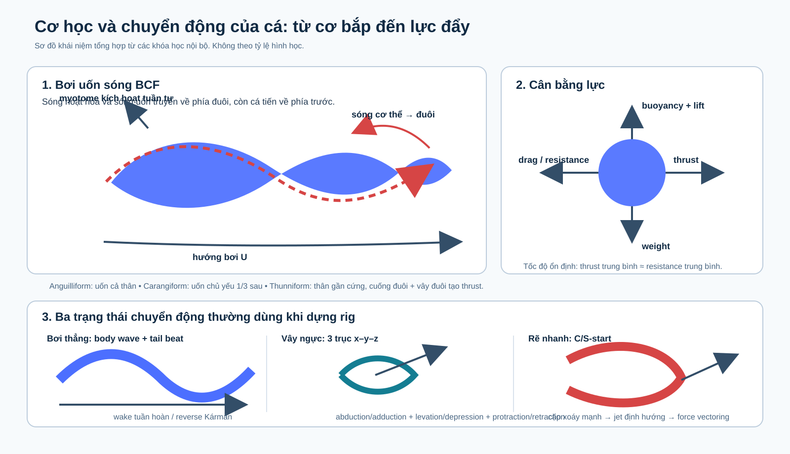
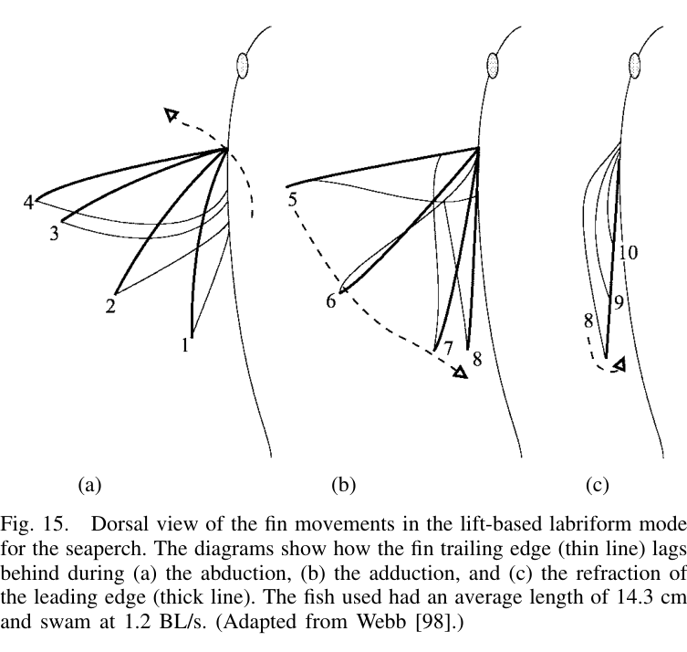
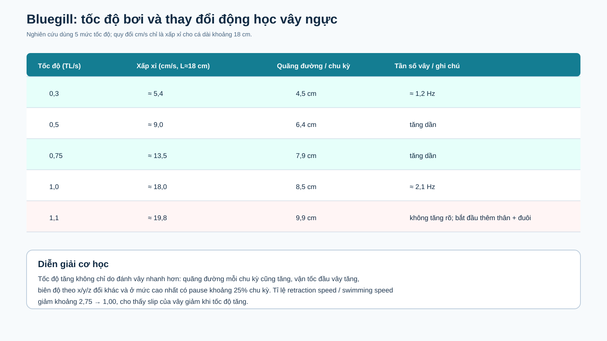
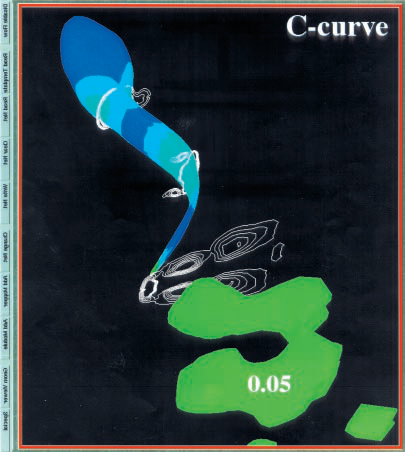
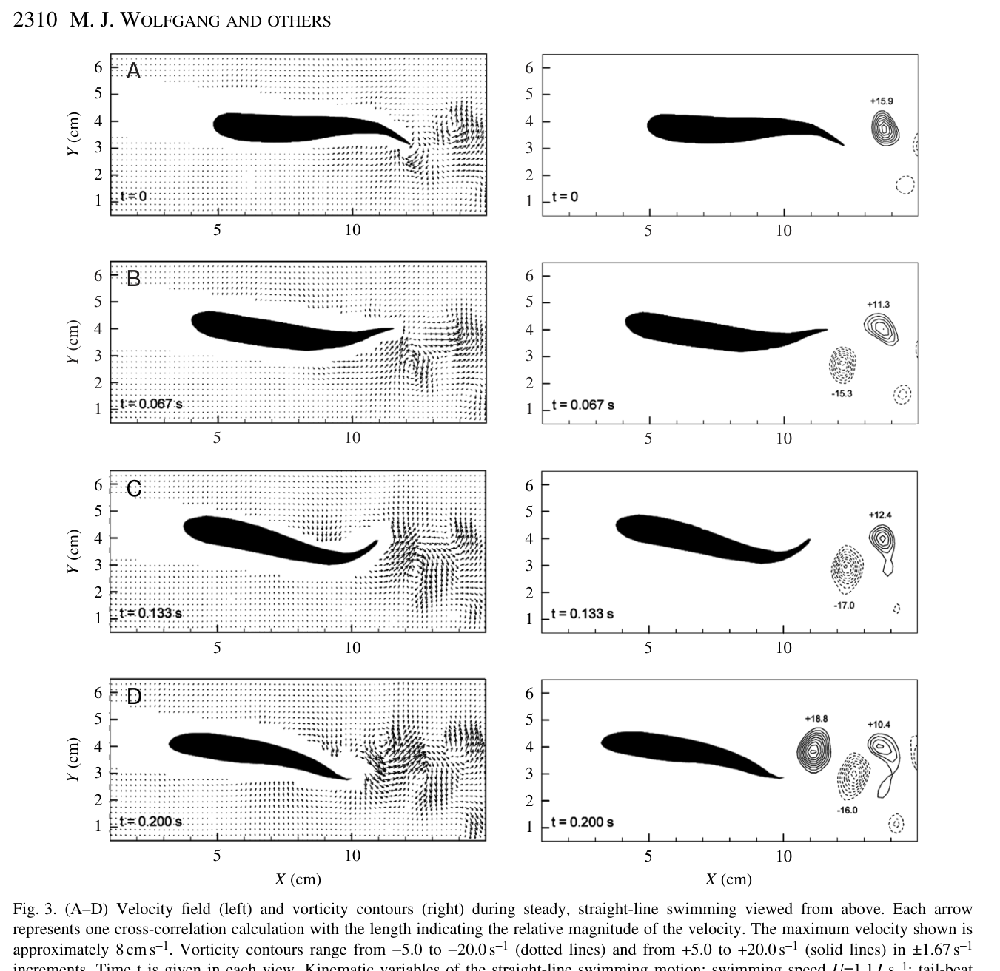

# Phân tích cơ học, chuyển động và tốc độ bơi của cá

## Phạm vi tài liệu

Tài liệu này tổng hợp các khóa học có trong thư mục người dùng cung cấp: chế độ bơi của cá, cơ học cơ–thân, thủy động lực học bơi kiểu cá, dòng gần thân, vây ngực bluegill, độ cứng cột sống và các nghiên cứu về wake/turning.

Các hình trong bộ này ưu tiên hình gốc đã có trong khóa học. Hai sơ đồ SVG đầu tài liệu là sơ đồ tổng hợp để dùng làm slide hoặc reference khi dựng rig trong Blender.

> Lưu ý về đơn vị: `TL/s` hoặc `BL/s` là số chiều dài thân đi được trong một giây; `L/s` trong các case của bài dòng gần thân là body-lengths per second. Không nên so sánh trực tiếp một con số `TL/s` của bluegill với một con số `BL/s` của loài khác nếu chưa thống nhất cách đo chiều dài.

## Tóm tắt kết luận

1. Cá không tạo lực đẩy chỉ bằng cách “quẫy đuôi”. Cơ thân, độ cứng cột sống, độ cong thân, cuống đuôi, vây đuôi và trường xoáy quanh cá phối hợp thành một hệ truyền công suất.
2. Ở bơi uốn sóng, sóng biến dạng truyền từ đầu về đuôi, còn cá tiến về phía trước. Biên độ thường tăng dần về phía sau vì vùng sau phải tạo vận tốc ngang lớn hơn để truyền động lượng cho nước.
3. Ba nhóm lực cần xét là drag, lift và acceleration reaction. Trong chuyển động không ổn định, acceleration reaction và vortex/wake có thể quan trọng không kém lực drag/lift gần ổn định.
4. Vây ngực bluegill là chuyển động 3D có lệch pha giữa các vùng dorsal–ventral. Không nên mô phỏng nó bằng một tấm cứng quay quanh một bản lề duy nhất.
5. Bơi thẳng tạo wake tuần hoàn, thường được mô tả bằng reverse Kármán street. Rẽ nhanh tạo một cặp xoáy có hướng để hình thành jet và vector lực quay cá.
6. Tốc độ tăng không chỉ bằng cách tăng tần số. Cá còn thay đổi quãng đường mỗi chu kỳ, vận tốc đầu vây, biên độ theo từng trục, độ cứng và thậm chí chuyển từ MPF sang BCF.



## 1. Chuỗi cơ học từ cơ bắp đến lực đẩy

### 1.1. Hoạt hóa cơ và sóng uốn

Ở bơi BCF, các myotome hai bên thân hoạt hóa luân phiên. Vùng trước thường được kích hoạt trước, sau đó hoạt hóa truyền dần về phía đuôi. Sự phối hợp giữa hoạt hóa cơ, bộ xương, mô đàn hồi và phản lực nước tạo ra một sóng uốn truyền về sau.

Sóng cơ thể có thể biểu diễn ở mức đơn giản bằng:

```text
y(x,t) = a(x) sin(kx - ωt)
```

Trong đó `a(x)` là biên độ thay đổi theo vị trí dọc thân. Với carangiform, `a(x)` nhỏ ở phần trước và tăng mạnh ở 1/3 sau. Với anguilliform, biên độ đáng kể trên gần như toàn thân. Với thunniform, thân trước gần cứng, chuyển động tập trung ở cuống đuôi và vây đuôi.

Điểm cần nhớ là hướng truyền của sóng uốn ngược với hướng tiến của cá. Vận tốc sóng `v` phải lớn hơn vận tốc tiến `u`; tỉ số `u/v` mô tả mức slip của cơ chế uốn sóng.

### 1.2. Các lực chính

| Thành phần | Nguồn gốc | Vai trò khi dựng hình/chuyển động |
|---|---|---|
| Drag | ma sát lớp biên, form drag, induced/vortex drag | chống lại chuyển động tương đối với nước |
| Lift | chênh lệch áp suất quanh bề mặt vây/thân | có thể tạo lực tiến, lực đứng hoặc lực quay tùy hướng vây |
| Acceleration reaction | gia tốc khối nước lân cận, thường gọi là added-mass effect | nổi bật khi vây/thân đổi tốc độ nhanh, fast-start và turning |
| Buoyancy và weight | lực nổi và trọng lượng | quyết định cân bằng theo phương đứng |
| Moment | lực đặt lệch tâm | điều khiển pitch, yaw, roll |

Ở tốc độ ổn định, lực đẩy trung bình xấp xỉ lực cản trung bình. Ở fast-start hoặc turning, lực tức thời có thể lớn hơn nhiều và không còn có dạng sin đều.

### 1.3. Cơ tạo và truyền công suất

Các khóa học về cơ bơi cho thấy cơ trước và cơ sau không nên bị chia cứng thành “bộ tạo lực” và “bộ truyền lực”. Net power vẫn có thể dương ở nhiều vị trí dọc thân, nhưng vùng sau đồng thời có thể:

- làm cứng thân để truyền công suất về đuôi;
- chịu stress lớn hơn;
- phối hợp với gân, myosepta, da và bộ xương;
- thay đổi độ cứng hiệu dụng của thân để gần với tần số đập đuôi.

Biên độ strain cơ điển hình trong vùng giữa thân được khóa học nêu tăng khoảng từ `±2%` đến `±8%`. Đây là giá trị tổng hợp từ các case nghiên cứu, không phải giới hạn chung cho mọi loài.

## 2. Các chế độ bơi và chuyển động đặc trưng


### 2.1. BCF: thân và vây đuôi

| Mode | Phần tham gia chính | Đặc trưng cơ học | Công dụng nổi bật |
|---|---|---|---|
| Anguilliform | gần như toàn thân + đuôi | sóng lớn, nhiều đoạn thân cùng uốn | linh hoạt, chui luồn, bơi lùi bằng đảo hướng sóng |
| Subcarangiform | nửa sau thân + đuôi | biên độ tăng mạnh sau thân giữa | cân bằng giữa tốc độ và cơ động |
| Carangiform | 1/3 sau thân + đuôi | thân trước tương đối cứng, lực tập trung phía sau | bơi nhanh, tạo thrust mạnh |
| Thunniform | cuống đuôi + lunate tail | oscillating foil, thân trước gần như ổn định | cruising nhanh và hiệu quả |
| Ostraciiform | đuôi cứng | đuôi lắc như con lắc, thân gần cứng | phù hợp thân bọc cứng, nhưng efficiency thấp hơn thunniform |

Với carangiform, một case Giant Danio trong khóa học có các tham số: `U = 1,1 L/s`, `f = 3,3 Hz`, tail-tip double amplitude `A = 0,16 L`, bước sóng backbone `λ = 1,1 L`, pha pitch–heave `95°`, góc tấn đuôi `6°`, `St = 0,45`. Đây là một case hiệu chỉnh mô hình cụ thể, không phải bộ thông số chung cho mọi cá carangiform.

Với thunniform/lunate tail, khóa học dẫn case kawakawa dài 40 cm bơi khoảng `8,2 BL/s`, tailbeat tới `14,5 Hz`, tương đương xấp xỉ `3,28 m/s`. Thrust chủ yếu đến từ vây đuôi hoạt động như một foil dao động, với heave và pitch phối hợp.

### 2.2. MPF: vây giữa và vây đôi

MPF thường có lợi ở tốc độ thấp, maneuvering, stabilization và hover. Các mode gồm:

- rajiform: vây ngực lớn tạo sóng như cánh;
- diodontiform: vây ngực mang nhiều bước sóng và kết hợp flapping;
- amiiform: vây lưng dài tạo sóng;
- gymnotiform: vây hậu môn dài tạo sóng, thân gần thẳng;
- balistiform: vây lưng và vây hậu môn cùng tạo sóng;
- tetraodontiform: vây lưng và vây hậu môn dao động như hai bộ cánh;
- labriform: vây ngực rowing hoặc flapping.

Khóa học ghi nhận undulating fins thường làm propulsion chính ở vùng dưới khoảng `3 BL/s`, nhưng đây là vùng tham khảo theo tổng quan chứ không phải ngưỡng sinh học tuyệt đối.

### 2.3. Labriform: rowing và flapping




**Drag-based rowing:**

1. Power stroke: vây quét về sau, góc tấn lớn, drag và acceleration reaction tạo thrust.
2. Recovery stroke: vây feather để giảm cản rồi đưa về trước.
3. Thrust gián đoạn, nhưng hữu ích ở tốc độ rất thấp và khi cần điều khiển tinh.

Case angelfish dài 8 cm bơi khoảng `0,5 BL/s` có 40% diện tích ngoài cùng của vây tạo hơn 80% tổng lực thủy động; efficiency rowing trong tính toán khoảng 16%.

**Lift-based flapping:** vây chuyển lên–xuống, lift có thể tạo thành phần tiến trong cả upstroke và downstroke. Khóa học dẫn efficiency khoảng `0,60–0,65` cho case seaperch. Chuyển động thực tế thường là hỗn hợp flap, rotate, twist và undulate, không phải flapping phẳng lý tưởng.

## 3. Phân tích chi tiết chu kỳ vây ngực bluegill

Bluegill là case có dữ liệu 3D rõ nhất trong thư mục. Nghiên cứu dùng 4 cá thể dài khoảng 17,7–18,1 cm, quay bằng hai góc nhìn ở 200 fields/s. Bốn marker được đặt từ ventral đến dorsal trên mép xa của vây.

### 3.1. Ba trục chuyển động

| Trục | Chuyển động cần theo dõi |
|---|---|
| `x` longitudinal | protraction ↔ retraction, trước–sau |
| `y` vertical | levation ↔ depression, lên–xuống |
| `z` lateral | abduction ↔ adduction, ra xa–về thân |

Một chu kỳ không phải một phép quay đơn. Vị trí, vận tốc và góc tấn của từng phần vây thay đổi theo cả ba trục.

### 3.2. Ở tốc độ thấp, 0,3 TL/s

Chu kỳ tương đối liên tục:

1. bắt đầu abduction;
2. vây đồng thời đi xuống, tức depression, và thường đi ra trước, tức protraction;
3. sau vùng mở rộng, chuyển sang adduction;
4. vây đồng thời đi về sau, tức retraction, và đi lên, tức levation;
5. vây trở về gần thân, gần như bắt đầu ngay chu kỳ mới.

Quỹ đạo của marker dorsal và ventral không đồng nhất: ở lateral view, một số marker tạo loop ngược chiều nhau. Đây là bằng chứng chống lại giả định “vây là một rigid plate”.


### 3.3. Ở tốc độ cao, 1,1 TL/s

Chu kỳ thay đổi rõ:

- sau adduction, vây có thể giữ gần thân khoảng 25% thời lượng chu kỳ;
- xuất hiện plateau hoặc pause ở một số trục;
- quỹ đạo dorsal tròn hơn, còn vùng ventral có thể thiên theo phương đứng;
- tại vùng tốc độ này, bluegill bắt đầu bổ sung thân và vây đuôi.


### 3.4. Cơ chế lực theo từng pha

- **Adduction/retraction:** drag có thể đóng góp lớn hơn khi vận tốc tương đối của vây hướng ngược với dòng tiến.
- **Abduction/depression:** lift có thể tạo thành phần lực tiến nếu orientation của phần tử vây phù hợp.
- **Cuối stroke:** vây tăng/giảm tốc nhanh nên acceleration reaction và added mass không thể bỏ qua.
- **Toàn chu kỳ:** kết luận phù hợp nhất là drag + lift + acceleration reaction cùng tham gia, với tỉ lệ thay đổi theo thời gian và vị trí trên vây.

Bluegill có `Re ≈ 5 × 10³` và reduced frequency `s ≈ 0,85`; theo lập luận của paper, mức này đủ cao để các hiệu ứng không ổn định và acceleration reaction giữ vai trò đáng kể.

## 4. Tốc độ: số liệu và cách diễn giải

### 4.1. Bluegill: tốc độ vây ngực

Năm mức tốc độ là `0,3; 0,5; 0,75; 1,0; 1,1 TL/s`. Với cá dài khoảng 18 cm, các mức này tương đương xấp xỉ `5,4; 9,0; 13,5; 18,0; 19,8 cm/s`.




| Tốc độ | Tần số vây | Quãng đường/cycle | Diễn giải |
|---:|---:|---:|---|
| 0,3 TL/s | khoảng 1,2 Hz | 4,5 cm | chuyển động liên tục, slip của vây lớn |
| 0,5 TL/s | tăng dần | 6,4 cm | quỹ đạo bắt đầu thay đổi |
| 0,75 TL/s | tăng dần | 7,9 cm | vận tốc đầu vây tăng |
| 1,0 TL/s | khoảng 2,1 Hz | 8,5 cm | tần số tăng rõ so với 0,3 TL/s |
| 1,1 TL/s | không tăng đáng kể | 9,9 cm | bắt đầu thêm thân + vây đuôi, có pause |

Tỉ lệ `maximal retraction speed / swimming speed` giảm khoảng `2,75 → 1,00` khi tốc độ tăng. Ở tốc độ thấp, đầu vây có thể đi về sau nhanh hơn tốc độ tiến của cá và tạo backward slip. Ở tốc độ cao, slip giảm, cho thấy cơ chế tạo lực hoặc phân bố đóng góp giữa vây và thân đã thay đổi.

### 4.2. Giant Danio: bơi thẳng và rẽ

Trong case bơi thẳng, Giant Danio có tốc độ trung bình khoảng `8,9 cm/s`, tương đương `1,1 L/s`; tail double amplitude khoảng `0,11–0,21 L`, tần số có thể tới `6,2 Hz`.

Trong case rẽ 60°, cá dài `8,32 cm`, trước maneuver khoảng `1,50 L/s`, sau đó bơi theo hướng mới khoảng `1,58 L/s`. Chuỗi đo gồm 25 ảnh cách nhau `0,0333 s`, còn phần maneuver chính hoàn tất trong hơn `0,5 s`.


### 4.3. Fast-start

Fast-start dùng C-start hoặc S-start: thân uốn mạnh, nhanh chóng giải uốn, rồi tail thực hiện một hoặc hai cú flip để shed cặp xoáy. Các nghiên cứu được khóa học dẫn báo cáo gia tốc cực đại ở pike vượt `150 m/s²`. Đây là gia tốc quá độ trong một maneuver, không phải tốc độ bơi ổn định.




## 5. Wake và thủy động lực học

### 5.1. Reverse Kármán street

Trong bơi thẳng, các xoáy trái dấu được shed theo chu kỳ và tổ chức thành jet gần trục giữa. Reverse Kármán street là dấu hiệu của wake tạo thrust, khác với Kármán street phía sau một vật thể gây drag.

Ở case Giant Danio, khóa học ghi nhận average nondimensional circulation khoảng `Γ/(LU) ≈ 0,3`, core radius xấp xỉ `0,1 L`, transverse near-body velocity tối đa khoảng `0,39 U` và longitudinal perturbation khoảng `0,14 U`.



### 5.2. Strouhal và hiệu suất

```text
St = fA / U
η  = <T>U / <P>
```

Khoảng `St ≈ 0,25–0,35` được khóa học nêu là vùng tham chiếu thường có lợi cho một số foil/profile khảo sát. Đây không phải hằng số tối ưu cho mọi loài cá. Cùng một `St` vẫn có thể cho hiệu suất khác nhau vì pha pitch–heave, góc tấn, chord, Reynolds number và topology wake khác nhau.

### 5.3. Rẽ nhanh và force vectoring

Rẽ không đơn giản là xoay root bone của cá. Chuỗi cơ học là:

```text
C/S-bend → bound vorticity → tail manipulation → vortex pair
→ directed jet → phản lực đổi hướng quỹ đạo
```

Trong case Giant Danio, turning vortex có nondimensional circulation `Γ* = 0,43`, cao hơn khoảng 42% so với vortex wake bơi thẳng ở tốc độ tương tự; bán kính lõi lớn hơn hơn hai lần. Các số này chỉ thuộc case nghiên cứu cụ thể nhưng minh họa rằng maneuver cần một gói động lượng mạnh trong thời gian ngắn.

## 6. Hướng dẫn chuyển thành rig Blender

### 6.1. Rig BCF

- Dùng một curve hoặc chuỗi xương dọc thân làm `midline controller`.
- Đặt envelope biên độ riêng cho anguilliform, subcarangiform, carangiform và thunniform.
- Tách `body-wave frequency`, `body amplitude`, `tail heave`, `tail pitch` và `forward speed` thành các tham số độc lập.
- Với thunniform, giữ thân trước ổn định hơn; tập trung yaw/heave/pitch ở peduncle và tail.
- Tạo body wave truyền ngược về đuôi, nhưng translation của root đi về phía trước.

### 6.2. Rig vây ngực bluegill

- Tách root rotation khỏi spanwise bending và chordwise twist.
- Tạo các bone/ray từ ventral đến dorsal, cho phép phase lag giữa các ray.
- Một chu kỳ cơ bản: `abduction + depression + protraction` rồi `adduction + levation + retraction`.
- Ở tốc độ cao, thêm khoảng pause gần thân và giảm slip tương đối của vây.
- Khi turning, thay đổi biên độ và phase trái/phải thay vì xoay cả cá như một khối cứng.

### 6.3. Rig fast-start/turning

- Tạo C-curve hoặc S-curve trước khi đổi hướng root trajectory.
- Tail stroke phải bất đối xứng trái/phải và có timing rõ giữa hai lần flip.
- Đổi hướng lực bằng body curvature + tail manipulation; không chỉ đổi rotation của root.
- Nếu mô phỏng wake, dùng cặp xoáy định hướng thay vì một đường khói đối xứng.

### 6.4. Stiffness và motion

Tách riêng các tham số `stiffness profile`, `joint limits`, `amplitude`, `phase` và `wavelength`. Cùng một hình thái có thể tạo các kinematics khác nhau khi thay đổi độ cứng. Đây là điểm được nhấn mạnh trong khóa về cột sống: không suy ra stiffness chỉ từ một đường cong chuyển động.

## 7. Bản đồ ảnh minh họa trong thư mục đầu ra

| Ảnh | Dùng để minh họa |
|---|---|
| `01_bcf_mode_gradient.png` | gradient anguilliform → subcarangiform → carangiform → thunniform |
| `02_body_forces_and_axes.png` | thrust, drag, lift và pitch/yaw/roll |
| `03_bluegill_low_speed_orbits.png` | quỹ đạo vây ngực ở 0,3 TL/s |
| `04_bluegill_high_speed_orbits.png` | quỹ đạo vây ngực ở 1,1 TL/s |
| `05_bluegill_frequency_vs_speed.png` | tần số đánh vây theo tốc độ |
| `06_bluegill_excursions_vs_speed.png` | thay đổi biên độ x–y–z theo tốc độ |
| `07_drag_based_labriform_rowing.png` | power stroke và recovery stroke |
| `08_lift_based_labriform_flapping.png` | abduction, adduction và flapping |
| `09_reverse_karman_wake.png` | wake và vortex khi bơi thẳng |
| `10_c_start_sequence.png` | C-start |
| `11_s_start_sequence.png` | S-start |
| `12_turning_60deg_sequence.png` | C-bend và turning 60° của Giant Danio |
| `13_lunate_tail_kinematics.png` | heave + pitch của lunate tail |
| `14_fin_force_vectors.png` | planar fin element, lift/drag/resultant |

## 8. Nguồn nội bộ đã đọc

- `review-of-fish-swimming-modes/Review-of-Fish-Swimming-Modes-Course/`
- `fish-swimming-muscle-function/Fish-Swimming-Muscle-Function-Course/`
- `hydrodynamics-of-fishlike-swimming/Hydrodynamics-of-Fishlike-Swimming-Course/`
- `near-body-flow-dynamics/Near-Body-Flow-Dynamics-Course/`
- `bluegill-pectoral-fin-locomotion/Bluegill-Pectoral-Fin-Locomotion-Course/`
- `convergence-undulatory-swimming-kinematics/Convergence-Undulatory-Swimming-Course/`
- `vertebral-column-stiffness-mechanics-kinematics/Vertebral-Column-Stiffness-Course/`
- `lauder-tytell-2006-hydrodynamics/Lauder-Tytell-2006-Hydrodynamics-Course/`

