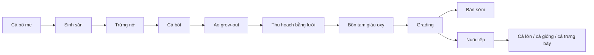

# KHÓA HỌC: TỪ TRỨNG ĐẾN CÁ KOI TRƯỞNG THÀNH — QUY TRÌNH NUÔI, TUYỂN CHỌN VÀ QUAN SÁT HÀNH VI

## 1. Giới thiệu

Khóa học này được biên soạn lại từ nội dung chuyến tham quan một trang trại koi tại Vương quốc Anh, kết hợp với ảnh minh họa có giấy phép mở từ Wikimedia Commons. Nội dung được viết như một giáo trình độc lập, không phải transcript.

Trọng tâm của khóa học là theo dõi toàn bộ hành trình của cá koi: từ sinh sản, ương cá bột, nuôi lớn trong ao, thu hoạch bằng lưới, vận chuyển ngắn hạn, chấm điểm, giữ cá bố mẹ, quan sát hành vi bơi và cuối cùng là nhận diện một cá thể Kujaku.


*Hình minh họa: Mô hình ao nuôi và cơ sở hạ tầng tại một trang trại koi ở Nhật Bản. Nguồn: [Konishi Koi Farm terraced ponds](https://commons.wikimedia.org/wiki/File:Konishi_Koi_Farm_terraced_ponds_Hiroshima_Martin_Kammerer-.jpg) — Martin Kammerer, CC BY-SA 4.0.*

## 2. Mục tiêu đầu ra

Sau khi hoàn thành khóa học, người học có thể:

1. Mô tả chu trình sản xuất koi từ cá bố mẹ đến cá thương phẩm.
2. Giải thích vì sao cá cùng lứa vẫn có thể khác nhau rõ rệt về kích thước, màu và hoa văn.
3. Trình bày nguyên tắc thu hoạch ao bằng lưới theo hướng giảm va chạm và tổn thương.
4. Hiểu vai trò của bồn tạm, oxy hòa tan và thời gian lưu trong quá trình xử lý cá.
5. Phân biệt mục tiêu của “grading” với việc chỉ phân loại theo kích thước.
6. Nhận biết vai trò của đàn cá bố mẹ trong chương trình lai tạo.
7. Phân tích một số hành vi bơi đàn và phản ứng của koi với con người.
8. Nhận biết đặc điểm trực quan cơ bản của Kujaku.
9. Xây dựng sơ đồ quy trình quản lý một lứa koi ở quy mô trang trại.

## 3. Cấu trúc khóa học

| Module | Chủ đề | Bài |
|---|---|---:|
| 01 | Tổng quan về koi và trang trại | 2 |
| 02 | Sinh sản, cá bột và giai đoạn grow-out | 2 |
| 03 | Thu hoạch ao và xử lý cá an toàn | 2 |
| 04 | Grading: chọn lọc màu, dáng và tiềm năng | 2 |
| 05 | Cá bố mẹ và tăng trưởng dài hạn | 2 |
| 06 | Hành vi bơi và hệ sinh thái hỗ trợ | 2 |
| 07 | Quan sát dưới nước, Kujaku và đồ án cuối khóa | 2 |

Tổng cộng: **14 bài**.

## 4. Cách học

Mỗi bài gồm phần kiến thức cốt lõi, hình minh họa, checkpoint quan sát và bài tập. Người học nên hoàn thành các checkpoint trước khi chuyển sang bài kế tiếp.

## 5. Lưu ý về hình ảnh

Các ảnh trong Markdown được nhúng bằng URL gốc và kèm tác giả + giấy phép ngay dưới ảnh. Vì vậy khi xem Markdown cần có kết nối Internet. File GIF tổng quan được đóng gói cục bộ trong thư mục `assets/gif/`.

## 6. Cấu trúc thư mục

```text
khoa_hoc_koi_farm/
├── 00_README.md
├── KHOA_HOC_CA_KOI.md
├── IMAGE_SOURCES.md
├── assets/
│   ├── gif/
│   │   └── koi_course_overview.gif
│   └── images/
│       └── README.md
└── modules/
    ├── 01_tong_quan/
    ├── 02_sinh_san_va_grow_out/
    ├── 03_thu_hoach_va_xu_ly/
    ├── 04_grading/
    ├── 05_ca_bo_me_va_tang_truong/
    ├── 06_hanh_vi_va_he_sinh_thai/
    └── 07_quan_sat_va_do_an/
```


# NỘI DUNG BÀI HỌC


---

# Bài 01 — Koi, Nishikigoi và mục tiêu của một trang trại lai tạo

## 1. Mục tiêu học tập

Sau bài này, người học có thể mô tả koi như một nhóm cá chép cảnh được chọn lọc theo màu, hoa văn, vảy và hình thể; đồng thời phân biệt mục tiêu “nuôi cá sống khỏe” với mục tiêu “tạo cá có giá trị thẩm mỹ cao”.

## 2. Koi trong bối cảnh trang trại

Trong mô hình trang trại chuyên nghiệp, cá không chỉ được nuôi để tăng kích thước. Người nuôi còn theo dõi cấu trúc cơ thể, độ sạch của nền da, độ đậm của màu, sự cân bằng hoa văn và tiềm năng phát triển theo tuổi.


*Hình minh họa: Đàn koi với sự đa dạng rõ rệt về màu và hoa văn. Nguồn: [Koi in a fish pond](https://commons.wikimedia.org/wiki/File:Koi_in_a_fish_pond_(3671118278).jpg) — Eddie Maloney, CC BY-SA 2.0.*

## 3. Hai dòng công việc diễn ra song song

- **Aquaculture:** sinh sản, chất lượng nước, dinh dưỡng, nhiệt độ, oxy và sức khỏe.
- **Selective breeding:** ghép bố mẹ, theo dõi kiểu hình, loại bỏ cá không đạt tiêu chí và giữ lại cá có tiềm năng.

Hai phần này không thể tách rời. Một cá thể đẹp nhưng tăng trưởng kém hoặc sức khỏe yếu không phải là kết quả lý tưởng.

## 4. Checkpoint

Hãy chọn 5 cá thể trong hình và ghi lại ba thuộc tính: màu nền, màu hoa văn chính và mức độ tương phản.

## 5. Bài tập

Viết 150–200 từ giải thích vì sao “cá đẹp” trong nuôi koi là một khái niệm nhiều chiều chứ không chỉ là màu sắc.


---

# Bài 02 — Bản đồ quy trình của một lứa koi

## 1. Mục tiêu học tập

Mục tiêu của bài là hình dung toàn bộ hệ thống trước khi đi vào từng công đoạn.

## 2. Chuỗi quy trình




*Hình minh họa: Một hệ thống ao nuôi nhiều ô cho phép chia nhóm cá theo giai đoạn. Nguồn: [Konishi Koi Farm terraced ponds](https://commons.wikimedia.org/wiki/File:Konishi_Koi_Farm_terraced_ponds_Hiroshima_Martin_Kammerer-.jpg) — Martin Kammerer, CC BY-SA 4.0.*

## 3. Ý nghĩa quản trị

Mỗi mũi tên trong sơ đồ là một “điểm chuyển giao” có rủi ro: thay đổi nhiệt độ, mật độ, chất lượng nước, stress và chấn thương cơ học. Vì vậy, quản lý koi chuyên nghiệp là quản lý cả cá lẫn quá trình di chuyển cá.

## 4. Checkpoint

Đánh dấu ba công đoạn mà bạn cho rằng rủi ro stress cao nhất và giải thích lý do.

## 5. Bài tập

Vẽ lại quy trình với thêm các biến kiểm soát: nhiệt độ, oxy, mật độ và thời gian.


---

# Bài 03 — Từ sinh sản đến cá bột

## 1. Mục tiêu học tập

Hiểu logic của việc sinh sản trong nhà, theo dõi giai đoạn đầu và chuyển cá non sang khu vực nuôi lớn.

## 2. Vì sao giai đoạn đầu cần kiểm soát chặt

Trứng và cá mới nở rất nhạy với biến động môi trường. Ở quy mô trang trại, mục tiêu là tạo được số lượng lớn cá non khỏe, sau đó chuyển sang hệ thống grow-out có diện tích và nguồn thức ăn phù hợp hơn.

## 3. Mật độ lớn không đồng nghĩa với kết quả đồng đều

Một lứa có thể gồm hàng chục nghìn cá non, nhưng khi lớn lên sẽ xuất hiện sai khác rõ về:

- tốc độ tăng trưởng;
- khả năng cạnh tranh thức ăn;
- hình thể;
- sắc tố;
- hoa văn;
- mức độ phù hợp với tiêu chuẩn của từng dòng koi.

## 4. Checkpoint

Giải thích vì sao việc đánh giá một cá thể ở giai đoạn rất sớm có thể khó hơn khi cá đã phát triển.

## 5. Bài tập

Tạo bảng theo dõi 4 tuần đầu gồm: ngày, kích thước trung bình, tỷ lệ sống, nhiệt độ, lượng thức ăn và ghi chú màu sắc.


---

# Bài 04 — Ao grow-out, tăng trưởng và biến thiên trong cùng một lứa

## 1. Mục tiêu học tập

Giải thích được vì sao cá cùng tuổi và cùng đợt sinh sản vẫn có thể chênh lệch kích thước đáng kể.

## 2. Tăng trưởng là kết quả của nhiều biến

Kích thước cuối giai đoạn grow-out chịu ảnh hưởng của di truyền, lượng thức ăn thực nhận, vị trí trong đàn, nhiệt độ, sức khỏe, mật độ và khả năng chuyển hóa.


*Hình minh họa: Một đàn koi đông cho thấy cá thể có thể chiếm các vị trí và hướng bơi khác nhau trong cùng không gian. Nguồn: [A swirl of Koi](https://commons.wikimedia.org/wiki/File:A_swirl_of_Koi._(52321534965).jpg) — Bernard Spragg. NZ, Public Domain Mark.*

## 3. Ý nghĩa của biến thiên

Trong chọn giống, biến thiên không chỉ là “lỗi”. Nó chính là nguồn vật liệu để người nuôi chọn ra cá có tiềm năng cao và quyết định cá nào nên được nuôi tiếp.

## 4. Checkpoint

Nếu hai cá cùng tuổi nhưng một con dài gấp 1,5 lần con còn lại, hãy nêu ít nhất bốn giả thuyết giải thích.

## 5. Bài tập

Thiết kế thí nghiệm đơn giản để phân biệt ảnh hưởng của mật độ nuôi và khẩu phần đến tăng trưởng.


---

# Bài 05 — Thu hoạch ao bằng lưới: gom cá mà không “kéo lê” cá

## 1. Mục tiêu học tập

Mô tả nguyên tắc sử dụng lưới để dồn đàn cá về vùng kiểm soát mà hạn chế va chạm với bờ và đáy.

## 2. Nguyên tắc thao tác

Khi thu hoạch, mục tiêu không phải là kéo cá thật nhanh. Người thao tác cần:

1. tạo một vùng bao bằng lưới;
2. giữ cá cách xa mép ao;
3. thu hẹp vùng bơi từ từ;
4. tránh để cá mắc vào mép hoặc bị ép;
5. dùng vợt/bát chuyên dụng để chuyển cá từng nhóm nhỏ.

## 3. Vì sao thao tác chậm lại quan trọng

Cá hoảng loạn có thể tăng tốc đột ngột, va vào lưới hoặc nhau. Tốc độ xử lý cần cân bằng giữa thời gian thao tác và mức stress.

## 4. Checkpoint

Viết quy trình 6 bước để huấn luyện một người mới tham gia thu hoạch ao.

## 5. Bài tập

Tạo checklist “trước — trong — sau thu hoạch” với tối thiểu 12 mục.


---

# Bài 06 — Bồn tạm, oxy và vận chuyển ngắn hạn

## 1. Mục tiêu học tập

Hiểu vì sao cá sau thu hoạch thường được đưa vào bồn tạm có kiểm soát trước khi grading hoặc vận chuyển.

## 2. Bồn tạm là vùng đệm

Bồn tạm giúp tách quá trình thu hoạch khỏi quá trình đánh giá. Nó tạo điều kiện để kiểm soát:

- oxy hòa tan;
- mật độ cá;
- nhiệt độ;
- thời gian lưu;
- quan sát dấu hiệu stress hoặc tổn thương.


*Hình minh họa: Cá được đóng túi để vận chuyển — minh họa một bước cần kiểm soát oxy và thời gian. Nguồn: [Bags of fish](https://commons.wikimedia.org/wiki/File:Bags_of_fish._(4106747356).jpg) — hairyeggg / Kevin Franklin, CC BY-SA 2.0.*

## 3. Nguyên tắc quan trọng

Không nên xem oxy như một biến duy nhất. Nhiệt độ cao, mật độ cao và thời gian dài đều làm nhu cầu oxy tăng và biên an toàn giảm.

## 4. Checkpoint

Nêu ba dấu hiệu cho thấy một bồn tạm đang có nguy cơ quá tải.

## 5. Bài tập

Lập bảng rủi ro cho ba tình huống: bồn quá đông, nước ấm, chậm grading.


---

# Bài 07 — Grading: kiểm soát chất lượng hay dự đoán tiềm năng?

## 1. Mục tiêu học tập

Phân biệt grading với phân cỡ đơn thuần.

## 2. Grading trong koi

Grading là quá trình đánh giá cá thể dựa trên một tập tiêu chí để quyết định giữ nuôi, bán sớm hoặc loại khỏi nhóm ưu tiên. Người có kinh nghiệm không chỉ nhìn “cá đẹp lúc này” mà còn cố dự đoán cá sẽ phát triển như thế nào.


*Hình minh họa: Quan sát cá trong bồn có nền đơn sắc giúp tập trung vào hình thể và màu. Nguồn: [Fish (koi farming / selection)](https://commons.wikimedia.org/wiki/File:Fish_(30470076785).jpg) — KoiQuestion, CC BY-SA 2.0.*

## 3. Các lớp tiêu chí

- **Hình thể:** khung thân, vai, độ cân đối.
- **Da:** độ sạch, độ bóng.
- **Màu:** độ đậm, độ đồng nhất, ranh giới.
- **Hoa văn:** phân bố, nhịp điệu, cân bằng.
- **Vảy:** đều, có chủ ý với dòng có reticulation.
- **Tiềm năng:** khả năng tiếp tục đẹp khi cá lớn.

## 4. Checkpoint

Vì sao một cá thể “đẹp nhất hôm nay” chưa chắc là cá thể đáng giữ nhất?

## 5. Bài tập

Tạo rubric grading 100 điểm, chia trọng số cho 5 tiêu chí.


---

# Bài 08 — Màu và hoa văn thay đổi theo thời gian

## 1. Mục tiêu học tập

Hiểu rằng đánh giá koi là một bài toán động.

## 2. Màu không phải thuộc tính cố định

Sắc tố và độ tương phản có thể thay đổi cùng tuổi, tăng trưởng, môi trường, dinh dưỡng và nền di truyền. Vì vậy, grading đòi hỏi kinh nghiệm theo dõi “quỹ đạo phát triển” thay vì chỉ chụp một ảnh tại một thời điểm.


*Hình minh họa: Kujaku: nền sáng kết hợp hoa văn đỏ/cam và hiệu ứng lưới trên vảy. Nguồn: [Kujaku nishikigoi](https://commons.wikimedia.org/wiki/File:Kujaku_nishikigoi_Konishi_Koi_Farm_Martin_Kammerer_ID3251-.jpg) — Martin Kammerer, CC BY-SA 4.0.*

## 3. Quan sát hoa văn vảy

Ở một số dòng, hiệu ứng “lưới” hoặc reticulation tạo cảm giác các vảy được viền thành mạng. Khi thân cá lớn, cách hoa văn kéo giãn cũng ảnh hưởng cảm nhận thẩm mỹ.

## 4. Checkpoint

Nêu hai lý do khiến cùng một hoa văn trông cân đối ở cá nhỏ nhưng mất cân đối khi cá lớn.

## 5. Bài tập

Chọn một dòng koi và lập “phiếu dự đoán 12 tháng” gồm ảnh hiện tại, đặc điểm cần theo dõi và tiêu chí quyết định giữ/bán.


---

# Bài 09 — Broodstock: cá bố mẹ và giá trị của phả hệ

## 1. Mục tiêu học tập

Mô tả vai trò của cá bố mẹ trong việc định hình thế hệ sau.

## 2. Cá bố mẹ không chỉ là cá lớn

Một cá thể được giữ làm broodstock thường phải kết hợp nhiều yếu tố: sức khỏe, hình thể, đặc điểm màu/hoa văn, nguồn gốc và khả năng truyền tính trạng mong muốn.

## 3. Học từ nhiều thế hệ

Trang trại có lợi thế khi lưu được lịch sử từng cá thể: nơi xuất xứ, năm nhập, các lần sinh sản, kết quả ở đời con và các nhóm phối giống.

## 4. Checkpoint

Nếu một cá bố mẹ rất đẹp nhưng đời con biến thiên quá lớn, bạn sẽ giữ hay thay thế? Hãy lập luận.

## 5. Bài tập

Thiết kế một mẫu “Broodstock Card” gồm tối thiểu 12 trường dữ liệu.


---

# Bài 10 — Cá lớn, hình thể và chiến lược nuôi dài hạn

## 1. Mục tiêu học tập

Hiểu vì sao một số cá được bán sớm còn một số được nuôi thêm nhiều năm.

## 2. Giá trị tăng theo chất lượng, không chỉ theo chiều dài

Một cá thể lớn nhưng khung thân xấu hoặc màu suy giảm có thể không đạt mục tiêu. Ngược lại, cá có tiềm năng về thân, da và hoa văn có thể đáng đầu tư thêm thời gian.


*Hình minh họa: Cá koi trưởng thành ở gần mặt nước, cho phép quan sát đầu, vai và bề mặt da. Nguồn: [Auftauchender Koi 2011](https://commons.wikimedia.org/wiki/File:Auftauchender_Koi_2011.JPG) — 4028mdk09, CC BY-SA 3.0.*

## 3. Chi phí cơ hội

Giữ một con cá lâu hơn sử dụng diện tích ao, thức ăn, công lao động và năng lực hệ thống. Vì vậy quyết định “nuôi tiếp” chính là một quyết định đầu tư.

## 4. Checkpoint

Lập danh sách 5 dữ liệu cần có trước khi quyết định nuôi tiếp một cá thể thêm một năm.

## 5. Bài tập

Mô phỏng quyết định giữ 10% trong một lứa 1.000 cá và nêu tiêu chí.


---

# Bài 11 — Hành vi bơi đàn, khoảng cách và “vòng xoay” trong bể

## 1. Mục tiêu học tập

Quan sát chuyển động tập thể thay vì chỉ nhìn từng cá.

## 2. Luồng bơi vòng

Trong bể tròn hoặc nơi có vật cản trung tâm, đàn cá có thể hình thành luồng bơi quanh chu vi. Chuyển động tập thể chịu ảnh hưởng của hình dạng bể, dòng nước, vị trí thức ăn và phản ứng với các cá thể khác.


*Hình minh họa: Đàn koi tạo cảm giác chuyển động vòng khi nhiều cá cùng bơi quanh một vùng trung tâm. Nguồn: [A swirl of Koi](https://commons.wikimedia.org/wiki/File:A_swirl_of_Koi._(52321534965).jpg) — Bernard Spragg. NZ, Public Domain Mark.*

## 3. Quan sát cho animation/3D

Khi dựng chuyển động cá trong game hoặc Blender, có thể tách hành vi thành:

- cruising thẳng;
- đổi hướng nhẹ;
- tăng tốc ngắn;
- né cá khác;
- rẽ theo biên bể;
- chuyển độ sâu;
- bơi vòng theo đàn.

## 4. Checkpoint

Mô tả một đoạn animation 10 giây trong đó một con koi hòa vào luồng bơi vòng nhưng vẫn có chuyển động riêng.

## 5. Bài tập

Viết state machine tối thiểu 6 trạng thái cho hành vi koi trong bể.


---

# Bài 12 — Pleco, tảo và vai trò của sinh vật hỗ trợ

## 1. Mục tiêu học tập

Hiểu ý tưởng sử dụng một loài cá ăn bám để hỗ trợ kiểm soát tảo, đồng thời nhận thức rằng đây không phải giải pháp thay thế quản lý nước.

## 2. Pleco là gì trong bối cảnh này?

Pleco là tên phổ biến cho nhiều loài cá da trơn có miệng hút/bám. Một số loài ăn tảo hoặc biofilm và thường được nuôi trong bể nhiệt đới.


*Hình minh họa: Một cá thể pleco nhỏ với phần miệng và thân thích nghi lối sống bám. Nguồn: [L144 Plecostomus](https://commons.wikimedia.org/wiki/File:L144_Plecostomus.jpg) — Michelle Jo, CC BY-SA 3.0.*

## 3. Không nên đơn giản hóa thành “cá dọn bể”

Khả năng ăn tảo không có nghĩa cá có thể xử lý mọi chất thải. Chất lượng nước vẫn phụ thuộc vào lọc cơ học, lọc sinh học, thay nước, mật độ, thức ăn và vệ sinh hệ thống.

## 4. Checkpoint

Nêu ba rủi ro khi đưa một loài phụ trợ vào hệ thống chỉ vì nó được quảng cáo là “ăn tảo”.

## 5. Bài tập

Viết một đoạn 200 từ phản biện câu: “Chỉ cần thả pleco thì ao sẽ tự sạch.”


---

# Bài 13 — Quan sát koi dưới nước và phản ứng với con người

## 1. Mục tiêu học tập

Biết cách dùng quan sát gần để đánh giá hành vi và hình thể mà không suy diễn quá mức.

## 2. Khi người vào môi trường của cá

Một đàn koi quen với việc được cho ăn và chăm sóc thường xuyên có thể ít phản ứng hoảng loạn hơn với con người. Tuy nhiên, “không bỏ chạy ngay” không đồng nghĩa mọi cá thể đều thoải mái.


*Hình minh họa: Koi tập trung gần nhau và gần mặt nước trong môi trường nuôi. Nguồn: [Koi in a fish pond](https://commons.wikimedia.org/wiki/File:Koi_in_a_fish_pond_(3671118278).jpg) — Eddie Maloney, CC BY-SA 2.0.*

## 3. Các dấu hiệu nên quan sát

- khoảng cách né tránh;
- tốc độ bơi;
- hướng bơi;
- việc quay lại vị trí cũ;
- nhịp đóng mở nắp mang;
- sự phân tán hoặc tụ đàn;
- phản ứng với bóng người và chuyển động đột ngột.

## 4. Checkpoint

Phân biệt “thân thiện” như cách nói đời thường với mô tả hành vi có thể đo được.

## 5. Bài tập

Thiết kế protocol quan sát 5 phút, ghi dữ liệu mỗi 10 giây.


---

# Bài 14 — Case study Kujaku và đồ án cuối khóa

## 1. Mục tiêu học tập

Tổng hợp kiến thức về giống, grading, tăng trưởng và quan sát hình thể thông qua một cá thể Kujaku.


*Hình minh họa: Kujaku nhìn từ trên xuống — thuận lợi để đánh giá bố cục hoa văn dọc thân. Nguồn: [Kujaku nishikigoi](https://commons.wikimedia.org/wiki/File:Kujaku_nishikigoi_Konishi_Koi_Farm_Martin_Kammerer_ID3251-.jpg) — Martin Kammerer, CC BY-SA 4.0.*

## 2. Đặc điểm trực quan thường được chú ý ở Kujaku

Kujaku thường gây ấn tượng bởi nền sáng/ánh kim kết hợp mảng hi đỏ/cam và hiệu ứng lưới sẫm trên vảy. Khi đánh giá, cần nhìn tổng thể thay vì chỉ một mảng màu nổi bật.

## 3. Đồ án cuối khóa

### 3.1 Nhiệm vụ

Xây dựng một “Production & Selection Plan” cho một lứa koi giả định 50.000 cá non.

### 3.2 Deliverables

1. Sơ đồ quy trình từ broodstock đến bán/giữ.
2. Bảng checkpoint chất lượng nước và welfare.
3. Kế hoạch thu hoạch.
4. Rubric grading 100 điểm.
5. Quy tắc chọn 1%, 5% và 20% cá ưu tiên.
6. Mô hình dữ liệu theo dõi từng cá thể hoặc từng batch.
7. Phân tích rủi ro.
8. Một trang case study cho Kujaku.

### 3.3 Rubric

| Tiêu chí | Điểm |
|---|---:|
| Logic quy trình | 20 |
| Welfare và quản lý nước | 20 |
| Grading và chọn lọc | 20 |
| Dữ liệu và khả năng truy vết | 15 |
| Phân tích hành vi | 10 |
| Case study Kujaku | 10 |
| Trình bày Markdown | 5 |
| **Tổng** | **100** |

## 4. Câu hỏi tổng kết

Vì sao quy trình koi chuyên nghiệp có thể được xem là giao điểm của sinh học, kỹ thuật nuôi trồng thủy sản, thẩm mỹ và quản trị dữ liệu?
