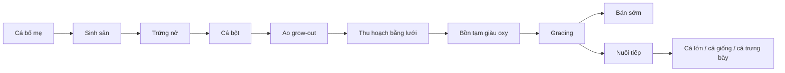

# Bài 02 — Bản đồ quy trình của một lứa koi

## 1. Mục tiêu học tập

Mục tiêu của bài là hình dung toàn bộ hệ thống trước khi đi vào từng công đoạn.

## 2. Chuỗi quy trình

*Hình minh họa: Một hệ thống ao nuôi nhiều ô cho phép chia nhóm cá theo giai đoạn. Nguồn: [Konishi Koi Farm terraced ponds](https://commons.wikimedia.org/wiki/File:Konishi_Koi_Farm_terraced_ponds_Hiroshima_Martin_Kammerer-.jpg) — Martin Kammerer, CC BY-SA 4.0.*

## 3. Ý nghĩa quản trị

Mỗi mũi tên trong sơ đồ là một “điểm chuyển giao” có rủi ro: thay đổi nhiệt độ, mật độ, chất lượng nước, stress và chấn thương cơ học. Vì vậy, quản lý koi chuyên nghiệp là quản lý cả cá lẫn quá trình di chuyển cá.

## 4. Checkpoint

Đánh dấu ba công đoạn mà bạn cho rằng rủi ro stress cao nhất và giải thích lý do.

## 5. Bài tập

Vẽ lại quy trình với thêm các biến kiểm soát: nhiệt độ, oxy, mật độ và thời gian.
