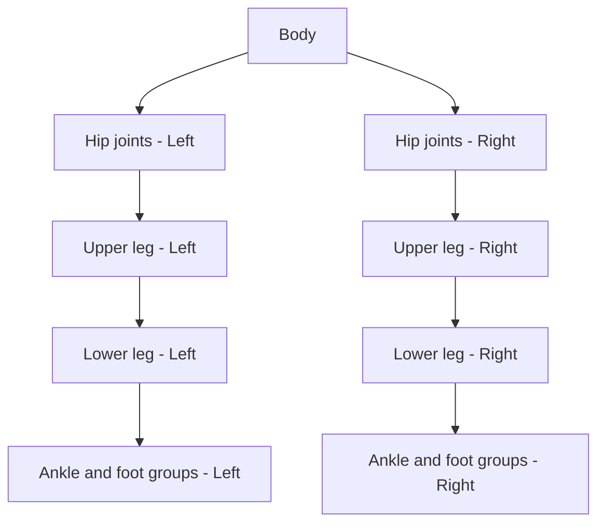

# Bài 04 — Nhóm các cụm cơ khí theo chuyển động của robot Mech

**Loại bài:** Lesson  
**Chủ đề:** Phân cụm khớp hông, đùi, cẳng chân, mắt cá, bàn chân; `Join`, `Separate`, `Linked Selection`

## 1. Tóm tắt

Một robot có hàng chục chi tiết cơ khí có thể chỉ cần một số cụm chuyển động chính. Sau khi các bên trái/phải đã được tách, bước tiếp theo là **Join các chi tiết thuộc cùng cụm cứng**, đồng thời giữ riêng những khớp có trục quay riêng. Đây là nguyên tắc quan trọng để chuẩn bị robot cho rigging và animation bước đi.

## 2. Mục tiêu học tập

Người học có thể:

- Phân loại chi tiết theo **chuyển động cùng nhau** và **chuyển động độc lập**.
- Gộp bánh răng hoặc chi tiết gắn cứng với đùi trên.
- Gộp bu lông, giáp và các chi tiết liên quan với cụm cẳng chân khi chúng chuyển động cùng nhau.
- Dùng `L` để chọn một đảo hình học liên kết và `P > Selection` để tách.
- Chuẩn bị nhóm mắt cá và bàn chân sao cho có thể xây dựng trục quay phù hợp về sau.

## 3. Thiết kế phân cấp cụm chuyển động

Hãy tưởng tượng cử động bước đi: hai chân phải có thể chuyển động khác nhau; mỗi chân lại có phần đùi, phần cẳng chân, khớp mắt cá và bàn chân. Mỗi cụm chỉ nên chứa các chi tiết có thể đi theo **cùng phép biến đổi cứng** trong chuyển động đã dự kiến.

Sơ đồ khái niệm sau mô tả nhóm cần phân biệt, **không phải sơ đồ xương hoặc parenting đã hoàn thành**:

Các mũi tên thể hiện quan hệ chuyển động cần cân nhắc. Khi rigging, cách gán xương hoặc ràng buộc thực tế có thể khác. Ở bước chuẩn bị mesh, điều quan trọng là **các khớp cần tự xoay không bị Join cứng vào cụm khác**.

## 4. Giữ riêng các khớp có trục quay độc lập

Tại vùng hông có thể có nhiều bản lề và vòng khớp. Dù các chi tiết nằm sát nhau, không nên hợp nhất tất cả thành một object nếu dự định chúng quay tương đối với nhau.

Thực hiện:

1. Quan sát từng chi tiết hông và xác định phần nào chuyển động theo thân, phần nào chuyển động theo chân.
2. Kiểm tra mỗi khớp đã được tách trái/phải.
3. Giữ nguyên object riêng của khớp cần điều khiển độc lập.
4. Nhấn `H` để tạm ẩn các khớp đã kiểm tra, nhờ đó dễ xử lý phần đùi và cẳng chân.

Ẩn object chỉ giúp thao tác rõ ràng; không ảnh hưởng bản chất rigging của mesh.

## 5. Gộp chi tiết chuyển động cùng đùi và cẳng chân

### 5.1. Cụm đùi trên

Nếu một bánh răng hay phần vỏ được bắt cố định vào đùi và luôn di chuyển cùng đùi:

1. Chọn Mesh của `Upper Leg` ở một bên.
2. Giữ `Shift` chọn chi tiết bánh răng hoặc ốp gắn cứng.
3. Chọn object mong muốn làm active sau cùng.
4. Nhấn `Ctrl + J`.
5. Kiểm tra trong `Edit Mode` và qua chế độ xem vật liệu.
6. Lặp lại cho bên đối diện.

Chỉ gộp chi tiết bánh răng nếu trong thiết kế chuyển động nó thực sự đi theo đùi. Nếu bánh răng phải quay riêng để tạo hiệu ứng cơ khí, giữ nó là object độc lập.

### 5.2. Cụm cẳng chân

Phần cẳng chân có thể gồm thân cẳng chân, giáp, bu lông và các chi tiết nhỏ. Khi các thành phần này không cần xoay tương đối với nhau, có thể hợp nhất thành một cụm.

1. Chọn những bu lông, ốp và giáp thuộc **cùng bên**.
2. Chọn object cẳng chân chính cuối cùng.
3. Nhấn `Ctrl + J`.
4. Kiểm tra bề mặt, các mảng giáp và Bevel.
5. Tạm ẩn cụm hoàn thành; tiếp tục ở chân đối diện.

Sau Join, không nên dùng một object duy nhất cho **cả** đùi và cẳng chân nếu khớp gối cần bẻ cong.

## 6. Tách và tổ chức nhóm mắt cá chân

Vùng mắt cá là nơi dễ nhầm giữa **chi tiết xoay quanh trục** và **chi tiết của bàn chân**. Trong mô hình, một mảnh tròn nằm chung Mesh với bàn chân có thể cần tách ra để gộp với đối tượng cơ khí liên quan.

Quy trình tách một đảo hình học:

1. Chọn object chứa mảnh tròn ở vùng mắt cá.
2. Nhấn `Tab` để vào `Edit Mode`.
3. Dùng chế độ chọn mặt hoặc đỉnh phù hợp, sau đó nhấn `Alt + A` để bỏ chọn tất cả.
4. Di chuột lên mảnh tròn cần tách rồi nhấn `L` (**Select Linked**) để chọn phần hình học liên kết dưới con trỏ.
5. Kiểm tra mảng đang chọn chỉ thuộc đúng chi tiết dự định.
6. Nhấn `P > Selection` để tách phần đó thành object độc lập.
7. Trở về `Object Mode` và Join chi tiết tròn này với **cụm dự kiến chuyển động cùng nó**.
8. Thực hiện đối xứng cho chân còn lại.

`L` chọn vùng hình học liên kết, không nhất thiết chọn đúng "một chi tiết" nếu hai chi tiết đã được hàn đỉnh. Khi đó phải chọn thủ công vùng mong muốn.

## 7. Kiểm tra logic chuyển động và thực hành

Hãy đặt câu hỏi cho từng cặp object: **Khi robot bước đi, hai chi tiết này có luôn duy trì vị trí và góc tương đối với nhau không?** Nếu có, có thể Join. Nếu không, nên tách hoặc giữ riêng cho bước rigging.

| Cụm | Hướng xử lý |
| --- | --- |
| Đầu gồm nhiều mảnh cứng | Gộp thành `Head` |
| Khớp hông có chuyển động riêng | Giữ độc lập theo bên và theo khớp |
| Bánh răng gắn cứng vào đùi | Gộp với đùi tương ứng |
| Giáp và bu lông cố định ở cẳng chân | Gộp với cẳng chân tương ứng |
| Vòng mắt cá và bàn chân | Xem xét trục quay để tách/gộp đúng nhóm |

**Thực hành:** Với một chân robot, lập bảng 2 cột “cần xoay độc lập” và “luôn đi cùng nhau”, sau đó thực hiện Join/Separate tương ứng. Lặp lại cho chân đối diện. Không tạo xương vội; mục tiêu của bài chỉ là cấu trúc các object hợp lý.

## 8. Câu hỏi ôn tập

### Câu 1

Nguyên tắc đáng tin cậy nhất để quyết định gộp các chi tiết robot là gì?

A. Các chi tiết có cùng màu.  
B. Các chi tiết gần nhau nhất.  
C. Các chi tiết cùng có Bevel.  
D. Các chi tiết luôn chuyển động cứng cùng nhau.

**Đáp án:** D  
**Giải thích:** Object được tổ chức theo chức năng chuyển động, không chỉ theo khoảng cách hoặc màu sắc.

### Câu 2

Khớp hông cần xoay riêng với thân robot. Cách chuẩn bị hợp lý là gì?

A. Gộp toàn bộ khớp vào thân ngay.  
B. Giữ khớp thành object hoặc cụm riêng.  
C. Xóa khớp để giảm số object.  
D. Chuyển khớp thành ánh sáng.

**Đáp án:** B  
**Giải thích:** Khớp phải có cấu trúc độc lập trước khi thiết lập điều khiển quay tương ứng.

### Câu 3

Lệnh `L` trong Edit Mode có tác dụng gì khi di chuột qua một mảnh mesh?

A. Chọn phần hình học liên kết dưới con trỏ.  
B. Apply toàn bộ modifier.  
C. Đặt tên lại object.  
D. Thêm camera.

**Đáp án:** A  
**Giải thích:** `Select Linked` chọn các thành phần được nối về mặt topology với phần dưới con trỏ.

### Câu 4

Vì sao không nên gộp đùi và cẳng chân thành một khối nếu robot cần gập gối?

A. Vì làm mất tất cả màu sắc.  
B. Vì không thể dùng Outliner.  
C. Vì hai cụm cần thay đổi góc tương đối ở khớp gối.  
D. Vì robot sẽ không còn là Mesh.

**Đáp án:** C  
**Giải thích:** Khớp gối đòi hỏi chuyển động tương đối giữa đùi và cẳng chân, nên cần giữ khả năng điều khiển riêng.

### Câu 5

Sau khi tách mảnh tròn ở mắt cá, bước phù hợp tiếp theo là gì?

A. Tự động xóa phần bàn chân.  
B. Đổi sang Curve cho mọi bộ phận.  
C. Apply Bevel cho toàn bộ scene.  
D. Gộp mảnh tròn vào cụm mà nó phải chuyển động cùng, sau khi xác định trục quay.

**Đáp án:** D  
**Giải thích:** Tách chỉ là bước trung gian; cấu trúc cuối phải phản ánh mối liên hệ cơ khí trong chuyển động.

## 9. Tổng kết

Khi chuẩn bị robot, hãy **giữ các khớp độc lập**, **gộp chi tiết gắn cứng cùng cụm**, và **xem xét trục quay ở mắt cá**. Việc tổ chức tốt ở cấp độ object giúp công đoạn rigging rõ ràng hơn và tránh phải sửa lại model khi làm chuyển động bước đi.
