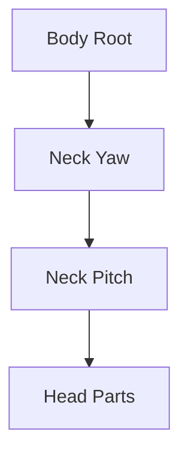

# Bài 06 — Rig robot cơ khí không dùng Armature: Origin, Parent và khóa trục

## 1. Tóm tắt

Robot hard-surface có thể hoạt hình bằng một hệ thống **các đối tượng cứng quay quanh khớp**, không nhất thiết phải dựng `Armature` và weight painting. Trong bài học này, mỗi phần tử chuyển động được đặt `Origin` tại đúng tâm cơ khí, liên kết thành hệ phân cấp `Parent–Child` và giới hạn hướng quay khi cần. Đây là bước quan trọng nhất để robot không bị rời khớp khi pose hoặc chạy animation.

## 2. Mục tiêu học tập

- Xác định tâm xoay của các khớp đầu, cổ, vai, khuỷu, ngàm và chân.
- Dùng `3D Cursor` và `Set Origin → Origin to 3D Cursor` để đặt pivot chính xác.
- Hiểu hướng truyền chuyển động trong hệ phân cấp object.
- Dùng `Ctrl+P → Object (Keep Transform)` để tạo Parent mà giữ vị trí hiện hành.
- Tách/join mesh có chủ đích và xử lý `Mirror Modifier` trước khi rig.
- Hạn chế các trục rotation không mong muốn và kiểm tra khớp bằng pose thử.

## 3. Cơ sở của mechanical rig

Mỗi object có một điểm gốc (`Origin`). Khi bạn dùng `R` trong `Object Mode`, object sẽ xoay quanh gốc này theo thiết lập pivot hiện hành. Nếu tâm gốc nằm giữa chi tiết nhưng bản lề thật lại ở đầu chi tiết, phép xoay sẽ làm khớp bị văng hoặc lệch. Vì vậy mechanical rig bắt đầu từ **đúng Origin**, không phải từ số lượng keyframe.

Ví dụ, chốt ngang ở cổ cho phép phần đầu gật quanh một trục, còn vòng đế ở dưới cổ cho phép toàn bộ cụm đầu quay nhìn hai bên. Đặt hai điểm gốc khác nhau để phục vụ hai chuyển động độc lập này.

Khi tạo `Parent`, chuyển động/biến đổi của parent được truyền xuống các object con. Ngược lại, xoay một object con không làm chuyển động tất cả object cha. Đây là quy tắc cơ bản quyết định thứ tự chọn khi nhấn `Ctrl+P`.

## 4. Dọn scene và chuẩn bị object

Ẩn các đèn và camera bằng `H` hoặc ẩn collection tương ứng trong `Outliner`; dùng `Alt+H` nếu cần hiện lại những object đã được ẩn trong viewport. Đảm bảo robot đang ở tư thế nghỉ, rồi lưu một file riêng trước khi sửa quan hệ object.

Một số chi tiết được dựng với `Mirror Modifier` vẫn chỉ có geometry thật ở nửa bên. Khi cần tách các chi tiết đối xứng thành object chuyển động độc lập, hãy **Apply Mirror** tại thời điểm phù hợp để có mesh ở cả hai phía. Sau đó vào `Edit Mode`, chọn vùng bằng `Wireframe`/`B` và `P → Selection`.

Nếu ba chi tiết luôn chuyển động như một bộ phận duy nhất, bạn có thể chọn chúng rồi `Ctrl+J` để **Join** thành một object. Chỉ join khi có cùng chức năng xoay; join nhầm tay trên với khuỷu hoặc bánh với chân sẽ làm việc rig khó hơn.

## 5. Đặt Origin tại tâm khớp

### 5.1. Quy trình chuẩn

1. Chọn object sẽ đóng vai trò khớp.
2. `Tab` vào `Edit Mode`.
3. Chọn vòng đỉnh, mặt trụ, hoặc nhóm đỉnh bao quanh **tâm chốt**.
4. Nhấn `Shift+S → Cursor to Selected` để đưa 3D Cursor về trung tâm vùng chọn.
5. `Tab` về `Object Mode`.
6. Chọn `Object → Set Origin → Origin to 3D Cursor`.
7. Kiểm tra thiết lập `Transform Pivot Point` (thường chọn `Median Point` khi thao tác object đơn lẻ) và thử `R X/Y/Z` xem khớp quay có đúng quanh tâm không.

Một vòng đỉnh đối xứng quanh trục chốt tạo mốc tâm rất thuận lợi. Nếu bị lệch tâm vì vùng chọn thiếu đối xứng, hãy chọn lại vòng mặt/đỉnh đầy đủ.

### 5.2. Kiểm tra từng khớp trước khi tạo parent

Thử xoay từng phần 10–20 độ theo trục mong muốn, quan sát chuyển động rồi `Alt+R` để xóa rotation thử. Chỉ chuyển sang parenting khi pivot đã chính xác. Việc sửa pivot sau khi hệ parent phức tạp thường dễ gây khó theo dõi transform hơn.

## 6. Thiết lập hệ phân cấp đầu và cổ

Bắt đầu với phần gật đầu. Chọn **tất cả các chi tiết đầu** cần đi cùng cụm khớp gật; chọn khớp điều khiển gật **cuối cùng** để nó trở thành active object. Nhấn `Ctrl+P → Object (Keep Transform)`. Kiểm tra bằng cách xoay khớp: toàn bộ đầu phải di chuyển nhưng hình dạng không bị đổi.

Tiếp theo chọn cụm gật và các bộ phận liên quan, parent vào khớp quay ngang của cổ, rồi từ khớp cổ dưới parent vào thân. Nếu một mặt ốp nằm cố định với thân, đừng parent nó vào khớp gật; nó cần giữ nguyên khi đầu chuyển động.

Sơ đồ mô tả đường truyền chuyển động: thân di chuyển thì cả đầu đi theo; `Yaw` quay làm cụm gật và đầu xoay theo; `Pitch` chỉ điều khiển phần đầu cần gật.

## 7. Rig vai, tay, cổ tay và ngàm

Đối với mỗi bên, thực hiện lần lượt từ đầu ngàm đi ngược về vai:

1. Đặt Origin cho từng ngàm ngay tại chốt gắn.
2. Parent mỗi ngàm vào cụm cổ tay hoặc giá bàn tay.
3. Đặt pivot của cổ tay/khuỷu ở tâm chốt và parent phần dưới vào phần trên.
4. Parent toàn bộ cụm cánh tay vào khớp vai.
5. Parent khớp vai vào thân.
6. Thử quay từng phần để phát hiện bất kỳ chi tiết nào bị bỏ sót khỏi parent.

Dùng `Alt+R` sau mỗi phép thử để trở về rotation mặc định nếu chưa ghi keyframe. Khi một vật thể xoay đúng nhưng phần vỏ trang trí đứng yên, nguyên nhân thường là nó chưa được parent vào đúng cụm.

## 8. Rig chân và cụm bánh xe

Nếu các chân được tạo bởi `Mirror Modifier`, Apply modifier nếu cần tách độc lập hai bên. Lựa chọn, tách và có thể `Ctrl+J` ghép những mảnh cùng xoay quanh một tâm. Đặt Origin trên mặt/chốt nối thân cho mỗi chân và thử xoay quanh trục bản lề.

Khi robot di chuyển theo phong cách xe/robot công nhân, các bánh xe cần vị trí hợp lý dưới hệ chân. Nếu bài toán animation chỉ yêu cầu robot dịch chuyển và bánh luôn đứng yên tương đối với chân, có thể parent chúng theo cụm; nếu muốn bánh quay thật, cần giữ object bánh riêng với Origin nằm tại trục bánh. Không dùng parenting khiến vòng bánh bị kéo lệch khỏi chân.

## 9. Giới hạn rotation và quản lý điều khiển

Khi một chốt chỉ nên quay quanh một trục, cần ngăn các góc quay vô lý. Có thể dùng **Transform Locks** ở `Object Properties`/bảng Transform để khóa hai thành phần rotation không sử dụng, hoặc constraint giới hạn rotation phù hợp. Ví dụ chốt bản lề chỉ dùng rotation theo `X` thì khóa `Y` và `Z` đối với object điều khiển đó.

Cần nhớ: khóa một trục của object không tự động làm cho hệ parent thông minh hơn; nó chỉ hạn chế kênh transform. Trước khi khóa, thử xoay đủ biên độ để xác định chính xác trục thực tế của khớp.

## 10. Kiểm thử toàn bộ hệ cơ khí

Dùng một checklist ngắn, thử lần lượt:

- [ ] Đầu gật lên/xuống không lệch khỏi chốt ngang.
- [ ] Cổ quay trái/phải kéo theo đầu và các chi tiết liên quan.
- [ ] Vai xoay không bỏ quên tấm giáp và lõi tay.
- [ ] Khuỷu và cổ tay quay quanh đúng tâm.
- [ ] Hai ngàm đóng/mở độc lập.
- [ ] Hai cụm chân gắn với thân đúng hướng.
- [ ] Khi di chuyển thân, toàn bộ robot đi theo nhưng các bộ phận không rơi rụng.
- [ ] Các đối tượng trong `Outliner` được đặt tên dễ tìm.

## 11. Debug những lỗi điển hình

| Biểu hiện | Kiểm tra | Cách sửa |
| --- | --- | --- |
| Đầu lắc thành vòng lớn | Origin ở sai tâm | Đặt 3D Cursor vào vòng chốt rồi `Origin to 3D Cursor` |
| Vỏ giáp rơi lại khi xoay | Thiếu parent | Chọn vỏ, chọn parent active cuối, `Ctrl+P` |
| Đầu đi theo thân nhưng không gật đúng | Parent sai tầng | Sắp lại `Body → Yaw → Pitch → Head` |
| Hai chi tiết hai bên phải xoay riêng nhưng dính nhau | Chưa tách Mirror/mesh | Apply Mirror phù hợp và `P → Selection` |
| Xoay sai hướng | Trục local/global hoặc khóa trục chưa đúng | Kiểm tra Origin, orientation và rotation lock |

## 12. Câu hỏi ôn tập

### Câu 1

Một cánh tay xoay quanh giữa thân thay vì quanh vai. Việc cần kiểm tra đầu tiên là gì?

A. Chất liệu kim loại.  
B. `Origin` của object điều khiển vai.  
C. Chế độ HDRI.  
D. Độ phân giải render.

**Đáp án:** B. **Giải thích:** `Origin` quyết định tâm phép xoay object.

### Câu 2

Khi tạo Parent bằng `Ctrl+P`, object nào phải được chọn active cuối cùng?

A. Object bất kỳ.  
B. Camera.  
C. Object con đầu tiên.  
D. Object đóng vai trò Parent.

**Đáp án:** D. **Giải thích:** Active object là parent của các object được chọn còn lại.

### Câu 3

Lệnh nào đưa 3D Cursor đến tâm vùng đỉnh đang chọn?

A. `Shift+S → Cursor to Selected`.  
B. `Ctrl+F12`.  
C. `Ctrl+L → Link Materials`.  
D. `Alt+H`.

**Đáp án:** A. **Giải thích:** Đây là bước nền để chuyển `Origin` đến tâm chốt.

### Câu 4

Tại sao cần Apply Mirror ở một số cụm khi chuẩn bị rig?

A. Để làm robot tự phát sáng.  
B. Để tự có chuyển động.  
C. Để có geometry thật ở hai bên, dễ tách thành các phần xoay độc lập.  
D. Để giảm độ phân giải ảnh.

**Đáp án:** C. **Giải thích:** Mirror chưa áp dụng vẫn hoạt động như modifier trên một object thay vì những geometry độc lập.

### Câu 5

Khi kiểm thử một khớp rồi muốn trả rotation về mặc định, dùng lệnh nào?

A. `F12`.  
B. `Alt+R`.  
C. `P`.  
D. `K`.

**Đáp án:** B. **Giải thích:** `Alt+R` xóa các giá trị rotation đang áp dụng cho object.

## 13. Tổng kết

Mechanical rig phụ thuộc vào ba yếu tố: **phân chia bộ phận phù hợp**, **Origin ở đúng tâm** và **Parent–Child có thứ bậc chính xác**. Khi ba yếu tố đó đạt, robot có thể tạo pose và keyframe mà không phải dùng weight painting. Hãy kiểm thử từng khớp rồi mới dựng cảnh và bắt đầu animation.
