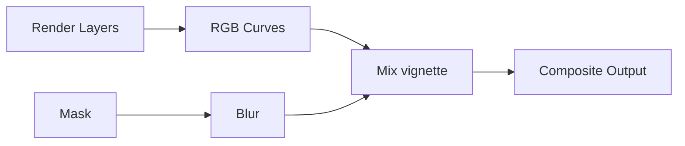

# Bài 07 — Dựng hành lang sci-fi, tạo pose và render ảnh hoàn chỉnh

## 1. Tóm tắt

Một robot đẹp vẫn khó tạo ấn tượng nếu thiếu bối cảnh, ánh sáng và bố cục. Bài học xây dựng **hành lang công nghiệp giao nhau** cho robot di chuyển qua, gán texture kim loại cho sàn/tường, tạo pose, thêm chiều sâu trường ảnh (`Depth of Field`), ánh sáng viền và hậu kỳ bằng Compositor. Kết quả là một ảnh tĩnh hoàn thiện, đồng thời là scene có thể tái sử dụng cho animation.

## 2. Mục tiêu học tập

- Tổ chức object theo `Collection` để scene dễ làm việc.
- Dựng sàn và tường hành lang từ `Plane` và `Extrude`.
- Dùng `Node Wrangler` nhập texture PBR từ các tập ảnh kim loại.
- Điều chỉnh hướng và tỷ lệ texture qua Mapping/UV.
- Tạo pose phù hợp với hệ rig cơ khí; bố trí camera, `Depth of Field` và đèn viền.
- Render ảnh và tinh chỉnh tương phản/màu bằng Compositor, bổ sung vignette.

## 3. Tổ chức scene trước khi xây dựng

Trong `Outliner`, nên gom các object vào các `Collection` có tên dễ đọc. Ví dụ: `Robot_Worker` cho mô hình robot, `Lights_Camera` cho đèn và camera, `Environment` cho sàn và tường. Chọn các object cần gom, nhấn `M → New Collection` để chuyển vào collection mới; hoặc tạo collection trong `Outliner` rồi chuyển object theo ý muốn.

Việc tổ chức này rất hữu ích cho quá trình rig và animate: bạn có thể ẩn `Lights_Camera` trong viewport khi pose robot rồi hiện lại lúc kiểm tra render. Đối với dự án nhiều chi tiết, việc đặt tên object rõ ràng cũng hạn chế chọn nhầm mesh.

## 4. Dựng hành lang từ mặt phẳng

### 4.1. Tạo sàn chữ L

1. Đưa 3D Cursor về giữa scene bằng `Shift+C`.
2. `Shift+A → Mesh → Plane`, dùng `S` kéo kích thước sàn.
3. Chuyển `Numpad 7` nhìn từ trên xuống; dùng `G` đưa Plane vào đúng vị trí dưới robot.
4. Trong `Edit Mode`, chọn các đỉnh/cạnh ở một đầu và `E Y` để kéo sàn theo hướng hành lang thứ nhất.
5. Chọn cạnh hoặc cặp đỉnh phù hợp rồi `E X` tạo nhánh rẽ theo phương vuông góc.
6. Chỉnh chiều rộng để robot có lối đi và camera có chỗ nhìn thấy cảnh.

Thiết kế chữ L có lý do trực tiếp: nhân vật sẽ tiến vào, nhìn quanh rồi rẽ sang hành lang thứ hai. Không cần dựng cả một thành phố sci-fi nếu camera chỉ nhìn thấy vài đoạn đường.

### 4.2. Tạo tường từ cạnh sàn

Chọn các cạnh/đỉnh dọc mép hành lang. Dùng `E Z` kéo thẳng lên để tạo tường. Khi mặt tường đã hình thành, chọn chúng và `P → Selection` để tách thành object `Wall`; phần sàn đặt tên `Ground`.

Sàn và tường nên là hai object độc lập bởi chúng cần định hướng texture khác nhau. Trong `Outliner`, đưa cả hai vào collection `Environment`.

## 5. Gán texture PBR cho sàn và tường

### 5.1. Chuẩn bị bộ texture

Sử dụng các bộ ảnh kim loại khoa học viễn tưởng từ **3D Textures**; trong ví dụ sàn dùng bộ **Metal Plate 015**, còn tường sử dụng bộ kim loại khác phù hợp. Những tệp thường có thể bao gồm màu nền (`Base Color`/`Diffuse`), `Roughness`, `Metallic` và `Normal`.

Nếu dùng add-on `Node Wrangler` và tính năng nhập nhiều texture, hãy chọn `Principled BSDF` rồi nhấn `Ctrl+Shift+T` để nạp các tệp. Node Wrangler cố gắng nhận diện kênh dựa trên tên file. Nếu `Base Color` không được tự động nối vì tên không khớp, thêm `Image Texture` và kết nối đúng ngõ `Base Color` thủ công.

Sơ đồ nguyên lý:

```text
Base Color texture ──────────────> Principled BSDF: Base Color
Roughness texture ───────────────> Principled BSDF: Roughness
Metallic texture ────────────────> Principled BSDF: Metallic
Normal texture ──> Normal Map ──> Principled BSDF: Normal
Principled BSDF ────────────────> Material Output
```

Với dữ liệu không phải màu như Roughness/Metallic/Normal, kiểm tra `Color Space` phù hợp (thường `Non-Color`) nếu phần mềm không thiết lập đúng tự động.

### 5.2. Kiểm soát chiều và tỷ lệ vân

Nếu vân sàn quá to hoặc quá nhỏ, chỉnh `Mapping` hoặc tỷ lệ UV. Khi đường sọc trên tường đang chạy ngang nhưng thiết kế cần đường dọc, mở `UV Editor`, chọn vùng UV và xoay bằng `R 90` để đổi hướng. Hãy kiểm tra vân theo góc nhìn camera thay vì chỉ nhìn riêng texture.

Đối với hành lang sci-fi, sàn nên có nhịp panel tương đối đều; tường có thể có vân chạy theo chiều cao để nhấn cảm giác không gian công nghiệp.

## 6. Đặt robot vào pose kể chuyện

Với rig đã kiểm thử, chọn một pose làm người xem cảm thấy robot đang quan sát môi trường. Ví dụ, quay thân nhẹ về lối rẽ, nghiêng đầu nhìn xuống một tay, kéo một cánh tay vào gần thân và để ngàm hơi mở. Hãy dùng rotation của các khớp cơ khí, không kéo geometry của từng mesh trong Edit Mode.

Tạo pose bằng một chuỗi chuyển động hợp lý: xoay cổ trước, chỉnh vai, khuỷu và ngàm sau. Việc này giúp hạn chế các chồng chéo và giữ trọng tâm thị giác vào đầu/cụm mắt.

## 7. Camera, chiều sâu và ánh sáng viền

### 7.1. Depth of Field

Chọn Camera và bật `Depth of Field` trong hệ thống camera/render phù hợp. Đặt `Focus Object` vào một phần đầu hoặc cảm biến gần camera, nhằm giữ robot rõ trong khi nền hành lang dịu hơn. Trong ví dụ, `F-Stop` có thể bắt đầu khoảng **1.1** rồi tăng dần khi nền mờ quá mạnh. F-Stop thấp tạo vùng nét mỏng hơn, nên phải kiểm tra robot có bị mờ những phần cần thấy hay không.

### 7.2. Ánh sáng tăng tách lớp

Ngoài hai đèn màu ấm–lạnh, bổ sung `Area Light` phía bên hoặc sau nhân vật để tạo **rim light** ở viền. Ánh sáng xanh/cam có thể giúp robot tách khỏi bối cảnh tối. Trong quá trình tinh chỉnh, năng lượng được thử ở mức khoảng **1000** rồi giảm hoặc tăng tùy vị trí và kết quả; điều quan trọng không phải con số mà là độ rõ cạnh và cảm giác không bị cháy sáng.

### 7.3. Giải pháp ánh sáng gián tiếp

Một số phiên bản Eevee trước đây cho phép thêm `Irradiance Volume` (Light Probe), tăng độ phân giải lưới probe và `Bake Indirect Lighting`; trong ví dụ, mật độ probe được nâng từ **4 lên 8** trên các trục để lấy mẫu chi tiết hơn. Đây là quy trình giao diện cũ: ở Blender mới, hãy dùng chức năng ánh sáng gián tiếp/giải pháp thay thế phù hợp. Không áp dụng bước bake cũ một cách máy móc nếu bản Blender hiện hành không còn tùy chọn đó.

## 8. Render và chỉnh ảnh bằng Compositor

Nhấn `F12` để render ảnh tĩnh. Khi đã có ảnh, chuyển sang `Compositing` và bật `Use Nodes`. Dùng `RGB Curves` để tăng một chút tương phản; có thể điều chỉnh riêng kênh `R` và `B` để ảnh ấm hơn hoặc lạnh hơn. Không đẩy tương phản quá cao khiến vùng kim loại tối mất hết chi tiết.

Để tạo **vignette**, thêm một mask dạng hộp/ellipse phù hợp với công cụ compositing, kết hợp blur và trộn tối vùng mép ảnh. Trong ví dụ, việc tăng/giảm độ mờ được tinh chỉnh quanh mức **250** cho bước làm mềm cạnh mặt nạ, tùy độ phân giải. Mặt nạ vignette cần tối mép nhẹ, không khiến khu vực trung tâm trông như một lỗ sáng có viền cứng.

Luồng xử lý ý tưởng:



Sơ đồ cho biết ảnh sau render được chỉnh màu rồi trộn lớp tối mép thông qua mask đã làm mờ. Cấu hình node cụ thể phụ thuộc phiên bản và kiểu mask bạn sử dụng.

## 9. Lab: Ảnh robot trong hành lang chữ L

**Nhiệm vụ:** dựng hành lang và xuất một ảnh có chiều sâu, robot là chủ thể nổi bật.

- [ ] Sàn hành lang và tường là những object riêng, đặt đúng collection.
- [ ] Texture PBR được nối đúng kênh, vân không bị xoay sai.
- [ ] Robot đã vào pose mới, các khớp không trượt khỏi chốt.
- [ ] DOF tập trung vào robot, nền không lấn át chủ thể.
- [ ] Có viền ánh sáng rõ ở ít nhất một phía.
- [ ] Ảnh được render và có bước chỉnh contrast/vignette vừa phải.
- [ ] Đã lưu file `.blend` và ảnh đầu ra.

**Tự đánh giá:** tắt riêng từng nhóm đèn để xem vai trò của HDRI, key/fill và rim light. Sau đó bật lại, kiểm tra chất lượng tổng thể.

## 10. Lỗi thường gặp

| Hiện tượng | Cách kiểm tra và sửa |
| --- | --- |
| Texture sàn bị phóng quá lớn | Điều chỉnh Mapping/UV Scale |
| Đường vân tường nằm ngang | Xoay UV (`R 90` khi phù hợp) |
| Một số texture không kết nối tự động | Kiểm tra tên tệp, nối `Image Texture` thủ công |
| Robot bị mờ thay vì nền | Chọn đúng `Focus Object` và tăng F-Stop khi cần |
| Vignette thành viền đen dày | Giảm độ mạnh, tăng/làm mềm mask hợp lý |
| Tường/sàn bị nhầm object | Đổi tên và tách bằng `P → Selection` |

## 11. Câu hỏi ôn tập

### Câu 1

Vì sao nên tách sàn và tường thành hai object?

A. Vì Blender không cho dựng chung mesh.  
B. Để dùng được Camera.  
C. Để dễ kiểm soát vật liệu và hướng UV riêng cho từng loại bề mặt.  
D. Để tự động tạo hoạt hình.

**Đáp án:** C. **Giải thích:** Sàn và tường thường cần vân chạy hướng khác nhau.

### Câu 2

Nếu ảnh `Normal Map` bị nối trực tiếp sai ngõ hoặc dùng color space không phù hợp, điều gì dễ xảy ra?

A. Hướng phản xạ/độ nổi bề mặt bị biểu diễn sai.  
B. Mọi đối tượng tự có xương.  
C. Camera biến mất.  
D. Timeline đặt thành 400 khung.

**Đáp án:** A. **Giải thích:** Normal map cần được giải mã đúng như dữ liệu hướng, không phải ảnh màu thông thường.

### Câu 3

Muốn robot sắc nét còn hành lang mềm hơn, nên đặt focus vào đâu?

A. Tường sau cùng.  
B. Mặt sàn xa camera.  
C. Một đèn bất kỳ.  
D. Vùng đầu hoặc cảm biến trên robot.

**Đáp án:** D. **Giải thích:** Focus Object quyết định vùng nét của DOF.

### Câu 4

`RGB Curves` dùng ở giai đoạn nào?

A. Dựng khớp.  
B. Chỉnh tương phản và màu sau khi render.  
C. Tạo UV tự động.  
D. Thêm bánh xe.

**Đáp án:** B. **Giải thích:** Đây là node điều chỉnh tonal range và các kênh màu trong Compositor.

### Câu 5

Khi vệt vân trên tường sai hướng 90 độ, công cụ nào xử lý trực tiếp nhất?

A. `Ctrl+P`.  
B. `Alt+R`.  
C. Xoay vùng UV trong `UV Editor`.  
D. `Render Animation`.

**Đáp án:** C. **Giải thích:** Hướng UV điều khiển cách texture trải lên bề mặt.

## 12. Tổng kết

Cảnh sci-fi chỉ cần đủ không gian phục vụ câu chuyện: một hành lang có nhánh rẽ, vật liệu PBR hợp lý và ánh sáng có chủ đích. Khi robot được pose và đưa vào khung hình có DOF, rim light và compositing tiết chế, mô hình trở thành một hình ảnh kể chuyện. Scene này cũng là nền để thiết lập đường đi và chuyển động ở bài animation.
